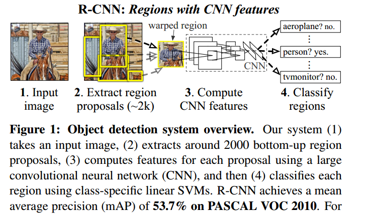
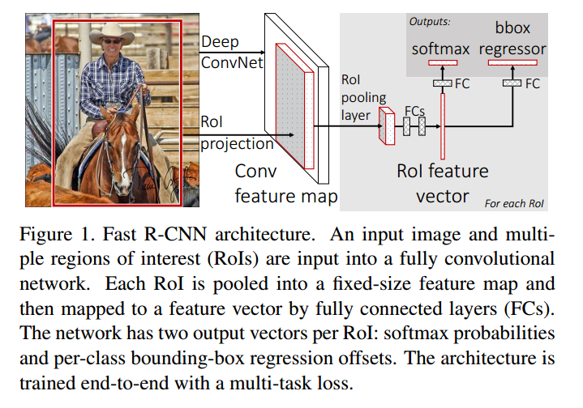
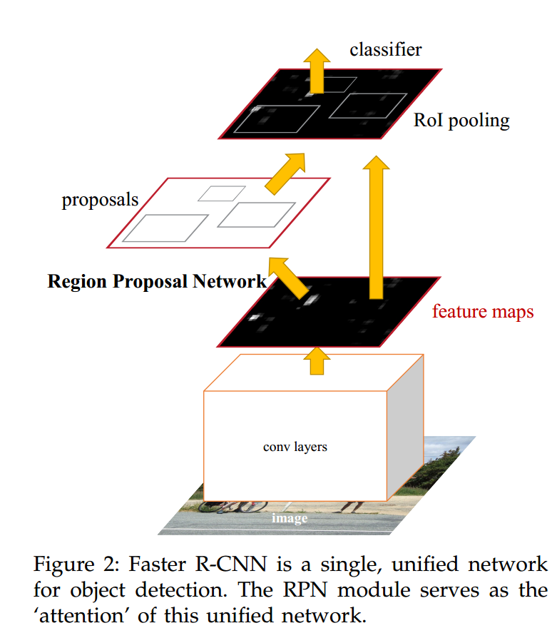

# R-CNN系列

## Rich feature hierarchies for accurate object detection and semantic segmentation

1. 通过选择性搜索来实现Region proposals，大约2000个proposals
2. 通过CNN提取每个proposal特征
3. 采用class-specific linear SVMs对每个框进行分类

## Fast R-CNN

相比于R-CNN多阶段训练、检测速度慢的问题，Fast R-CNN通过如下方法进行解决：

1. 采用CNN和最大池化层来处理整个图像
2. 将proposals通过ROI Pooling操作提取固定大小的特征图
3. 每个proposals的特征图经过FC层后通过分类和回归分支预测

## Faster R-CNN: Towards Real-Time Object Detection with Region Proposal Networks

# YOLO系列

# DETR系列

# 技术发展的趋势

**多尺度检测技术：**

- 特征金字塔+滑动窗口
- 目标提议框检测
- 深度回归了anchor-free检测

**上下文建模：**

- 局部上下文检测：扩大卷积神经网络的感受野
- 全局上下文检测：利用注意力机制实现增大感受野
- 上下文交互

**难负样本挖掘：**

- Boostrap：从一小部分背景样本开始训练，然后迭代地增加新的误分类样本地一组训练技术
- 在正负窗之间平衡权重，采用Focal Loss，使其关注难的、错误分类的例子。正负样本的定义是通过IOU来进行判断的，并且为了限制负样本的数量，可以通过正负样本1：3进行采样

**损失函数：**

- 分类损失：用来评价预测类别与实际类别的偏离程度的，早期采用交叉熵进行计算，为了解决噪声标签的过度自信问题，提出了Label Smooth；为了解决类别不平衡和难样本的问题，设计了Focal Loss。
- 定位损失：用于优化位置和尺寸偏差。L2 Loss在早期的研究中发现容易收到噪声数据的影响，发生梯度爆炸，结合L1 Loss，提出了Smooth L1 Loss。 进一步提出了IOU损失，G-IOU损失解决了预测框和真实框不重叠情况下不能优化的问题；

**非极大值抑制的演变：**

- 贪婪选择：对于一组重叠的检测，选择检测得分最高的边界框，而对于剩余的检测框，则根据预定义的重叠阈值去除。缺点：**得分最高的盒子可能不是最合适的，不能抑制假阳性检测框。**
- 边界框聚合：思想是将多个重叠的边界框组合或聚类成一个最终检测。这种方法的优点是充分考虑了对象关系及其检测框的空间布局。
- 可学习的NMS：主要思想是将NMS视为一个过滤器，重新对所有原始检测进行评分，并以端到端方式将NMS作为网络的一部分进行训练，或者训练网络来模仿NMS的行为。
- NMS-free：要求使用最高质量的box用来训练，以实现NMS-free的效果。

**算法加速：**

- 特征图共享计算：Fast-RCNN
- 级联检测：
- 网络剪枝和模型量化
- 轻量化网络结构设计
  - 可分解卷积
  - 分组卷积
  - 深度可分离卷积
  - Bottleneck Design
  - 网络结构搜索

