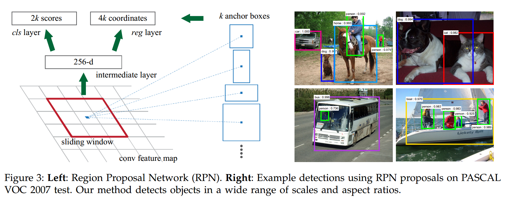
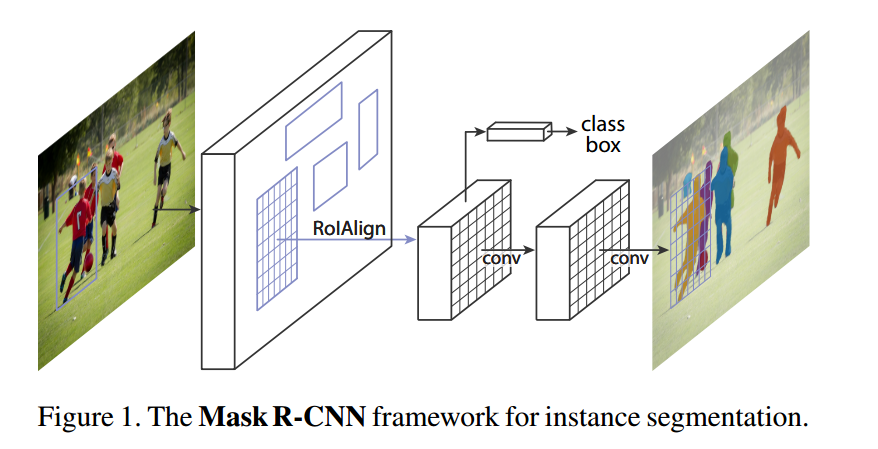
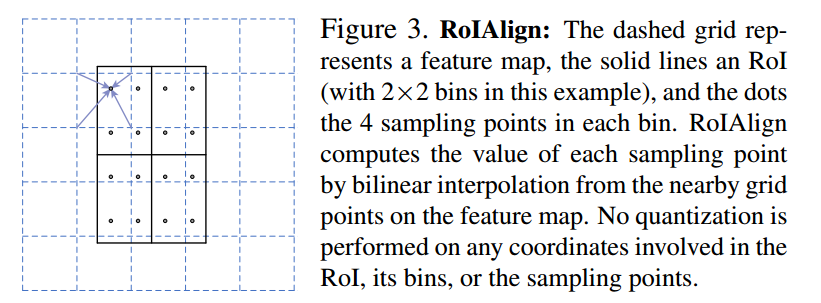
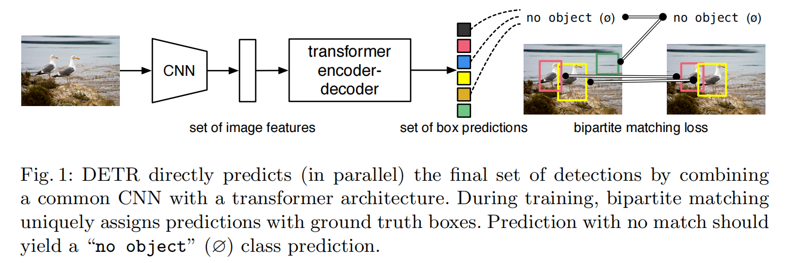
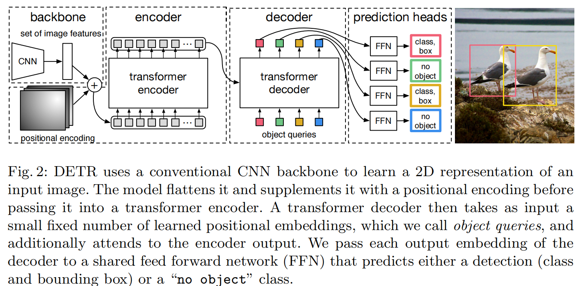
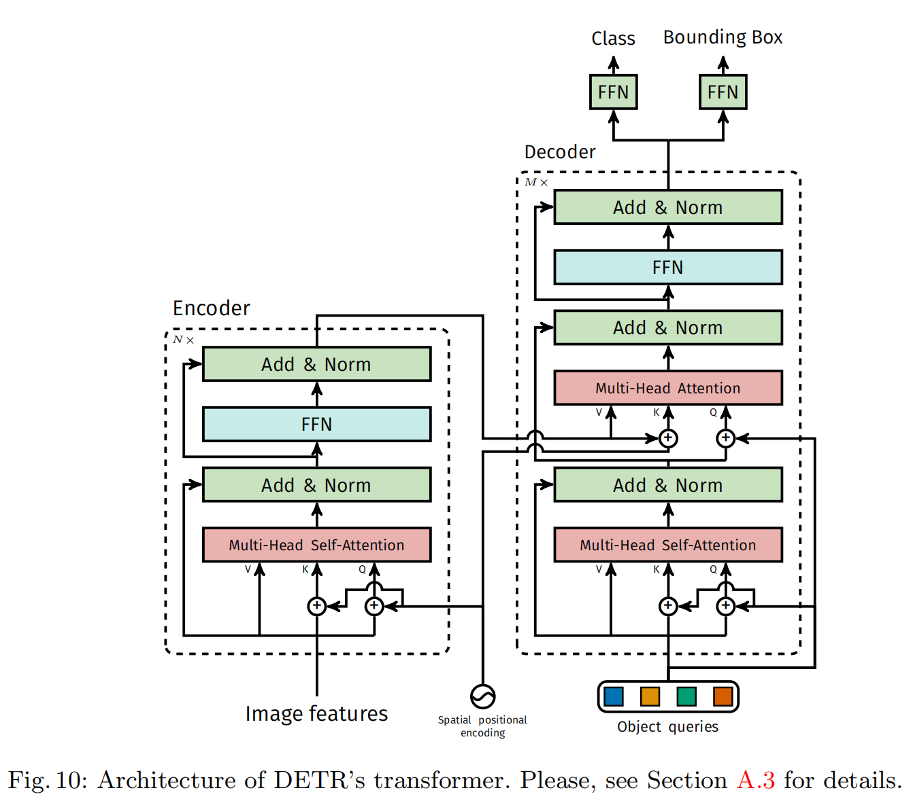
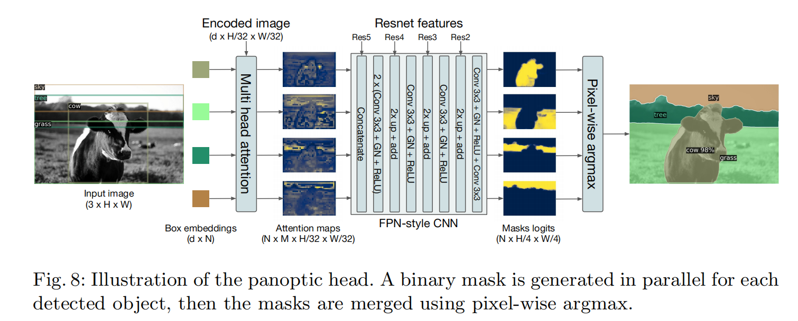

# R-CNN系列

## Rich feature hierarchies for accurate object detection and semantic segmentation

1. 通过选择性搜索来实现Region proposals，大约2000个proposals
2. 通过CNN提取每个proposal特征
3. 采用class-specific linear SVMs对每个框进行分类

## Fast R-CNN

相比于R-CNN多阶段训练、检测速度慢的问题，Fast R-CNN通过如下方法进行解决：

1. 采用CNN和最大池化层来处理整个图像
2. 将proposals通过ROI Pooling操作提取固定大小的特征图
3. 每个proposals的特征图经过FC层后通过分类和回归分支预测

对于每一个ROI来说，分类头会预测N个类别，box regressor会预测4N的位置参数

## Faster R-CNN: Towards Real-Time Object Detection with Region Proposal Networks

**Motivation：**

- Fast R-CNN中proposal的获取是在CPU上计算的，并且不同通过端到端的方式优化，因此Fast R-CNN中提出了Region Proposal Network（RPN）
- 为了适应RPN结构，提出了Anchor的概念

**RPN**是一个全卷积结构的网络，RPN网络与分类头和检测头共享之前的卷积层参数。

**anchor：**在每个滑动窗口处会生成k个reference boxes成为anchor，其中k=9，分别有3中尺寸和3种比例的anchor。因此这种多尺度的anchor可以在单尺度的图像特征上进行计算。

**训练RPN网络：** 将与ground box的IOU最大的anchor作为正样本或者将IOU大于0.7的anchor作为正样本。

**RPN网络的损失函数：**$$\begin{aligned}L(\{p_i\},\{t_i\})&=\frac1{N_{cls}}\sum_iL_{cls}(p_i,p_i^*)+\lambda\frac1{N_{reg}}\sum_ip_i^*L_{reg}(t_i,t_i^*).\end{aligned}$$​

其中，$p_i^*=0$表示为负样本，$p_i^*=1$表示为正样本，$L_{cls}$是二分类log Loss。

$$L_{reg}(t_i,t_i^*) = R(t_i - t_i^*)$$，其中$R$是Smooth L2 Loss。

在计算损失函数的时候，随机采样256个anchor来进行损失函数计算，其中正样本和负样本的比例为1：1，如果正样本数量少于128个

，则用负样本进行填充。

**整体的训练过程：**

1. 训练RPN和前面的resnet
2. 使用训练好的RPN生成的proposal训练Fast R-CNN
3. 冻结住resnet，只微调RPN
4. 冻结住resnet，只微调Fast R-CNN

## Mask R-CNN

**Motivation：**提出了一个通用的实例分割框架，扩展了Faster R-CNN，在边界框识别分支的基础上，增加了一个用于预测对象掩码的分支

Mask R-CNN与Faster R-CNN一样，第一阶段采用RPN，第二阶段在预测类别以及boxes offest的同时，还为每个ROI生成一个二值的mask，即mask的类别由box的类别决定。这与基于FCN的语义分割方法不同，Mask R-CNN将类别预测和掩码预测解耦开来，通过per-pixel sigmoid binary loss不会导致mask之间相互竞争。

**ROI ALIGN:** 采用ROI Pooling会造成量化问题，导致特征发生错位，这对小目标的边界框回归有着较大的影响。ROI ALIGN通过双线性插值避免引入量化的问题。

# YOLO系列

# DETR系列

## **End-to-End Object Detection with Transformers**

**Motivation：**

- 之前的目标检测方法需要通过非极大值抑制，或者通过先验设定anchor的大小。
- DETR可以通过端到端的方式进行训练，不需要加入一些人工设置的部分。

**Backbone：**利用CNN提取图像的特征图，将$3\times H \times W$下采样成$2048 \times \frac{H}{32} \times frac{W}{32}$

**Transformer encoder:** 通过$1\times 1$的卷积将特征进行降维成$d$，将图像特征序列化为$d\times HW$，由于序列化之后token失去了位置信息，因此在self-attention的$Q,K$中加入正余弦的位置编码。针对二维特征图的特点，DETR实现了自己的二维位置编码方式。DETR是为二维特征图的 x 和 y 方向各自计算了一个位置编码，每个维度的位置编码长度为$\frac{d}{2}$,将x方向的位置编码和y方向的位置编码进行拼接即可得到维度为$d$的位置编码。

**Transformer decoder：**由于transformer是permutation-invariant，因此通过插入$N$个可学习的位置编码object queries来生成$N$个boundding box。通过self- 和encoder-decoder-attention来进行全局上下文推理。

**FFN：**FFN用于预测$N$个box标准化后的中心点坐标和宽高，还有一个linear通过softmax输出类别。由于每张图像会输出$N$​个物体，因此对于没有匹配上的期望模型预测为**背景类别**。

**Hungarian loss：**通过匈牙利匹配算法为groud truth匹配预测的框，而后只计算匹配上的框与groud truth之间的损失。

匹配过程为：

$$\hat{\sigma}=\underset{\sigma\in\mathfrak{S}_N}{\operatorname*{\arg\min}}\sum_i^N\mathcal{L}_{\mathrm{match}}(y_i,\hat{y}_{\sigma(i)})$$

$${L}_{\mathrm{match}}=-\mathbb{1}_{\{c_i\neq\varnothing\}}\hat{p}_{\sigma(i)}(c_i)+\mathbb{1}_{\{c_i\neq\varnothing\}}\mathcal{L}_{\mathrm{box}}(b_i,\hat{b}_{\sigma(i)})$$

其中第一项表示惩罚预测类别与真实类别不匹配的情况。**对于每个非空目标，若模型的预测正确的概率越低，惩罚越大**。

第二项是惩罚预测的bounding box与真实的bounding box之间的偏差。

DETR的损失函数为：$$\mathcal{L}_{\text{Hungarian}}(y,\hat{y})=\sum_{i=1}^N\left[-\log\hat{p}_{\hat{\sigma}(i)}(c_i)+\mathbb{1}_{\{c_i\neq\varnothing\}}\mathcal{L}_{\text{box}}(b_i,\hat{b}_{\hat{\sigma}}(i))\right]$$

表示，计算每个通过上述的匹配过程得到的结果的类别预测交叉熵（**未匹配上的框的类别标签为背景，匹配上的类别标签为ground truth的标签**）以及框的位置损失（GIOU，L1 Loss）

由于目标检测中，正负样本不平衡是一个很常见的问题，因此**背景类的损失会主导训练过程，使模型忽视对目标类的学习**。因此在计算损失是对于$c_i=\varnothing$​​，即真实类别为背景的情况，将分类损失函数的权重下降为0.1

**推理：**在推理时认为分类头预测概率大约0.7的为非背景目标，并进行输出。

**DETR用于全景分割任务：**

添加了一个**掩码头（Mask Head）**，用于为每个预测的边界框生成二值掩码。通过多头注意力机制生成低分辨率热力图，并使用类似FPN的架构提高分辨率。最终的掩码使用DICE损失和Focal损失独立进行监督。

**总结：**

- 虽然DETR在处理全局上下文方面很强，但对小目标的检测性能相对较弱。
- DETR的一个显著缺点是训练时间相对较长。
- DETR的mAP（Mean Average Precision）可以和当前最先进的目标检测方法（如Faster R-CNN）相媲美
- 由于DETR没有NMS等后处理步骤，因此推理速度相对较快。然而，由于Transformer的计算复杂度较高，计算资源需求大。
- DETR取消了像Faster R-CNN等传统方法中的锚框机制，直接用一个Transformer网络进行端到端的目标检测。这种方式避免了许多复杂的后处理步骤（如NMS），大大简化了整个检测流程。

# SAM系列

# Open Set系列

# 技术发展的趋势

**多尺度检测技术：**

- 特征金字塔+滑动窗口
- 目标提议框检测
- 深度回归了anchor-free检测

**上下文建模：**

- 局部上下文检测：扩大卷积神经网络的感受野
- 全局上下文检测：利用注意力机制实现增大感受野
- 上下文交互

**难负样本挖掘：**

- Boostrap：从一小部分背景样本开始训练，然后迭代地增加新的误分类样本地一组训练技术
- 在正负窗之间平衡权重，采用Focal Loss，使其关注难的、错误分类的例子。正负样本的定义是通过IOU来进行判断的，并且为了限制负样本的数量，可以通过正负样本1：3进行采样

**损失函数：**

- 分类损失：用来评价预测类别与实际类别的偏离程度的，早期采用交叉熵进行计算，为了解决噪声标签的过度自信问题，提出了Label Smooth；为了解决类别不平衡和难样本的问题，设计了Focal Loss。
- 定位损失：用于优化位置和尺寸偏差。L2 Loss在早期的研究中发现容易收到噪声数据的影响，发生梯度爆炸，结合L1 Loss，提出了Smooth L1 Loss。 进一步提出了IOU损失，G-IOU损失解决了预测框和真实框不重叠情况下不能优化的问题；

**非极大值抑制的演变：**

- 贪婪选择：对于一组重叠的检测，选择检测得分最高的边界框，而对于剩余的检测框，则根据预定义的重叠阈值去除。缺点：**得分最高的盒子可能不是最合适的，不能抑制假阳性检测框。**
- 边界框聚合：思想是将多个重叠的边界框组合或聚类成一个最终检测。这种方法的优点是充分考虑了对象关系及其检测框的空间布局。
- 可学习的NMS：主要思想是将NMS视为一个过滤器，重新对所有原始检测进行评分，并以端到端方式将NMS作为网络的一部分进行训练，或者训练网络来模仿NMS的行为。
- NMS-free：要求使用最高质量的box用来训练，以实现NMS-free的效果。

**算法加速：**

- 特征图共享计算：Fast-RCNN
- 级联检测：
- 网络剪枝和模型量化
- 轻量化网络结构设计
  - 可分解卷积
  - 分组卷积
  - 深度可分离卷积
  - Bottleneck Design
  - 网络结构搜索

