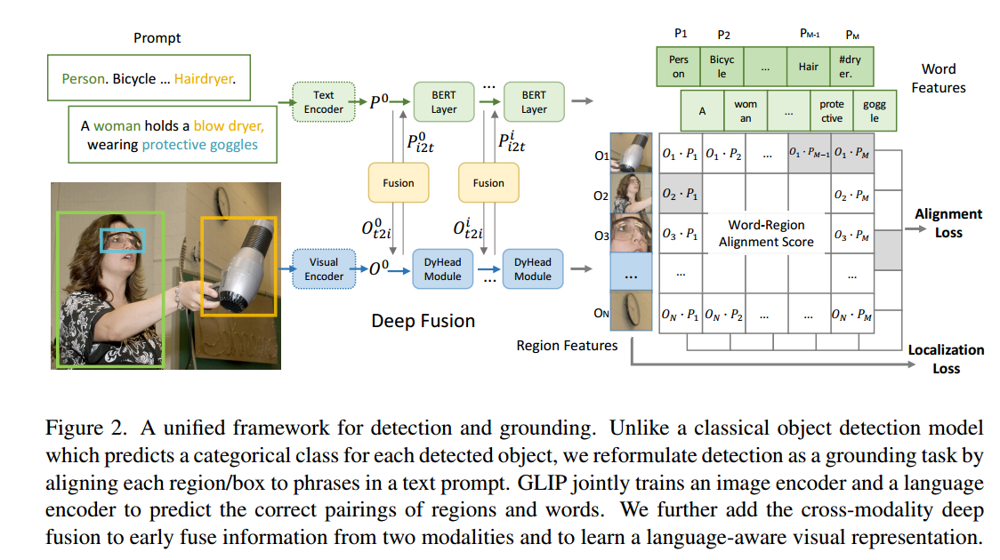

# R-CNN系列

## Rich feature hierarchies for accurate object detection and semantic segmentation

1. 通过选择性搜索来实现Region proposals，大约2000个proposals
2. 通过CNN提取每个proposal特征
3. 采用class-specific linear SVMs对每个框进行分类

## Fast R-CNN

相比于R-CNN多阶段训练、检测速度慢的问题，Fast R-CNN通过如下方法进行解决：

1. 采用CNN和最大池化层来处理整个图像
2. 将proposals通过ROI Pooling操作提取固定大小的特征图
3. 每个proposals的特征图经过FC层后通过分类和回归分支预测

对于每一个ROI来说，分类头会预测N个类别，box regressor会预测4N的位置参数

## Faster R-CNN: Towards Real-Time Object Detection with Region Proposal Networks
**Motivation：**

- Fast R-CNN中proposal的获取是在CPU上计算的，并且不同通过端到端的方式优化，因此Fast R-CNN中提出了Region Proposal Network（RPN）
- 为了适应RPN结构，提出了Anchor的概念

**RPN**是一个全卷积结构的网络，RPN网络与分类头和检测头共享之前的卷积层参数。

**anchor：**在每个滑动窗口处会生成k个reference boxes成为anchor，其中k=9，分别有3中尺寸和3种比例的anchor。因此这种多尺度的anchor可以在单尺度的图像特征上进行计算。

**训练RPN网络：** 将与ground box的IOU最大的anchor作为正样本或者将IOU大于0.7的anchor作为正样本。

**RPN网络的损失函数：**$$\begin{aligned}L(\{p_i\},\{t_i\})&=\frac1{N_{cls}}\sum_iL_{cls}(p_i,p_i^*)+\lambda\frac1{N_{reg}}\sum_ip_i^*L_{reg}(t_i,t_i^*).\end{aligned}$$​

其中，$p_i^*=0$表示为负样本，$p_i^*=1$表示为正样本，$L_{cls}$是二分类log Loss。

$$L_{reg}(t_i,t_i^*) = R(t_i - t_i^*)$$，其中$R$是Smooth L2 Loss。

在计算损失函数的时候，随机采样256个anchor来进行损失函数计算，其中正样本和负样本的比例为1：1，如果正样本数量少于128个

，则用负样本进行填充。

**整体的训练过程：**

1. 训练RPN和前面的resnet
2. 使用训练好的RPN生成的proposal训练Fast R-CNN
3. 冻结住resnet，只微调RPN
4. 冻结住resnet，只微调Fast R-CNN

## Mask R-CNN

**Motivation：**提出了一个通用的实例分割框架，扩展了Faster R-CNN，在边界框识别分支的基础上，增加了一个用于预测对象掩码的分支

Mask R-CNN与Faster R-CNN一样，第一阶段采用RPN，第二阶段在预测类别以及boxes offest的同时，还为每个ROI生成一个二值的mask，即mask的类别由box的类别决定。这与基于FCN的语义分割方法不同，Mask R-CNN将类别预测和掩码预测解耦开来，通过per-pixel sigmoid binary loss不会导致mask之间相互竞争。

**ROI ALIGN:** 采用ROI Pooling会造成量化问题，导致特征发生错位，这对小目标的边界框回归有着较大的影响。ROI ALIGN通过双线性插值避免引入量化的问题。

# YOLO系列

# DETR系列

## **End-to-End Object Detection with Transformers**

**Motivation：**

- 之前的目标检测方法需要通过非极大值抑制，或者通过先验设定anchor的大小。
- DETR可以通过端到端的方式进行训练，不需要加入一些人工设置的部分。

**Backbone：**利用CNN提取图像的特征图，将$3\times H \times W$下采样成$2048 \times \frac{H}{32} \times frac{W}{32}$

**Transformer encoder:** 通过$1\times 1$的卷积将特征进行降维成$d$，将图像特征序列化为$d\times HW$，由于序列化之后token失去了位置信息，因此在self-attention的$Q,K$中加入正余弦的位置编码。针对二维特征图的特点，DETR实现了自己的二维位置编码方式。DETR是为二维特征图的 x 和 y 方向各自计算了一个位置编码，每个维度的位置编码长度为$\frac{d}{2}$,将x方向的位置编码和y方向的位置编码进行拼接即可得到维度为$d$的位置编码。

**Transformer decoder：**由于transformer是permutation-invariant，因此通过插入$N$个可学习的位置编码object queries来生成$N$个boundding box。通过self- 和encoder-decoder-attention来进行全局上下文推理。

**FFN：**FFN用于预测$N$个box标准化后的中心点坐标和宽高，还有一个linear通过softmax输出类别。由于每张图像会输出$N$​个物体，因此对于没有匹配上的期望模型预测为**背景类别**。

**Hungarian loss：**通过匈牙利匹配算法为groud truth匹配预测的框，而后只计算匹配上的框与groud truth之间的损失。

匹配过程为：

$$\hat{\sigma}=\underset{\sigma\in\mathfrak{S}_N}{\operatorname*{\arg\min}}\sum_i^N\mathcal{L}_{\mathrm{match}}(y_i,\hat{y}_{\sigma(i)})$$

$${L}_{\mathrm{match}}=-\mathbb{1}_{\{c_i\neq\varnothing\}}\hat{p}_{\sigma(i)}(c_i)+\mathbb{1}_{\{c_i\neq\varnothing\}}\mathcal{L}_{\mathrm{box}}(b_i,\hat{b}_{\sigma(i)})$$

其中第一项表示惩罚预测类别与真实类别不匹配的情况。**对于每个非空目标，若模型的预测正确的概率越低，惩罚越大**。

第二项是惩罚预测的bounding box与真实的bounding box之间的偏差。

DETR的损失函数为：$$\mathcal{L}_{\text{Hungarian}}(y,\hat{y})=\sum_{i=1}^N\left[-\log\hat{p}_{\hat{\sigma}(i)}(c_i)+\mathbb{1}_{\{c_i\neq\varnothing\}}\mathcal{L}_{\text{box}}(b_i,\hat{b}_{\hat{\sigma}}(i))\right]$$

表示，计算每个通过上述的匹配过程得到的结果的类别预测交叉熵（**未匹配上的框的类别标签为背景，匹配上的类别标签为ground truth的标签**）以及框的位置损失（GIOU，L1 Loss）

由于目标检测中，正负样本不平衡是一个很常见的问题，因此**背景类的损失会主导训练过程，使模型忽视对目标类的学习**。因此在计算损失是对于$c_i=\varnothing$​​，即真实类别为背景的情况，将分类损失函数的权重下降为0.1

**推理：**在推理时认为分类头预测概率大约0.7的为非背景目标，并进行输出。

**DETR用于全景分割任务：**

添加了一个**掩码头（Mask Head）**，用于为每个预测的边界框生成二值掩码。通过多头注意力机制生成低分辨率热力图，并使用类似FPN的架构提高分辨率。最终的掩码使用DICE损失和Focal损失独立进行监督。

**总结：**

- 虽然DETR在处理全局上下文方面很强，但对小目标的检测性能相对较弱。
- DETR的一个显著缺点是训练时间相对较长。
- DETR的mAP（Mean Average Precision）可以和当前最先进的目标检测方法（如Faster R-CNN）相媲美
- 由于DETR没有NMS等后处理步骤，因此推理速度相对较快。然而，由于Transformer的计算复杂度较高，计算资源需求大。
- DETR取消了像Faster R-CNN等传统方法中的锚框机制，直接用一个Transformer网络进行端到端的目标检测。这种方式避免了许多复杂的后处理步骤（如NMS），大大简化了整个检测流程。

## DEFORMABLE DETR: DEFORMABLE TRANSFORMERSFOR END-TO-END OBJECT DETECTION

**Motivation:**

- DETR在展示良好性能的同时，消除了对许多手工设计的物体检测组件(anchor，NMS)的需要。然而，由于Transformer注意力模块在处理图像特征映射时的局限性，它的**收敛速度慢**，**高分辨率图像计算复杂**。
- Deformable DETR的注意力模块**只关注参考周围的一小部分关键采样点**。Deformable DETR可以比DETR获得更好的性能(特别是在小物体上)，训练次数减少10倍。

**Backbone：** Deformable DETR中采用Resnet作为backbone，并生成了4组不同分辨率的**多尺度特征图**

**多尺度位置编码：** 由于多分辨率特征图采用相同的位置编码无法进行辨别，因此提出了一种**scale-level embedding**的变量（随机初始化的）来解决这个问题，在每一层的原始位置编码（pos_embed）的基础上**加上**对应的Scale-Level Embedding（level_embed ）

**Deformable Attention：**

对每个query，仅在全局位置中采样 局部/部分 位置的key（自学习的方式），最后把这个局部/稀疏的注意力权重和局部key进行计算。

$$\operatorname{DeformAttn}(\boldsymbol{z}_q,\boldsymbol{p}_q,\boldsymbol{x})=\sum_{m=1}^M\boldsymbol{W}_m\big[\sum_{k=1}^KA_{mqk}\cdot\boldsymbol{W}_m'\boldsymbol{x}(\boldsymbol{p}_q+\Delta\boldsymbol{p}_{mqk})\big]$$

其中，$z_q$为查询向量，是从输入的多尺度特征图中提取的特征，每个特征图中的每个空间位置（像素点）可以看作一个查询点。$\Delta\boldsymbol{p}_{mqk}$是由查询向量$z_q$通过linear生成的位置偏移量，用于在参考点附近采样key，由于位置偏移量不一定是一个整数，因此**key的值通过双线性插值获得**；$A_{mqk}$是由查询向量$z_q$通过linear和softmax生成的注意力分数。$p_q$为$z_q$在特征图上的位置。

**Multi-scale Deformable Attention Module：** 

Deformable Attention可以很简单地扩展到多尺度可变性注意力机制中，对每个分辨率中地查询向量，会计算在不同分辨率下的key之间的注意力。

$$\text{MSDeformAttn}(\boldsymbol{z}_q,\hat{\boldsymbol{p}}_q,\{\boldsymbol{x}^l\}_{l=1}^L)=\sum_{m=1}^M\boldsymbol{W}_m\big[\sum_{l=1}^L\sum_{k=1}^KA_{mlqk}\cdot\boldsymbol{W}_m^{\prime}\boldsymbol{x}^l(\phi_l(\hat{\boldsymbol{p}}_q)+\Delta\boldsymbol{p}_{mlqk})\big]$$

# SAM系列

## Segment Anything

**Motivation：**

- 在语言模型中发现，随着模型规模、数据集大小和总训练计算量的增加，模型在zero-shot和few-shot中表现出了惊人的效果。

- SAM建立一个图像分割的基础模型（提示模型），使用一个能够**泛化的任务在大量数据集**上进行预训练。

- 关键组成部分：**task, model, data**

**Segment Anything Task:**

prompatble segmentation task提出了一种自然的预训练算法，该算法为每个训练样本模拟一系列提示(例如，点、框、掩码)，并将模型的掩码预测与ground truth进行比较。

这种训练方式可以很好的应用于下游任务中，比如可以用目标检测的box输入给SAM，生成实例分割结果。

**模型框架：**

**Image encoder：** 通过MAE预训练的ViT作为图像编码器，减小高分辨率图像的训练时长

**Prompt encoder：** 可以对points, boxes, text，masks等提示进行输入。point，boxes可以通过进行位置编码，text可以由CLIP的text encoder进行编码，mask可以由卷积和特征点乘编码。

**Mask decoder：** 

每个decoder layer包含几个步骤：

1. 对prompt tokens进行self-attention
2. 将prompt tokens作为query，Image embedding作为key和value，执行cross-attention
3. 通过MLP更新prompt特征
4. 将image embedding做为query，prompt token作为key和value，利用提示去更新图像特征
5. 将图像特征通过2层专职卷积进行上采样
6. 再进将prompt与image embedding进行交互，并通过3层MLP将特征与卷积后的图像特征对齐
7. 通过点乘操作获得mask的输出

为了使得decoer能够关注到image embedding，会重新将位置编码添加到image embedding当中。

**模型的歧义感知：**

由于单个提示可能会含有歧义，因此对于每个提示都会预测多个掩码。为了对预测掩码进行排序，因此添加了一个small head，用于估计预测掩码与对象之间的IOU

**损失函数：**采用focal loss和dice loss对掩码进行监督，采用预测掩码与ground truth之间的IOU与IOU head的输出之间的MSE作为损失函数进行监督

# Open Set系列

## ViLD：OPEN-VOCABULARY OBJECT DETECTION VIA VISION AND LANGUAGE KNOWLEDGE DISTILLATION

**Motivation：**

- 能不能训练一个开放词汇的目标检测其，该检测器仅仅使用训练数据集中的基类标注来检测未见过的新类别物体？
- 虽然LVIS数据集构建了包含1203个类别的数据集，但是物体类别自然遵循长尾分布，扩大数据集检测词汇表的成本很高
- CLIP通过互联网上收集的大量图像文本对数据训练了一个很好的图像文本表示模型
- **一般的开放集目标检测的推理速度特别慢**，因为要将每一个proposal与文本算相似性，同时对每个类别执行NMS获得最终的检测结果

**一般的开放集目标检测的做法：**

根据R-CNN系列的风格，将开放词汇检测器分为**generalized object proposal** 和 **open-vacabulary image classification**。利用基类（LIVS数据集中的大量类别）的标注来训练RPN，同时利用预训练的VL模型对proposal进行分类。最后的效果发现，ViLD在新类结果上已经超越了全监督学习的方法。

**class-agnostic modules：** 修改标准的two-stage目标检测器，将第二阶段的边界框回归和掩码预测层替换为针对所有对象的，从而可以泛化到novel obejects中。

**open-vocabulary detection with cropped regions: ** 当选定好object cnadidates后，利用预训练的开放词汇分类器对每个region进行分类

- image embedding: 利用预训练的RPN提取类别无关的proposals，并且利用预训练的图像编码器提取proposal的特征
- text embedding：通过模板“a photo of {category} in the scene”获得文本特征

**ViLD的做法：**

**先训练ViLD-text：** 与一般的分类头相比，通过计算region embedding与category embedding之间的相似性进行分类，并利用交叉熵进行训练。在此text embedding是预训练模型通过模板和类别名称生成的，而由于背景类别很难表达不匹配的proposal，因此background embedding通过学习的方式得到。

$$\mathcal{L}_{\text{ViLD-text}}=\frac1N\sum_{r\in P}\mathcal{L}_{\text{CE}}\Big(softmax\big(\mathbf{z}(r)/\tau\big),y_r\Big)$$

在推理时，就只需要**替换text embedding**即可实现对任意类别的检测。

**训练ViLD-image：** 通过知识蒸馏的方法将教师图像编码器迁移到学生检测器，以L1 Loss作为损失函数

$$\mathcal{L}_{\text{ViLD-image}}=\frac1M\sum_{\tilde{r}\in\widetilde{P}}\|\mathcal{V}(\mathrm{crop}(I,\tilde{r}_{\{1\times,1.5\times\}}))-\mathcal{R}(\phi(I),\tilde{r})\|_1$$

$$\mathcal{L}_{\mathrm{ViLD}}=\mathcal{L}_{\text{ViLD-text}}+w\cdot\mathcal{L}_{\text{ViLD-image}}$$

## GLIP：Grounded Language-Image Pre-training

**Motivation：**

- **CLIP能够学习到很好的图像级别的视觉表征**，这是因为通过了大量的图像-文本对，因为文本中包含了远超预定义的视觉内容，使得能够学习到丰富的语义内容，但是**在object-level上的视觉表征**还没有很好的解决方案。
- 目标检测和视觉标定实际上是一样的任务，GLIP将object detection转换为了visula grounding任务，从而引入更加丰富的语义信息

**文本建模：**

由于目标检测数据集中并没有图像的文本描述，因此，将类别通过“. ”进行拼接得到prompt

**将目标检测作为短语定位：** 

在定位模型中，通过如下的方式计算对应分数alignment socres $S_{ground} \in \mathbf{R}^{N \times M}$:

$$O=\mathrm{Enc}_I(\mathrm{Img}), P=\mathrm{Enc}_L(\mathrm{Prompt}), S_\mathrm{ground}=OP^\top $$

而对于类别$T \in \{0,1\}^{N\times c}$，单词的数量$M$很可能大于类别数量$c$，因此在计算损失函数$$\mathcal{L}_\mathrm{cls}=loss(S_{grond};T)$$时，如果一个短语是匹配上的，那么短语的子单词也是正例，其他的单词都是负例。

**图像-文本特征的深度融合：**

通过跨模态多头注意力机制实现，使得图像特征的学习与文字特征产生关联，从而让ext prompt可以影响到检测模型的预测。

**大量数据预训练：**

利用bbox+phrase grounding标注的数据集进行训练，数据集中包含了超过2000个类别。包括3M个人工精细标注，24M网络中抓取的图像文本对。对于24M个图像文本对，利用在精确标注下的模型输出结果作为伪标签（执行度高于0.5），得到了78.1M个phrase-box伪标签。

**总结：**

- GLIP能够实现细粒度的object-word-level视觉表达，从而支持目标检测，动作识别，语义分割等下游任务中

## GLIPv2：Unifying Localization and VL Understanding

**Motivation:**

- 如何统一**location和understanding任务**并从中实现互利互惠是一个长期存在的挑战，因为这两个任务存在很大的差异。定位任务要求输出精确的结果（bbox，pixle mask），理解任务强调high-level语义输出（句子，描述）

**总结：**

- GLIPv2可以同时实现多个下游任务，包括目标检测，实例分割，VAQ，图像描述生成等
- 通过GLIP中提出的region-word level对比学习以及BERT中的MLM的方式进行预训练
- GLIPv2从定位和视觉语言理解任务中获得了互利互惠

# 技术发展的趋势

**anchor box：**

- Faster R-CNN中，锚框是预定义的一组框，分布在每个特征图像素位置，用于检测不同尺度和宽高比的物体。每个锚框被送入RPN网络，RPN将预测该锚框是否包含物体，并**对其进行回归修正，从而生成候选的区域提案**（Region Proposals）。最后这些提案会**经过NMS（非极大值抑制）来去除冗余的框**，然后送到RoI Pooling层，**进一步进行分类和边界框回归**。
- YOLO使用**K-Means聚类**算法来从训练数据集中自动生成一组合适的锚框。锚框的中心位于特征图的网格单元中心，并预测该网格单元所包含的物体。模型会**回归预测框的偏移值和宽高调整值，使锚框调整为预测的目标框。**

**多尺度检测技术：**

- 特征金字塔+滑动窗口
- 目标提议框检测
- 深度回归了anchor-free检测

**上下文建模：**

- 局部上下文检测：扩大卷积神经网络的感受野
- 全局上下文检测：利用注意力机制实现增大感受野
- 上下文交互

**难负样本挖掘：**

- Boostrap：从一小部分背景样本开始训练，然后迭代地增加新的误分类样本地一组训练技术
- 在正负窗之间平衡权重，采用Focal Loss，使其关注难的、错误分类的例子。正负样本的定义是通过IOU来进行判断的，并且为了限制负样本的数量，可以通过正负样本1：3进行采样

**损失函数：**

- 分类损失：用来评价预测类别与实际类别的偏离程度的，早期采用交叉熵进行计算，为了解决噪声标签的过度自信问题，提出了Label Smooth；为了解决类别不平衡和难样本的问题，设计了Focal Loss。
- 定位损失：用于优化位置和尺寸偏差。L2 Loss在早期的研究中发现容易收到噪声数据的影响，发生梯度爆炸，结合L1 Loss，提出了Smooth L1 Loss。 进一步提出了IOU损失，G-IOU损失解决了预测框和真实框不重叠情况下不能优化的问题；

**非极大值抑制的演变：**

- 贪婪选择：对于一组重叠的检测，选择检测得分最高的边界框，而对于剩余的检测框，则根据预定义的重叠阈值去除。缺点：**得分最高的盒子可能不是最合适的，不能抑制假阳性检测框。**
- 边界框聚合：思想是将多个重叠的边界框组合或聚类成一个最终检测。这种方法的优点是充分考虑了对象关系及其检测框的空间布局。
- 可学习的NMS：主要思想是将NMS视为一个过滤器，重新对所有原始检测进行评分，并以端到端方式将NMS作为网络的一部分进行训练，或者训练网络来模仿NMS的行为。
- NMS-free：要求使用最高质量的box用来训练，以实现NMS-free的效果。

**算法加速：**

- 特征图共享计算：Fast-RCNN
- 级联检测：
- 网络剪枝和模型量化
- 轻量化网络结构设计
  - 可分解卷积
  - 分组卷积
  - 深度可分离卷积
  - Bottleneck Design
  - 网络结构搜索

