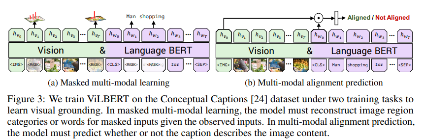

# 多模态系列论文

几种视觉文本多模态的框架。

a. 代表工作VSE

b. 代表工作CLIP

c. 代表工作ViLBERT，对于方法a来说，仅通过cosine相似度的模态交互作用太弱了，采用Transformer Encoder进行模态交互

d. 代表工作ViLT，由于方法a,c中都需要用到预训练的目标检测器，导致视觉部分很大，使得训练和推理很困难。因此通过ViT进行视觉特征抽取，去除掉了目标检测器。

## VSE： Learning the Best Pooling Strategy for Visual Semantic Embedding

- 论文地址：[2011.04305 (arxiv.org)](https://arxiv.org/pdf/2011.04305)
- 代码地址： [woodfrog/vse_infty: Code for "Learning the Best Pooling Strategy for Visual Semantic Embedding", CVPR 2021 (Oral) (github.com)](https://github.com/woodfrog/vse_infty)

 Visual Semantic Embedding(VSE)是跨模态检索中的常见方法。旨在学习一个嵌入空间，具有相同语义的视觉和文本在空间中距离相近。然而现在的VSE方法使用复杂的方法将多模态的信息聚合为整体特征。例：注意力加权，图神经网络，seq2seq。本文发现了使用简单的池化策略进行特征聚合在跨模态检索任务上可以超越复杂模型的性能。池化策略聚合特征具有简单和有效性，但是如何在不同模态的数据上进行聚合特征，本文提出了generalized pooling operator（GPO）自动学习最佳池化策略。

**Feature encoder：** 一个图片使用RCNN提取36个region，每个region是2048维向量，即张量表示为（batch_size, 36, 2048）。使用BERT提取文本表示即（batch_size, tokens,dim）。

**Aggregator：** 将图像的多个region聚合为一个视觉表示。对于文本则是将一句话的多个token聚合为一个文本表示。常见的方法为：注意力，图神经网络。

**Embedding Space：** 在嵌入空间中度量相似性。大部分方法使用余弦相似度进行度量，同时结合三元损失。

**GPO池化策略：**

- 位置编码当做GRU的输入更加侧重于输入的初始化，至于权重的学习，则更加倾向于让模型学出来

**优化目标：** 

使用基于hinge的三元组排序损失进行在线难负样本挖掘优化

- 语言和文本的相似性：$$s_{(\boldsymbol{x},\boldsymbol{t})}=\frac{\boldsymbol{v}^\top\boldsymbol{u}}{\|\boldsymbol{v}\|\cdot\|\boldsymbol{u}\|}$$
- 语言文本匹配损失：$$\begin{aligned}\ell_{\mathrm{MATCH}}&=\sum_{(\boldsymbol{x},\boldsymbol{t})\sim\mathcal{D}}[\alpha-s_{(\boldsymbol{x},\boldsymbol{t})}+s_{(\boldsymbol{x},\hat{\boldsymbol{t}})}]^++[\alpha-s_{(\boldsymbol{x},\boldsymbol{t})}+s_{(\hat{\boldsymbol{x}},\boldsymbol{t})}]^{+}\end{aligned}$$

## CLIP：Learning Transferable Visual Models From Natural Language Supervision

- 论文地址： [Learning Transferable Visual Models From Natural Language Supervision (arxiv.org)](https://arxiv.org/pdf/2103.00020)
- 代码地址： [openai/CLIP: CLIP (Contrastive Language-Image Pretraining), Predict the most relevant text snippet given an image (github.com)](https://github.com/OpenAI/CLIP)

预测结果表示：$$p(\hat{y}=c|I)=\frac{exp(sim(t_i^c,v_i)/\tau)}{\sum_{c'=1}^Cexp(sim(t_i^{c'},v_i)/\tau)}$$

损失函数表示：$$L^{v\to t}=-\frac{1}{N}\sum_{i=1}^{N}\sum_{j=1}^{N}y_{ij}log(p_{ij})$$，$$L=\frac{L^{v\to t}+L^{t\to v}}{2}$$

## ViLBERT：ViLBERT: Pretraining Task-Agnostic Visiolinguistic Representations for Vision-and-Language Tasks

- 论文地址：[1908.02265 (arxiv.org)](https://arxiv.org/pdf/1908.02265)
- 代码地址：[facebookresearch/vilbert-multi-task: Multi Task Vision and Language (github.com)](https://github.com/facebookresearch/vilbert-multi-task)

在这些领域，预训练的模型可以为目标任务提供有用的信息。为此，作者开发一个通用的视觉基础模型，该模型可以学习这些联系并在广泛的视觉和语言任务中运用。类似于 BERT 中的训练任务，训练的两个代理任务上：在给定未屏蔽输入的情况下**预测屏蔽词和图像区域的语义**，以及**预测图像和文本段是否对应**。作者将预训练模型作为四个既定的视觉和语言基础任务（ visual question answering ,visualcommonsense reasoning, referring expressions, caption-based image retrieval）四项任务均达到 SOTA 。

**Image Encoder：** 作者通过**从预训练的目标检测网络中提取边界框及其视觉特征来生成图像区域特征**。与文本中的单词不同，图像区域缺乏自然排序。**作者改为编码空间位置，从区域位置（标准化的左上角和右下角坐标）和覆盖的图像区域的比例构建一个 5 维向量**。然后将其投影以匹配视觉特征的维度并将它们相加。作者用代表整个图像的特殊 *IMG* token 标记图像区域序列的开始。

**Text Encoder：** 使用词嵌入（word embeddings）来表示文本的输入（例如问题、句子或描述）。然后，通过多层 Transformer 对这些词嵌入进行建模，捕捉词汇之间的上下文依赖关系。

**Two-Stream Model：**分别处理视觉和语言信息。这两个流由独立的 Transformer 网络处理，直到某些特定层才会通过跨模态注意力机制（cross-modal attention）将它们的特征进行融合。

**预训练方式1（ masked language modelling）：**标记 Mask 大约为 15% 的单词和图像区域输入，并在给定剩余输入的情况下对模型进行重构。对于标记 Mask 的图像区域的图像特征在 90% 的情况下被归零，10% 的情况下未改变。掩码文本输入的处理方式与 BERT 相同。该模型不是直接回归掩蔽特征值，而是预测相应图像区域的语义类分布。为了对此进行监督，作者从特征提取中使用的相同预训练检测模型中获取该区域的输出分布。作者训练模型以最小化这两个分布之间的 KL 散度。**这个选择反映了这样一种观念，即语言通常只识别视觉内容的高级语义，不太可能重建准确的图像特征**。

**预训练方式2（multi-modal alignment task）:** 模型以图像-文本对的形式呈现，并且预测图像和文本是否对齐，将输出的$h_{IMG}$和$h_{CLS}$作为视觉和语言的整体表示，计算$h_{IMG}$和$h_{CLS}$​之间的元素乘积，并学习一个线性层来进行二值预测。

**预训练损失函数为交叉熵。**

**VQA任务：** VQA 任务需要回答有关图像的自然语言问题。作者对 VQA 2.0 数据集进行训练和评估，该数据集包含 110 万个关于 COCO 图像的问题，每个问题有 10 个答案。为了在 VQA 上fine-tune ViLBERT，作者在图像和文本表示的元素乘积 $h_{IMG}$和$h_{CLS}$​之上学习了一个两层 MLP，将此表示映射到 3,129 个可能的答案。

##  ViLT: Vision-and-Language Transformer Without Convolution or Region Supervision

- 论文地址：[ViLT: Vision-and-Language Transformer Without Convolution or Region Supervision (arxiv.org)](https://arxiv.org/pdf/2102.03334)
- 代码地址：[dandelin/ViLT: Code for the ICML 2021 (long talk) paper: "ViLT: Vision-and-Language Transformer Without Convolution or Region Supervision" (github.com)](https://github.com/dandelin/vilt)

目前的VLP方法在很大程度上依赖于图像特征提取过程（以往大家发现视觉的网络越好，最终的效果也越好），其中大部分涉及区域超视距（如目标检测）和卷积结构（如ResNet）。这两种方法存在效率和表达能力的问题。

- 提取图像特征需要比多模态融合花的时间还要多。
- 用一个预训练好的目标检测器，目前目标检测数据集的类别并不大，检测的类别很有限，并不能涵盖所有范围，所以模型如果不是端到端，仅仅是使用预训练模型去提取特征，那么大概率将不是最优解。

- ViLT是迄今为止最简单的 vision- and-language 模型，除了模态融合用的 Transformer 外就没用其它模型了。
- 在减少计算复杂度的同时，ViLT能够保证在不使用 Region Features 和 CNN 的情况下性能下降很少甚至不降
- 在训练时用了更多的数据增强方式，如在文本部分将整个词 mask 掉，在图像部分使用**图像增强**，使得模型性能得到提高。

**模态融合的方式：** 

- single-stream approaches：只用一个模型。那么怎么解决两个模态的输入呢？最简单的方法就是将两个输入 concat 起来，把两个序列合并成一个序列就可以输入到一个模型去了。
- dual-stream approaches：用两个模型。这两个模型先各自对各自的输入做一些处理，充分挖掘单模态中的信息，然后在后面再做一些融合。

**ViLT使用的是 single-stream**，也就是将两个模态的特征 concat 后传给 Transformer 学习。而 dual-stream 是两个模型，所以需要的参数量更大一些。

**Vision embedding的方法：**

- **Region Feature：** 首先是通过一个 Backbone抽取一些特征，然后通过 FPN 抽取一些 RoI，再通过 NMS 将 RoI 降到一定的数量，然后通过 RoI head 就能得到一些一维的向量，这些就是 Region Feature 了。
- **Grid Feature：** 将图像划分为均匀的网格，为每个网格区域用CNN抽取特征。
- **Patch Projection：**和ViT中相同，将图片划分为patch，将patch展平后输入给一个全连接层

**ViLT的输入部分：**将文本与图像token进行拼接，并且文本和图像都有一个`[CLS]`token用于提示模型哪块属于图像，哪块属于文本。

**ViLT的输出部分：**

- **Image Text Matching（ITM Loss）：** 以0.5的概率随机用不同的图像替换对齐的图像。一个线性层的ITM（Image-Text Matching）头将池化后的输出特征 $$p$$ 投射到二元分类的logits上，并计算负对数似然损失
- **Word Patch Alignment（WPA Loss）：**计算文本特征和图像特征之间的相似度，利用 optimal transport（最优运输理论），可以理解成将文本的输出和图像的输出当成一个概率分布，然后计算这两个分布之间的距离，这里当然也是越小越好。
- **Masked Language Modeling（MLM Loss）：**相当于完形填空，把其中某个单词 mask 掉，再通过模型重建，这是基本所有 NLP 任务中都会用到的。

**ViLT的下游任务微调：**

- **视觉问答任务和视觉推理任务：**Transformer 的 [CLS] token 通常被用作全局图像-文本对的特征表示，通过两层MLP去微调下游任务。
- **图文检索任务：**similarity score head from the pre-trained ITM head，通过sample 15个随机的文本作为负样本和一个匹配的正样本，通过交叉熵损失进行优化。

## ALBEF：Align before Fuse: Vision and Language Representation Learning with Momentum Distillation

- 论文地址：[2107.07651 (arxiv.org)](https://arxiv.org/pdf/2107.07651)
- 代码地址：[salesforce/ALBEF: Code for ALBEF: a new vision-language pre-training method (github.com)](https://github.com/salesforce/ALBEF)

**Motivation:**

- 由于视觉和文本token之间存在较大的差异，像ViLT那样直接融合，会导致效果下降。因此在模态融合之前，通过ITC Loss将图像和文本特征进行Align。
- 去除掉了目标检测器，follow ViLT的那种方法
- 通过momentum distillation的方式改进noisy web data的问题，通过momentum model生成伪标签

**总结以下上述的方法：**

- 使用更大的视觉模型能够获得更好的效果，但是不希望引入目标检测模型
- 模态融合的模型也要尽可能的大
- ITC Loss的效果很好训练很高效， 由于之前的方法中有需要目标检测模型而引入了WPA Loss（计算效率很低）， MLM Loss在NLP和CV中都获得了很好的效果（标配），ITM Loss也具有较好的效果。

**模型的结构：** ALBEF中的图像编码器采用了12层Transformer，文本编码器采用了6层Transformer，模态融合模型也采用了6层Tranformer。

**ITC Loss:** 按照MoCo的实现方式，Momentum队列中的存储了65536个负样本的`[CLS] embedding`，计算交叉熵。

softmax-normalized image-to-text similarity: $$p_m^{\mathrm{i}2\mathrm{t}}(I)=\frac{\exp(s(I,T_m)/\tau)}{\sum_{m=1}^M\exp(s(I,T_m)/\tau)},$$

softmax-normalized text-to-image similarity:$$p_m^{\mathrm{t2i}}(T)=\frac{\exp(s(T,I_m)/\tau)}{\sum_{m=1}^M\exp(s(T,I_m)/\tau)}$$

 The image-text contrastive loss is defined as the cross-entropy H between p and y:

$$\mathcal{L}_{\mathrm{itc}}=\frac{1}{2}\mathbb{E}_{(I,T)\sim D}\big[\mathrm{H}(\boldsymbol{y}^{\mathrm{i2t}}(I),\boldsymbol{p}^{\mathrm{i2t}}(I))+\mathrm{H}(\boldsymbol{y}^{\mathrm{t2i}}(T),\boldsymbol{p}^{\mathrm{t2i}}(T))\big]$$

**ITM Loss:** 模型预测图像和文本配对是否为正样本或负样本。我们使用多模态编码器的 [CLS] 标记的输出嵌入作为图像-文本对的联合表示。但是由于图片与文本的匹配问题较为简单，很多大部分图像-文本对都是负样本，因此，在选负样本的时候去选择最难的负样本，从ITC Loss中的相似度第二高的样本作为负样本。

$$\mathcal{L}_{\mathrm{itm}}=\mathbb{E}_{(I,T)\sim D}\mathrm{H}(\boldsymbol{y}^{\mathrm{itm}},\boldsymbol{p}^{\mathrm{itm}}(I,T))$$​

**MLM Loss:**  借助了图像的信息来帮助文本的复原。

$$\mathcal{L}_{\mathrm{mlm}}=\mathbb{E}_{(I,\hat{T})\sim D}\mathrm{H}(\boldsymbol{y}^\mathrm{msk},\boldsymbol{p}^\mathrm{msk}(I,\hat{T}))$$

**综上，**ALBEF在训练的时候做了两次模型的前向传播，分别是$$ALBEF(I,T)$$和$$ALBEF(I,T^{msk})$$

**动量蒸馏(Momentum Distillation): ** 获取的图像-文本对通常是弱相关的，因此在借此算目标函数的时候会产生偏差，并且做单词完形填空MLM的时候，一个mask可能对应不止一个单词。因此在计算ITC Loss和MLM Loss的时候会引入momentum model的输出的pseudo targets进行训练，由于pseudo target是一个softmax score，因此采用KL散度进行计算。

$$\mathcal{L}_{\mathrm{itc}}^{\mathrm{mod}}=(1-\alpha)\mathcal{L}_{\mathrm{itc}}+\frac{\alpha}{2}\mathbb{E}_{(I,T)\sim D}\big[\mathrm{KL}(\boldsymbol{q}^{\mathrm{i}2\mathrm{t}}(I)\parallel\boldsymbol{p}^{\mathrm{i}2\mathrm{t}}(I))+\mathrm{KL}(\boldsymbol{q}^{\mathrm{t}2\mathrm{i}}(T)\parallel\boldsymbol{p}^{\mathrm{t}2\mathrm{i}}(T))\big]$$​

使用pseudo target的好处：

## VLMO: Unified Vision-Language Pre-Training with Mixture-of-Modality-Experts

**Motivation:**

- CLIP和ALIGN采用双塔模型，模态之间的交互通过cosine相似性，但是这样无法做复杂任务。fusion encoder的方法能够在复杂任务上取得好的效果，但是它在做检索任务的时候计算复杂度很高。因此能够能有一个框架能够结合dual-encoder和fusion encoder的优点。VLMo通过**混合模态专家模型Mixture of Modality Experts**来解决这个问题。
- 多模态的数据集数量不够，但是单模态的数据集有很多。因此VLMo分批次地进行训练，专门在单个模态上训练Vision experts和language experts，而后在一起训练。

**损失函数：** ITC, ITM, MLM， 同时也做了难负样本挖掘

当训练好了VLMo后，可以把模型拆分开来去做图文检索任务，VR，VE，VQA等任务。

self-attention的参数是share weights的，使用了尽可能少的inductive bias，所以Transformer不挑输入的数据，不需要重新训练该部分的参数。

**单模态预训练：**

- image-only data: 通过BEiT这种方式（Mask image modeling）预训练

- Text-Only Data： 通过MLM的方式预训练，只训练Language Experts，冻结住self-attention

**实验结果发现：**采用图像预训练的MSA能够很好地迁移到文本中，但是采用文本预训练MSA迁移到图像中的效果并不好。

