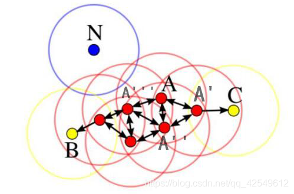
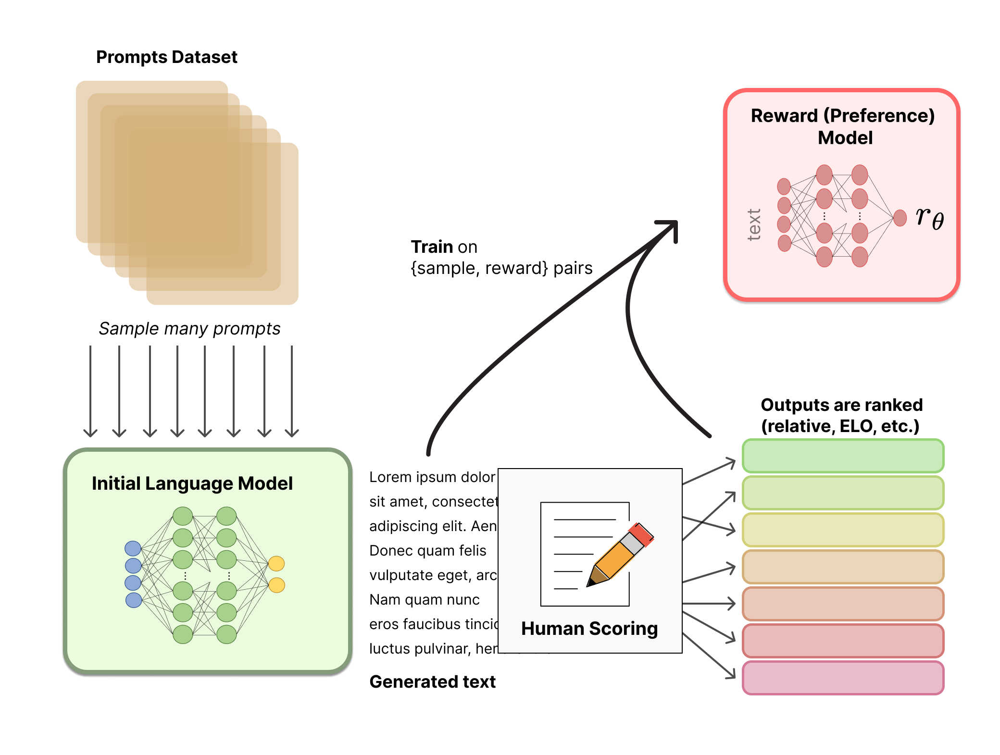
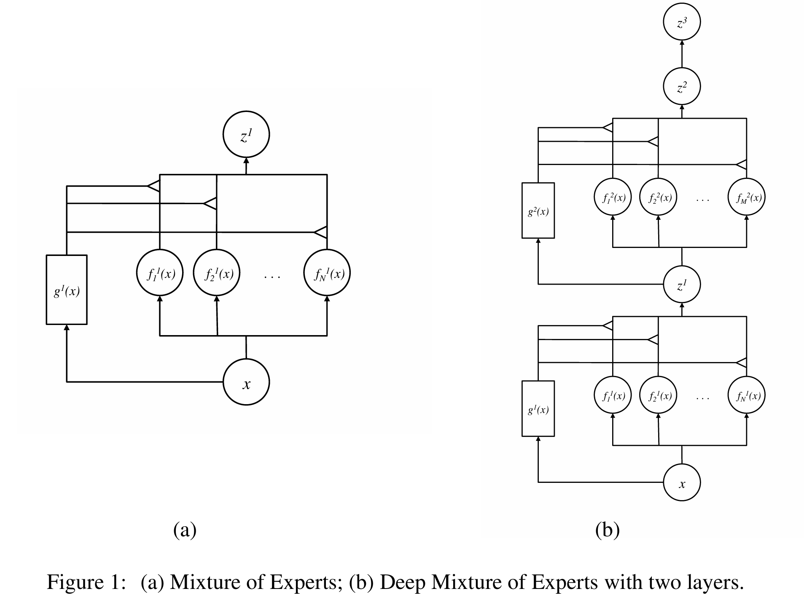
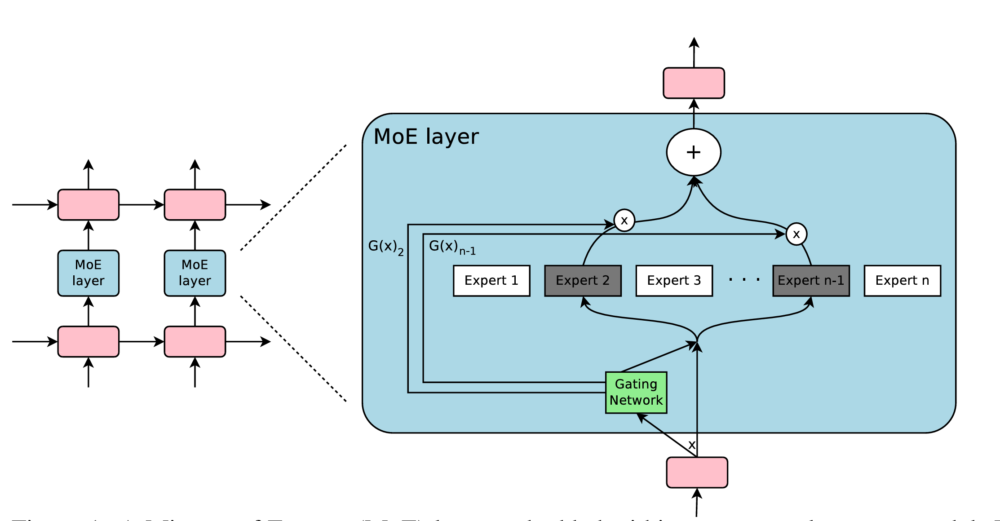
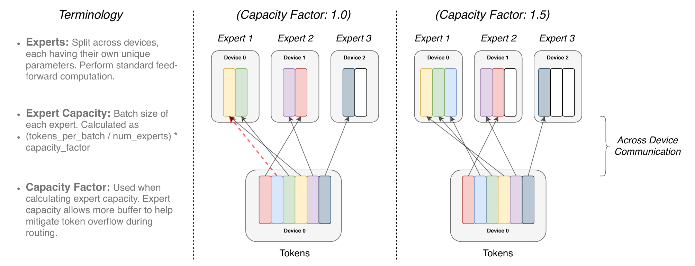
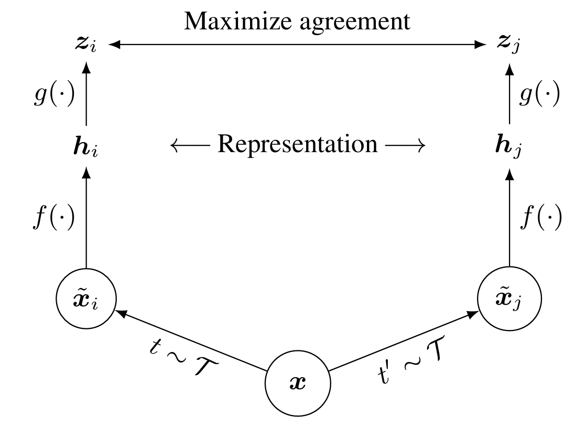
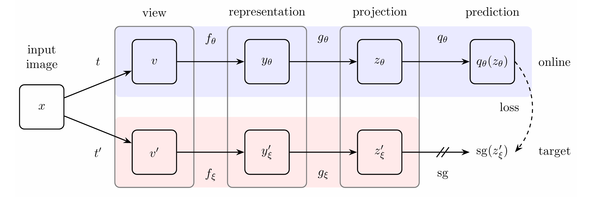
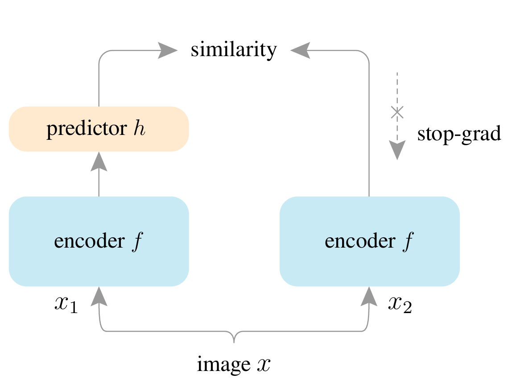
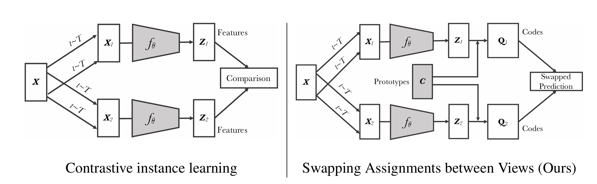

# 目录

- [1.携程推荐算法面试题8道](#1.携程推荐算法面试题8道)
  - 讲一讲推荐系统包含哪些流程？
  - Transformer 位置编码是什么？
  - QKV 注意力公式为什么除以根号 d
  - 简单讲讲 GCN
  - 简单讲讲RNN
  - RNN 里的参数有什么特点？
  - Dropout 是怎么做的？有什么作用？推理和训练时 Dropout 的区别？如果推理也用 dropout 会怎么样？
  - 讲讲 BN？BN 训练和推理什么区别？有什么用？
- [2.趣玩科技推荐算法面试题9道](#2.趣玩科技推荐算法面试题9道)

  - 二分类的分类损失函数？
  - 多分类的分类损失函数(Softmax)？
  - 关于梯度下降的sgdm,adagrad，介绍一下。
  - 为什么不用 MSE 分类用交叉熵？
  - yolov5 相比于之前增加的特性有哪些？
  - 可以介绍一下 attention 机制吗？
  - 关于 attention 机制，三个矩阵 Q,K,V的作用是什么？
  - 介绍一下文本检测 EAST？
  - 编程题(讲思路)：给定两个字符串 s,t，在 s 字符串中找到包含 t 字符串的最小字符串。
- [3.快手推荐算法面试题7道](#3.快手推荐算法面试题7道)

  - 为什么 self-attention 可以堆叠多层，有什么作用？
  - 多头有什么作用？如果想让不同头之间有交互，可以怎么做？
  - 讲一讲多目标优化，MMoE 怎么设计？如果权重为 1,0,0 这样全部集中在某一个专家上该怎么办？
  - 介绍一下神经网络的优化器有哪些。
  - 介绍一下推荐算法的链路流程。
  - 介绍一下神经网络的初始化方法。
  - 讲一讲推荐算法序列建模的模型。
- [4.华为NLP算法面试题9道](#4.华为NLP算法面试题9道)

  -  **NLP中常见的分词方法有哪些？**
  - 讲一下BERT的结构？
  - 自然语言处理有哪些任务？
  - L1，L2正则化的区别，岭回归是L1正则化还是L2正则化？
  - 怎么处理类别不平衡？
  - 模型提速的方法有哪些？
  - 了解数据挖掘的方法嘛？
  - 了解对比学习嘛？
  - 说一下广度优先遍历和深度优先遍历？
- [5.联想算法面试题9道](#5.联想算法面试题9道)

  - 分类问题的交叉熵是什么？
  - 分类问题是否可以用MSE？
  - 推荐系统中，相比于余弦相似度，是否可以用欧几里得距离判断相似度？
  - 过拟合怎么处理？
  - L1、L2正则化的效果、区别、原理？
  - Dropout的原理、在训练和测试时的区别？
  - SGD、Adam、动量优化的SGD？
  - Adam和动量优化的SGD效率上的区别？
  - 推荐系统中，如何进行负采样？
- [6.字节电商CV算法实习岗面试题8道](#6.字节电商CV算法实习岗面试题8道)

  - 如何解决类别极度不平衡的问题？
  - 说下 Transformer 模型
  - 说下 Focal Loss
  - 介绍下深度可分离卷积和传统卷积的区别
  - 如何防止过拟合
  - BN 在训练和测试的时候的区别？可以防止过拟合吗？
  - 什么是 AUC？
  - 卷积核计算公式
- [7.中兴算法面试题5道](#7.中兴算法面试题5道)

  - 介绍一下矩阵分析课程中的内容
  - 介绍一下内积和外积
  - 参数估计时，极大似然和贝叶斯的区别
  -  EM算法的原理
  - CLIP框架
- [8.Cver整理](#8.Cver整理)
  - TensorRT优化的流程
  
  - 介绍YOLOv4-YOLOv8
  
  - 密集行人检测遮挡问题怎么解决
  
  - 为什么U-Net在医学图像上表现好
  
  - 自动驾驶中检测模型如何针对Corner case优化
  
  - 训练网络时怎么判断有没有过拟合、欠拟合
  
  - GBDT和Adaboost的区别
  
  - 神经网络的初始化方法
  
  - DETR中匈牙利匹配算法的具体流程
  
  - 为什么transformer中要用layerNorm
  
  -  为什么self-attention可以堆叠多层，有什么作用
  
  - 介绍常用的聚类算法(KMeans,DBSCAN, Mean shift)
  
  - Canny算子的流程
  
  - NMS的缺点及其改进工作
  
  - 怎么判断连通域是否相邻
  
  - Segmentation和Matting的区别
  
  - 介绍SVM和逻辑回归
  
  - 如何检测未知目标
  
  - 多卡的BN如何实现同步
  
  - 图像边缘检测算子有哪些
  
  - 各种回归损失的计算以及优缺点
  
  - Transformer相比于CNN的优缺点
  
  - LN和BN
  
  - 介绍RLHF
  
  - 介绍MoE和变体
  
  - 介绍LoRA和变体
  
  - LoRA参数更新的机制
  
  - 如何减轻LLM中的幻觉现象
  
  - MLM和MIM的关系和区别
  
  - Stable Diffusion的技术原理
  
  - 解决LLM Hallucination的方法
  
  - Occupancy预测的出发点是什么
  
  - 介绍RWKV，Mamba和Mamba v2
  
  - 2D图像预训练怎么迁移到3D点云任务
  
  -  为什么现在的LLM都是decoder-only架构
  
  -  Transformer训练深有什么问题，怎么解决
  
  - 现在车道线检测的主流的loss是什么?你有哪些想法?
  
  - 如何让 LLM基于 query和 context得到高质量的response
  
  - 为什么GAN中经常遇到mode collapse，而Diffusion比较少?
  
  - 位置编码有哪些？
  
  - ViT为什么要分patch？
  
  - Transformer训练和部署技巧
  
  - 介绍自注意力机制和数学公式
  
  - 介绍Transformer的Encoder模块
  
  - 介绍Transformer的Decoder模块
  - Transformer和Mamba（SSM）的区别
  
  - Transformer中的残差结构以及意义
  
  - 为什么Transformer适合多模态任务？
  
  - Transformer的并行化体现在哪个地方？
  
  - Transformer为什么使用多头注意力机制？
  
  - Transformer训练的Dropout是如何设定的？
  
  - Transformer 模型中的自注意力机制是如何工作的？
- [9.牛客整理](#9.牛客整理)
  -  BERT和GPT的区别，分别的优势
  -  大模型的发展趋势
  -  介绍一下flash attention
  -  介绍一下Group Query Attention
  -  dense特征和sparse特征的区别是什么
  -  mapreduce如何做10亿个数字的全局排序
  -  RNN、LSTM、Transformer的区别
  -  MMOE，PLE框架介绍
  -  LightGBM和XGBoost的区别
  -  XGBoost原理讲解
  -  随机森林如何保证每个树的随机性
  -  MMoE如何保证每个专家的随机性
  -  multi-head attention如何保证每个head的随机性
  -  bagging和boosting的区别
  -  介绍卷积 激活 池化 全连接层含义
  -  什么情况下可以不使用池化层
  -  决策树怎么划分特征
  -  随机森林有两种随机方式 怎么体现
  -  线性模型和非线性模型的优缺点
  -  样本数量小且特征数量多时 使用线性还是非线性模型
  -  离散特征的处理方式
  -  单阶段与二阶段的区别
  -  为什么L1和L2正则化能缓解过拟合的问题
  -  什么时候会用softmax，softmax和sigmoid的区别
  -  介绍一下SGD，ADAM等优化器
  -  常见的多任务模型
  -  介绍一下常用的降维方法
  -  PPO算法的原理
  -  LLM的评测是怎么做的
  -  LLM微调以后模型会出现什么问题，如何改进
  -  BERT与GPT的区别
- [腾讯](#腾讯)
  - 如果有大规模的图数据，并且不断更新，你应该如何做？
  - DeepWalk的弊端？为什么大家现在都不用这种形式了？
  - K-Means和K-Means++的区别？
  - NLP里面数据增强有哪些方法？
  - 讲一下你对 对比学习 的了解。
  - SimCLR里面对比学习的loss是怎么计算的？
  - 树模型：树节点如何分裂？
  - 位置编码
  - 假设王者里面你需要检测送人头的行为。然后已经有一个分析方法是先得到一帧帧的向量，再经过Transformer得到了一些结果。你觉得这个方法还有哪些优化的空间？
  - 目前（CV）最常用（有效）的预训练方法是哪些？
  - 随机森林、GBDT、XGBoost、LightGBM
  - XGBoost为什么效果会好一些
  - XGBoost用了哪些正则化的技术
  - 图模型和Transformer有哪些区别
  - 表格数据怎么做数据增强
  - 过拟合和欠拟合如何处理
  - 样本不均衡的情况如何处理
  - 如何使用BERT做句子分类
  - 大模型了解如何
  - LoRA和P-Tuning有什么不同
  - 为什么P-Tuning在前面加上可学习的token能够有效
  - 王者在哪方面做的比较好
  - 有没有在游戏里面碰到外挂等异常行为
  - 假如某位玩家有开了透视挂，你觉得他有哪些异常行为？我们可以提取哪些特征来做？
  - 边缘分布，联合分布，贝叶斯定理，假设检验
  - 了解哪些统计学习分类模型
  - 聚类如何自动确定簇数
  - 集成学习的boosting和bagging，哪种效果更好

- [#旷视科技](旷视科技)

  - 介绍yolov5
  - CSP用了哪几种池化大小的核
  - VAE的loss是怎么计算的
  - Clip正负样本怎么选择的
  - DDIM为什么可以加速
  - Softmax公式
  - VQGAN有几个损失？作用分别是什么？
  - 样本不够多的处理办法
  - 判断两个矩形相交

- [商汤科技](#商汤科技)

- [招银网络](#招银网络)

  - 生成器和迭代器

  - try，except，else finally，with的作用

  - 浅深拷贝

  -  L1和L2范数正则化

  - 如果5个API需要调用，用什么方法来提升效率

  - 样本不均衡问题解决思路

  - 常见的激活函数以及为什么要用到激活函数

  - B树和B+树了解吗

  - 特征相关性较高会怎样

  - 梯度消失和梯度爆炸，以及解决方法

  - 讲解算法模型（seq2seq）

  - xgboost为何能并行化

    

<h2 id="1.携程推荐算法面试题8道">1.携程推荐算法面试题8道</h2>

###  **问题1：讲一讲推荐系统包含哪些流程？**
推荐系统的流程通常包括以下几个步骤：
- **数据收集**：收集用户行为数据（如浏览记录、购买记录、点击记录等）和物品数据（如物品特征、分类、标签等）。
- **数据预处理**：对数据进行清洗、归一化、特征提取等预处理操作。
- **特征工程**：构建用户画像和物品画像，提取有助于推荐的特征。
- **模型选择**：选择合适的推荐算法，如基于内容的推荐、协同过滤、矩阵分解、深度学习等。
- **模型训练**：使用历史数据训练推荐模型。
- **推荐生成**：根据训练好的模型生成推荐列表。
- **评估与调优**：使用评价指标（如准确率、召回率、F1-score等）评估推荐效果，并进行模型调优。
- **上线与更新**：将推荐系统上线，并定期更新模型和数据。

### 问题2：**Transformer 位置编码是什么？**
Transformer中的位置编码（Positional Encoding）是为了弥补自注意力机制中缺乏顺序信息的缺陷。位置编码有两种常见方式：
- **固定位置编码**：如原始Transformer论文中使用的正弦和余弦函数。每个位置的编码是一个固定的向量，不随训练变化。
- **可训练位置编码**：将位置编码作为可训练的参数，与模型其他参数一起训练。

### 问题3：QKV 注意力公式为什么除以根号 d
除以根号 $\( \sqrt{d_k} \)$ 的原因是为了防止内积值过大导致softmax函数的梯度消失问题。由于Q和K的维度较高，其内积的值会随 $\( d_k \)$ 增加而增大，
从而导致softmax的输出极端化（接近0或1）。除以根号 $\( \sqrt{d_k} \)$ 可以使得内积值的方差接近1，保持梯度稳定。

### 问题4：简单讲讲 GCN
GCN（Graph Convolutional Network，图卷积网络）是一种用于图数据的神经网络。GCN通过在图的节点上进行卷积操作来提取节点的特征。基本的GCN操作步骤包括：

- **邻接矩阵**：用邻接矩阵 \( A \) 表示图结构。
- **节点特征矩阵**：用矩阵 \( X \) 表示节点特征。
- **卷积操作**：将节点特征与邻接矩阵进行卷积。

### 问题5：**简单讲讲RNN**

RNN（Recurrent Neural Network，循环神经网络）是一类用于处理序列数据的神经网络。RNN通过循环结构使得网络可以在序列的每个时间步共享参数，
从而记忆和处理序列中的上下文信息。RNN的基本结构包括：
- **输入层**：接收序列的当前时间步输入。
- **隐藏层**：通过循环连接，将前一时间步的隐藏状态和当前时间步的输入一起处理，生成当前时间步的隐藏状态。
- **输出层**：生成当前时间步的输出。

### 问题6：RNN 里的参数有什么特点？

RNN的参数具有共享性，即在序列的每个时间步使用相同的一组参数。这使得RNN能够有效处理不同长度的序列，并在参数数量固定的情况下学习序列中的时间依赖关系。

### 问题7：Dropout 是怎么做的？有什么作用？推理和训练时 Dropout 的区别？如果推理也用 dropout 会怎么样？

Dropout是一种正则化技术，通过在训练过程中随机丢弃（即设置为零）一部分神经元来防止过拟合。具体步骤为：

1. 在每一层的输出中，以一定的概率 $\( p \)$ 随机丢弃一些神经元。
2. 对保留的神经元进行放大 $( \frac{1}{1-p} \)$ ，以保持总的激活值不变。

作用：通过随机丢弃神经元，减少节点之间的相互依赖，从而提高模型的泛化能力。

推理和训练时 Dropout 的区别
- **训练时**：应用Dropout，即随机丢弃神经元，并对保留的神经元进行放大。
- **推理时**：不应用Dropout，使用完整的网络。

如果推理时也用Dropout，模型的输出将变得不稳定，因为每次推理时网络结构都不同，导致结果不可预测且精度下降。


### 问题8：讲讲 BN？BN 训练和推理什么区别？有什么用？

Batch Normalization（BN）是一种加速深层神经网络训练并提高其稳定性的方法。BN通过对每一层的输入进行标准化，使得输入具有零均值和单位方差，
同时允许网络学习最优的均值和方差。

训练和推理的区别

- **训练时**：使用mini-batch的均值和方差，并更新全局均值和方差的移动平均值。
- **推理时**：使用训练过程中计算的全局均值和方差。

作用

- 减少内部协变量偏移（Internal Covariate Shift）。
- 加快训练速度。
- 提高模型的泛化能力。


<h2 id="2.趣玩科技推荐算法面试题9道">2. 趣玩科技推荐算法面试题9道</h2>

### 问题1： 二分类的分类损失函数？
二分类的分类损失函数一般采用交叉熵（Cross Entropy）损失函数，即 CE 损失函数。二分类问题的 CE 损失函数可以写成： 

$$-y \log(p) - (1 - y) \log(1 - p)$$

其中， $y$ 是真实标签， $p$ 是预测标签，取值为0或1。
    
### 问题2：多分类的分类损失函数(Softmax)？
多分类问题一般采用交叉熵损失函数与Softmax激活函数结合使用。多分类问题的交叉熵损失函数可以写成： 

$$-\sum_{i=1}^{N} y_i \log(p_i)$$

其中， $N$ 是类别的数量， $y_i$ 是第 $i$ 类的真实标签， $p_i$ 是第 $i$ 类的预测概率。

### 问题3：关于梯度下降的sgdm,adagrad，介绍一下。
SGD（Stochastic Gradient Descent）是最基础的梯度下降算法，每次迭代随机选取一个样本计算梯度并更新模型参数。
SGDM（Stochastic Gradient Descent with Momentum）在 SGD 的基础上增加了动量项，可以加速收敛。
Adagrad（Adaptive Gradient）是一种自适应学习率的梯度下降算法，它根据每个参数的梯度历史信息调整学习率，可以更好地适应不同参数的变化范围。

### 问题4：为什么不用 MSE 分类用交叉熵？
MSE （ Mean Squared Error ）损失函数对离群点敏感，而交叉熵（Cross Entropy）损失函数在分类问题中表现更好，
因为它能更好地刻画分类任务中标签概率分布与模型输出概率分布之间的差异。

### 问题5：yolov5 相比于之前增加的特性有哪些？
YOLOv5 相比于之前版本增加了一些特性，包括：使用 CSP（Cross Stage Partial）架构加速模型训练和推理；采用 Swish 激活函数代替 ReLU；
引入多尺度训练和测试，以提高目标检测的精度和召回率；引入 AutoML 技术，自动调整超参数以优化模型性能。

### 问题6：可以介绍一下 attention 机制吗？
Attention 机制是一种用于序列建模的技术，它可以自适应地对序列中的不同部分赋予不同的权重，以实现更好的特征表示。
在 Attention 机制中，通过计算查询向量与一组键值对之间的相似度，来确定每个键值对的权重，最终通过加权平均的方式得到 Attention 向量。

### 问题7：关于 attention 机制，三个矩阵 Q,K,V的作用是什么？
在 Attention 机制中，KQV 是一组与序列中每个元素对应的三个矩阵，其中 K 和 V 分别代表键和值，用于计算对应元素的权重，Q 代表查询向量，
用于确定权重分配的方式。三个矩阵 K、Q、V 在 Attention 机制中的具体作用如下：
- K（Key）矩阵：K 矩阵用于计算每个元素的权重，是一个与输入序列相同大小的矩阵。通过计算查询向量 Q 与每个元素的相似度，
确定每个元素在加权平均中所占的比例。
- Q（Query）向量：Q 向量是用来确定权重分配方式的向量，与输入序列中的每个元素都有一个对应的相似度，可以看作是一个加权的向量。
- V（Value）矩阵：V 矩阵是与输入序列相同大小的矩阵，用于给每个元素赋予一个对应的特征向量。在 Attention 机制中，
加权平均后的向量就是 V 矩阵的加权平均向量。

通过K、Q、V三个矩阵的计算，Attention机制可以自适应地为输入序列中的每个元素分配一个权重，以实现更好的特征表示。

### 问题8：介绍一下文本检测 EAST？
EAST（Efficient and Accurate Scene Text）是一种用于文本检测的神经网络模型。EAST 通过以文本行为单位直接预测文本的位置、方向和尺度，
避免了传统方法中需要多次检测和合并的过程，从而提高了文本检测的速度和精度。EAST 采用了一种新的训练方式，即以真实文本行作为训练样本，
以减少模型对背景噪声的干扰，并在测试阶段通过非极大值抑制（NMS）算法进行文本框的合并。

### 问题9：编程题(讲思路)：给定两个字符串 s,t，在 s 字符串中找到包含 t 字符串的最小字符串。
给定两个字符串 s、t，可以采用滑动窗口的方式在 s 中找到包含 t 的最小子串。具体做法如下：
- 定义两个指针 left 和 right，分别指向滑动窗口的左右边界。
- 先移动 right 指针，扩展滑动窗口，直到包含了 t 中的所有字符。
- 移动 left 指针，缩小滑动窗口，直到无法再包含 t 中的所有字符。
- 记录当前滑动窗口的长度，如果小于之前记录的长度，则更新最小长度和最小子串。
- 重复（2）到（4）步骤，直到 right 指针到达 s 的末尾为止。


<h2 id="3.快手推荐算法面试题7道">3.快手推荐算法面试题7道</h2>

### 问题1：为什么 self-attention 可以堆叠多层，有什么作用？
   Self-attention 能够捕捉输入序列中的长距离依赖关系，通过堆叠多层 self-attention，模型可以学习序列中更深层次的模式和依赖关系。
   多层 self-attention 就像神经网络中的多个隐藏层一样，使模型能够学习和表示更复杂的函数。

### 问题2：多头有什么作用？如果想让不同头之间有交互，可以怎么做？
   多头注意力（Multi-head attention）的设计是为了让模型同时学习到输入序列的不同表示。每个“头”都有自己的参数，可以学习到不同的注意力分布，
   这样可以让模型同时关注不同的特征或信息。至于不同头之间的交互，这通常在所有头的输出被拼接和线性转换之后自然实现。如果你希望在这之前增加交互，
   你可能需要设计新的结构或者机制。

### 问题3：讲一讲多目标优化，MMoE 怎么设计？如果权重为 1,0,0 这样全部集中在某一个专家上该怎么办？
   多目标优化是指优化多个目标函数，通常需要在不同目标间找到一个权衡。多门专家混合网络（MMoE, Multi-gate Mixture-of-Experts）
   是一种处理多目标优化的方法，其中每个目标都由一个专家网络来处理，而门网络则决定每个专家对最终输出的贡献。如果权重全部集中在某一个专家上，
   那么模型的输出就完全由那个专家决定。这可能在某些情况下是合理的，但在大多数情况下，你可能希望各个专家都能对输出有所贡献，
   这需要通过训练和调整权重来实现。

### 问题4：介绍一下神经网络的优化器有哪些。
   常见的神经网络优化器有：
   - 梯度下降（GD）
   - 随机梯度下降（SGD）
   - 带动量的随机梯度下降（Momentum SGD）
   - Adagrad
   - RMSProp
   - Adam
   - Adadelta
   - Nadam 等

### 问题5：介绍一下推荐算法的链路流程。
   推荐系统通常包括以下步骤：
   - 数据收集（用户行为、物品信息等）
   - 特征工程
   - 模型选择和训练
   - 推荐列表生成
   - 排序等

### 问题6：介绍一下神经网络的初始化方法。
   常见的神经网络初始化方法有：
   - 零初始化（所有权重设为 0）
   - 随机初始化（权重随机设定，如高斯初始化或均匀分布初始化）
   - Xavier/Glorot 初始化（权重初始化为均值为 0，方差为 $\( \frac{1}{n} \)$ 的正态分布或均匀分布，其中 $\( n \)$ 为输入神经元的数量）
   - He 初始化（类似于 Xavier，但方差为 $\( \frac{2}{n} \)$，适用于 ReLU 激活函数）

### 问题7：讲一讲推荐算法序列建模的模型。
   推荐算法中的序列建模通常使用序列模型来捕捉用户行为的时间依赖性。常见的序列模型有：
   - RNN（如 LSTM 和 GRU）
   - 序列到序列模型（Seq2Seq）
   - 注意力模型（如 Transformer）
   - 预训练模型（如 BERT、GPT 等）

   这些模型可以处理用户行为序列，学习用户的历史行为对他们未来行为的影响，并据此进行推荐。


<h2 id="4.华为NLP算法面试题9道">4.华为NLP算法面试题9道</h2>

### 问题1. **NLP中常见的分词方法有哪些？**
   **常见的中文分词方法包括基于规则、基于统计和基于深度学习的方法。** 其中，基于规则的方法根据预先定义的规则对文本进行切分；基于统计的方法通过统计某个词
   在语料库中出现的概率来进行分词；基于深度学习的方法则利用深度神经网络模型从大规模语料中学习分词模型。

### 问题2. **讲一下BERT的结构？**
   BERT（Bidirectional Encoder Representations from Transformers）是**一种基于Transformer模型的预训练语言模型。** 其结构由多层
   Transformer编码器组成，其中每层包含多头自注意力机制和前馈神经网络。**BERT还采用了双向训练策略，使得模型能够在不同层次、
   不同粒度下理解输入序列中的上下文信息。**

### 问题3. **自然语言处理有哪些任务？**
   自然语言处理任务包括**文本分类、命名实体识别、情感分析、机器翻译、文本生成、问答系统等。**

### 问题4. **L1，L2正则化的区别，岭回归是L1正则化还是L2正则化？**
   **L1正则化和L2正则化都是用来约束模型的复杂度，以避免过拟合。** L1正则化通过将模型参数的**绝对值之和**作为正则项，使得一些参数变为0，
   从而达到特征选择的目的；L2正则化通过将模型参数的**平方和**作为正则项，使得参数的值都变小，从而使模型更加稳定。岭回归是一种使用L2正则化的线性回归模型。

### 问题5. **怎么处理类别不平衡？**
   **类别不平衡问题可以通过过采样、欠采样、生成新样本、集成学习等方法来解决。** 过采样方法包括随机过采样、SMOTE等；欠采样方法包括随机欠采样、
   TomekLinks等；生成新样本方法包括GAN、VAE等；集成学习方法包括Bagging、Boosting等。

### 问题6. **模型提速的方法有哪些？**
   模型提速的方法包括**模型压缩、剪枝、量化、分布式训练等。** 模型压缩包括权重共享、低秩近似、深度可分离卷积等方法；
   剪枝包括通道剪枝、结构剪枝、权重剪枝等；量化包括权重量化、激活量化等；分布式训练则是利用多个计算节点共同完成模型训练任务，加速训练过程。

### 问题7. **了解数据挖掘的方法嘛？**
   数据挖掘包括**数据预处理、特征工程、模型构建和模型评估等步骤。** 其中，数据预处理包括数据清洗、数据集成、数据变换和数据规约；
   特征工程包括特征提取、特征选择和特征构建；模型构建包括选择合适的模型和模型参数调优；模型评估包括模型效果评估和模型泛化能力评估。

### 问题8. **了解对比学习嘛？**
   **对比学习是一种无监督学习方法，** 通过训练模型使得相同样本的表示更接近，不同样本的表示更远离，从而学习到更好的表示。
   对比学习通常使用对比损失函数，例如Siamese网络、Triplet网络等，用于学习数据之间的相似性和差异性。

### 问题9. **说一下广度优先遍历和深度优先遍历？**
   - **广度优先遍历（BFS）** 是一种图形搜索算法，从起点开始，依次访问与起点相邻的所有节点，再访问与这些节点相邻的所有未访问过的节点，
      直到找到目标节点或者所有节点都被访问。广度优先遍历使用队列来保存访问过的节点。
   - **深度优先遍历（DFS）** 是一种图形搜索算法，从起点开始，一直访问相邻节点，直到达到最深的节点，再返回上一级节点，继续访问其他未访问过的节点，
      直到找到目标节点或者所有节点都被访问。深度优先遍历使用栈来保存访问过的节点。与广度优先遍历相比，深度优先遍历更适用于搜索深度较深的图形。


<h2 id="5.联想算法面试题9道">5.联想算法面试题9道</h2>

### 问题1：分类问题的交叉熵是什么？
   **分类问题的交叉熵（cross-entropy）** 是一种用来衡量分类模型输出与真实标签之间差异的指标。在二分类问题中，交叉熵可以表示为以下公式：
   $$H(p, q) = -\sum_{c=1}^{2} p(c) \log(q(c))$$
   其中， $p$ 表示真实标签， $q$ 表示模型预测的标签， $N$ 表示样本数量。

### 问题2：分类问题是否可以用MSE？
   **分类问题通常不能使用均方误差（MSE）作为损失函数，** 因为分类问题中的标签通常是离散的，而MSE适用于连续变量的回归问题。
   当使用MSE作为损失函数时，模型的输出可能会超过1或小于0，这是因为MSE的计算方式不适用于概率值的范围。

### 问题3：推荐系统中，相比于余弦相似度，是否可以用欧几里得距离判断相似度？
   **在推荐系统中，通常使用余弦相似度来度量用户或物品之间的相似度。** 因为余弦相似度考虑的是向量之间的夹角，而不是向量的长度，
   因此它对于不同大小的向量比较稳健。而欧几里得距离则是考虑向量之间的长度，因此对于不同大小的向量比较敏感。

### 问题4：过拟合怎么处理？
   过拟合是指模型在训练集上表现良好，但在测试集上表现较差的现象。过拟合的常见处理方法包括：
   - **增加数据量**：通过增加训练数据来降低模型对于训练集的过度拟合。
   - **简化模型**：减少模型的参数量，简化模型的结构，降低模型的复杂度。
   - **正则化**：通过在损失函数中添加正则化项，限制模型参数的大小，从而避免模型过度拟合。常见的正则化方法包括L1正则化和L2正则化。

### 问题5：L1、L2正则化的效果、区别、原理？
   **L1正则化和L2正则化都是正则化方法，目的是通过限制模型参数的大小，降低模型的复杂度，防止过拟合。**
   - **L1正则化**： $$\( \text{L1 Regularization} = \lambda \sum |w_i| \)$$ ，会使一部分参数变为0，从而实现特征选择的效果， 适合处理稀疏数据。
   - **L2正则化**： $$\( \text{L2 Regularization} = \lambda \sum w_i^2 \)$$ ，会让所有参数都趋向于较小的值，但不会使参数为0。

### 问题6：Dropout的原理、在训练和测试时的区别？
   **Dropout是一种常用的正则化方法，** 其原理是在每次迭代中随机将一部分神经元的输出置为0，从而减少神经元之间的共适应性，防止过拟合。
   在训练时，Dropout会随机将一定比例的神经元的输出置为0，而在测试时，为了保持网络的稳定性，Dropout通常被关闭。

### 问题7：SGD、Adam、动量优化的SGD？
   **SGD（Stochastic Gradient Descent）是一种基本的梯度下降算法，使用单个样本的梯度来更新模型参数。** 
   **动量优化的SGD（Momentum SGD）** 在SGD的基础上引入了动量，使得更新方向更加平稳，收敛速度更快。
   Adam是一种基于梯度的优化算法，结合了RMSProp和动量优化的思想，
   通过维护一个梯度的指数加权移动平均和梯度平方的指数加权移动平均来自适应地调整每个参数的学习率。

### 问题8：Adam和动量优化的SGD效率上的区别？
   **Adam相对于动量优化的SGD有自适应性、速度快和可靠性高的优点。** Adam能够自适应地调整每个参数的学习率，从而在不同的参数空间下能够更加快速地收敛，
   并且对超参数的选择不太敏感。

### 问题9：推荐系统中，如何进行负采样？
   在推荐系统中，**负采样是一种重要的技术，用于构造负样本，以便训练推荐模型。** 负采样的过程通常包括计算每个物品的权重、根据权重进行采样、
   去除已有的正样本和控制负采样比例等步骤。


<h2 id="6.字节电商CV算法实习岗面试题8道">6.字节电商CV算法实习岗面试题8道</h2>

### 问题1：如何解决类别极度不平衡的问题？
- 在机器学习中，类别不平衡是指数据集中各类样本的数量差异较大，这可能导致模型对多数类过度拟合，而对少数类泛化能力差。


### 问题2：说下 Transformer 模型
- **Transformer 模型** 是一种基于自注意力机制的神经网络架构，广泛应用于序列到序列的任务中。Transformer 本身是一个典型的encoder-decoder模型，
Encoder端和Decoder端均有6个Block， Encoder 端的Block 包括两个模块，多头self-attention模块以及一个前馈神经网络模块；Decoder端的
Block 包括三个模块，多头self-attention模块，多头Encoder-Decoder attention交互模块，以及一个前 馈神经网络模块； 
需要注意：Encoder端和Decoder端中的每个模块都有残差层和LayerNormalization层。

### 问题3：说下 Focal Loss
- **Focal loss 是目标检测中解决正负样本严重不平衡的方法**，在标准交叉熵损失基础上修改得到的。这个函数可以通过减少易分类样本的权重，
使得模型在训练时更专注于稀疏的难分类的样本；防止大量易分类负样本在loss 中占主导地位

### 问题4：介绍下深度可分离卷积和传统卷积的区别
- **深度可分离卷积首先在每个通道上独立进行空间卷积，然后使用 $1 \times 1$ 的卷积来组合通道特征，与传统卷积相比，它大大减少了参数数量和计算量。**
- 传统的卷积是各个通道上采用不同的卷积核，然后不同的卷积核用于提取不同方面的特征。 
- 深度可分离卷积先在各个通道上采用不同的卷积核提取不同的特征，但是这样对于某个通道来说，就只提取了一方面的特征，因此在此基础上加入点卷积，
用1*1的卷积对提取特征后的特征图再次提取不同方面的 特征，最终产生和普通卷积相同的输出特征图。

### 问题5：如何防止过拟合
- 防止过拟合的方法包括：获取更多数据、数据增强、正则化（如L1、L2正则化）、Dropout、Early Stopping等。

### 问题6：BN 在训练和测试的时候的区别？可以防止过拟合吗？
- **Batch Normalization (BN) 在训练时对每个mini-batch的数据进行归一化，而在测试时使用整个训练集的统计量。**
- **BN有助于防止过拟合，因为它使得模型对于输入数据的分布变化更加鲁棒。** BN算法防止过拟合：在网络的训练中，BN的使用使得一个minibatch中所有样本都被关联在了一起，因此网络不会从某一个训练样本中生成确定的结果，即同样一个样本的输出不再仅仅取决于样本的本身，也取 决于跟这个样本同属一个batch的其他样本，而每次网络都是随机取batch，这样就会使得整个网络不会朝这一个方向使劲学习。一定程度上避免了过拟合。

### 问题7：什么是 AUC？
- **AUC（Area Under the Curve）是ROC曲线下的面积，用来衡量分类器的排序能力。** AUC可以解读为从所有正例中随机选取一个样本A，
再从所有负例中随机选取一个样本B，分类器将A判为正例的概率比将B判为正例的概率大的可能性。AUC反映的是分类器对样本的排序能力。
AUC越大，自然排序能力越好，即分类器将越多的正例排在负例之前。

### 问题8：卷积核计算公式
- 卷积层的输出特征图可以通过以下公式计算： 

$$Output = (W - K + 2P) / S + 1$$ 

其中 $W$ 是输入特征图的大小， $K$ 是卷积核的大小， 
$P$ 是padding的大小， $S$ 是步长。
- 如果想保持卷积前后的特征图大小相同，通常会设定padding为：

$$P = \frac{K - 1}{2}$$ 


<h2 id="7.中兴算法面试题5道">7.中兴算法面试题5道</h2>

### 问题1：介绍一下矩阵分析课程中的内容

- 矩阵基础：
  - 矩阵的定义与表示
  - 矩阵运算（加减乘，转置，逆）
  - 特殊类型的矩阵（对角矩阵、单位矩阵、对称矩阵、三角矩阵）
- 行列式与逆矩阵
- 矩阵分解
  - LU分解
  - QR分解
  - Cholesky分解
  - 奇异值分解
  - 特征值分解
- 向量空间与线性变换
  - 基与维数
  - 线性变换及其矩阵表示
  - 正交变换与正交矩阵
- 正交性与投影
  - 内积与范数
  - 向量的正交性与正交基
  - Gram-Schmidt正交化过程

### 问题2： 介绍一下内积和外积

- 内积是向量空间中的一种运算，定义了两个向量之间的“乘积”，从而引入了长度和角度的概念。

​	$<u,v>=\sum_i^nu_iv_i$

- 外积是两个向量的另一种运算，结果是一个矩阵，外积用于表示投影和线性变换

​	$u⊗v=uv^T$​

- 范数适用于测量向量大小或长度的函数，有非负性、齐次性、三角不等性


### 问题3：参数估计时，极大似然和贝叶斯的区别

- 极大似然估计是基于已经观察到的数据，通过选择最可能生成这些数据的参数值来进行估计。具体步骤为：
  - 定义似然函数$L(\theta;X)=P(X|\theta)=\prod_{i=1}^nP(x_i|\theta)$
  - 最大化似然函数来找到参数的估计值$\hat\theta$, $\hat\theta=argmax_{\theta}logL(\theta;X)$
- 贝叶斯估计是基于贝叶斯定理，通过综合先验知识和观察到的数据来进行参数估计。
  - 定义先验分布：选择一个先验分布$P(\theta)$来表达对参数$\theta$的先验知识；
  - 计算后验分布：$P(\theta|x)=\frac{P(x|\theta)P(\theta)}{P(x)}$，其中$P(x)=\int P(x|\theta)P(\theta)d\theta$
  - 参数估计：可以用后验分布的期望值$\hat\theta_{mean}=\int \theta P(\theta|x)d\theta$或者后验分布的最大值作为参数估计值

- **区别：**MLE完全基于数据，不考虑任何先验信息，假设参数值在初始时是等可能的；贝叶斯估计结合先验信息和数据进行估计，先验分布$P(\theta)$起到重要的作用。 MLE给出单点估计，即最可能的参数值；贝叶斯估计给出参数的后验分布，可以提供更加丰富的信息，包括参数的不确定性。MLE只需要最大化对数似然函数，相对简单；贝叶斯估计需要计算后验分布，有时需要复杂的数值积分或采样方法，计算复杂度高；MLE在大样本情况下具有较好的统计性质；贝叶斯估计在小样本情况下先验信息可以显著改善估计效果。


### 问题4： EM算法的原理

EM算法（Expectation-Maximization算法）是一种用于**含有隐变量（或缺失数据）的概率模型的参数估计方法**。它广泛应用于混合模型、隐马尔可夫模型等统计模型中。EM算法通过交替执行期望步骤（E步）和最大化步骤（M步）来迭代地找到模型参数的**最大似然估计**。

假设我们有观测数据 $X$和隐变量$Z$，以及参数向量 $\theta$。EM算法的目标是找到参数 $\theta$ 使得观测数据的似然函数 $P(X;\theta)$最大化。

- 初始化参数$\theta^0$
- 迭代过程：
  - E step: 计算隐变量的条件期望，使用当前参数估计$\theta^t$;$Q(\theta|\theta^t)=E_{Z|X;\theta^t}[logP(X,Z;\theta)]$
  - M step: 最大化条件期望，更新参数估计：$\theta^{t+1}=arg max_{\theta}Q(\theta|\theta^t)$


### 问题5： CLIP算法的框架


<h2 id="8.CVer整理">8.CVer整理</h2>

### 问题1：TensorRT优化的流程

1. [**模型转换**：首先，您需要将预训练的 PyTorch 模型转换为 ONNX 格式。这可以通过两种方案实现：pytorch -> onnx -> engine 或者 pytorch -> wts -> engine](https://blog.csdn.net/weixin_44742084/article/details/126518991)[2](https://blog.csdn.net/weixin_44742084/article/details/126518991).
2. **导入 ONNX 模型**：将 ONNX 模型导入到 TensorRT 中。这一步包括从磁盘加载 ONNX 文件，并将其转换为 TensorRT 网络。
3. **应用优化并生成引擎**：使用 TensorRT 的 builder 对象，根据输入模型、目标平台和其他配置参数，构建优化的 TensorRT 引擎。这个引擎将针对特定硬件进行优化，以提高性能。
4. **执行推理**：最后一步是向 TensorRT 引擎提供输入数据，执行推理并获取输出结果。


### 问题3： 密集行人检测遮挡问题怎么解决

论文：Repulsion Loss: Detecting Pedestrians in a Crowd

链接： https://arxiv.org/abs/1711.07752

思路：使得预测框更加接近所负责的真实目标框，而远离周围的目标。

$L=L_\text{Attr}+\alpha*L_\text{RepGT}+\beta*L_\text{RepBox},\quad(1)$

$L_{\mathrm{Attr}}=\frac{\sum_{P\in\mathcal{P}_+}\mathrm{Smooth}_{L_1}(B^P,G_{Attr}^P)}{|\mathcal{P}_+|}$

$L_{\mathrm{RepGT}}=\frac{\sum_{P\in\mathcal{P}_+}\text{Smooth}_{ln}\left(IoG(B^P,G_{Rep}^P)\right)}{\left|\mathcal{P}_+\right|}$

$\left.\text{Smooth}_{ln}=\left\{\begin{array}{ll}-\ln\left(1-x\right)&x\leq\sigma\\\\\frac{x-\sigma}{1-\sigma}-\ln\left(1-\sigma\right)&x>\sigma\end{array}\right.\right.$

$L_{\mathrm{RepBox}}=\frac{\sum_{i\neq j}\mathrm{Smooth}_{ln}\left(IoU(B^{P_i},B^{P_j})\right)}{\sum_{i\neq j}1[IoU(B^{P_i},B^{P_j})>0]+\epsilon}$


### 问题4：为什么U-Net在医学图像上表现好

U-Net最关键的、也是最特色的部分在于**Skip Connection**。每一次下采样都会有一个跳跃连接与对应的上采样进行级联，这种不同尺度的特征融合对上采样恢复像素大有帮助，具体来说就是高层(浅层)下采样倍数小，特征图具备更加细致的图特征，底层(深层)下采样倍数大，信息经过大量浓缩，空间损失大，但有助于目标区域(分类)判断，当high level和low level的特征进行融合时，分割效果往往会非常好。


### 问题5： 自动驾驶中检测模型如何针对Corner case优化

自动驾驶中coner case的定义

- 传感器级别：硬件原因和外部环境的干扰导致，比如镜头等光学器件的损坏，表面的污迹等造成成像偏差。
- 数据内容级别：
  - 域级： 驾驶环境变换后，激光雷达无法理解不同道路的形状；使用国家变换后，摄像头在不同国家输入的内容让算法产生歧义；毫米波雷达在遇天气环境变化后，比如雨雪，会产生虚检
  - 目标级：激光雷达的点云输入会受灰尘、蚊虫的影响，产生未定义的目标；摄像头的输入出现某种为定义的动物；毫米波雷达的特性可能会导致丢失低速的目标；
  - 场景级：激光雷达的上下文异常,比如停放在人行横道上的清扫车；摄像头输入的内容中，发现一个人离地面很高，实际情况可能是在广告牌上的人；毫米波雷达所检测到的目标太多，实际可能是路上的灌木造成。
- 交通参与者超预期问题

**解决方案：**

- 置信度(Confidence score)：通过神经网络估计不确定coner case的置信的，确定是否是异常情况。

- 重建(Reconstructive):对异常对象进行重建，或者仿真模拟得出异常对象数据，加入模型训练。

- 生成coner case（Generative):对异常对象和数据进行扩充，利用GAN等技术生成扩充的coner case案例。

- 特征抽取coner case(Feature Extraction):利用聚类或者svm等分类算法，对coner case案例进行快速的定位。

- 预测补充coner case(Prediction):利用前后帧之间运动物体不会凭空消失或突变等，进行异常情况的校正回归(陈时中直呼内行)。


### 问题6： 训练网络时怎么判断有没有过拟合、欠拟合

- 过拟合（over-fitting），机器学习模型或者是深度学习模型在训练样本中表现得过于优越，导致在验证数据集以及测试数据集中表现不佳。也就是泛化误差比较大，泛化能力差。
- 欠拟合是指模型不能在训练集上获得足够低的误差，模型复杂度低，模型在训练集上就表现很差，没法学习到数据背后的规律。

看训练集合验证集随着样本数量的增加，他们之间的差值变化。如果训练集和测试集的准确率都很低，那么说明模型欠拟合；如果训练集的准确率接近于1而验证集还相差甚远，说明模型典型的过拟合。


### 问题7： GBDT和Adaboost的区别

各类 Boost 方法是基于树模型的集成模型。

- Adaboost的基本思想是：
  - 通过不断修改样本权重（增大分错样本的权重，降低分对样本的权重），达到自适应调整样本权重的效果。
  - 将弱分类器组合成一个强分类器：加权多数表决（加大分类误差率小的弱分类器的权值，减小分类误差率大的弱分类器的权值）。

- GBDT
  - 采用梯度下降法，每一次迭代都是为了优化当前损失函数，进而在损失函数减少（负梯度，即一阶导数的反方向）的方向上建立一个新的模型。
  - 当损失函数选择为“均方损失”时候，其沿着负梯度方向拟合，实质上就是拟合残差
- XGBoost
  - XGBoost 的 boosting 策略则与 GBDT 类似，均是在新加入的基分类器进一步拟合预测值与真实值之间的差异（不一定是残差），只不过 GBDT 是沿着负梯度的方向进行拟合，只用到了一阶梯度信息，而 **XGBoost 则是对损失函数进行二阶泰勒展开**，相比于 GBDT，其拟合方向更准、速度更快。


### 问题8： 神经网络的初始化方法

- **是否可以将权重初始化为0？**     不可以，如果所有的参数都为0，那么神经元的输出都将会相同，那么在BP的时候同一层的神经元学到的东西相同，gradient相同，weight update也相同。
- **pre-training:** 选择一个已经训练好的在任务A上的模型（称为pre-trained model），将其放在任务B上做模型调整（称为fine-tuning）。

- **随机初始化：**随机初始化的缺点，np.random.randn()其实是一个均值为0，方差为1的高斯分布中采样。当神经网络的层数增多时，会发现越往后面的层的激活函数（使用tanH）的输出值几乎都接近于0。
- **Xavier：**为了解决随机初始化的问题提出来的另一种初始化方法,**适用于 sigmoid 和 tanh 激活函数**，尽可能的让输入和输出服从相同的分布，这样就能够避免后面层的激活函数的输出值趋向于0。但是这种初始化方式对于ReLU激活函数不起作用。公式为$W\sim\mathcal{N}(0,\sqrt{\frac{2}{n_{in}+n_{out}}})$
- **HE:**一种针对ReLU的初始化方法。公式为$W\sim\mathcal{N}(0,\sqrt{\frac{2}{n_{in}}})$​


### 问题9：DETR中匈牙利匹配算法的具体流程

- DETR的核心：目标检测的end-to-end框架，输入的是一张图像，输出的直接是最后的预测标注结果，不再需要后处理（nms非极大值抑制）。因为nms对于模型的调参比较复杂。而且因为不是所有的硬件都支持这nms，所有即使训练好了模型，部署起来也比较困难。

- DETR的训练：
  - 用卷积神经网络抽特征
  - 用Transformer Encoder去学全局特征，帮助后面做检测
  - 用Transformer Decoder调整object query生成100个预测框
  - 用输出的100个object query框和ground truth框做一个匹配，然后在一一配对好的框中去计算目标检测的loss（分类loss与回归loss）
- DETR的推理：其和训练过程的前3步都是一致的，直接在最后的输出上用一个阈值卡一下模型的置信度。然后最后模型置信度高的（置信度大于0.7）预测就会被保留下来。
- DETR的二分图匹配：
  - 规约：
    - 行规约（每一行减去该行最小值）
    - 列规约（每一列减去该列最小值）
  - 试指派
    - 找到含0数目最少的行或列(不妨取行) 随后将该行第一个零置为“T0”,随后将“T0”所在行和列中其他的零置“F0”。依次类推，完成归约矩阵所有行的操作。
    - 用最少的直线来覆盖矩阵中所有的零。

```python
from scipy.optimize import linear_sum_assignment
...
# 匈牙利算法实现二分图匹配
class HungarianMatcher(nn.Module):
    """This class computes an assignment between the targets and the predictions of the network
    For efficiency reasons, the targets don't include the no_object. Because of this, in general,
    there are more predictions than targets. In this case, we do a 1-to-1 matching of the best predictions,
    while the others are un-matched (and thus treated as non-objects).
    """
    def __init__(self, cost_class: float = 1, cost_bbox: float = 1, cost_giou: float = 1):
        """Creates the matcher
        Params:
            cost_class: This is the relative weight of the classification error in the matching cost
            cost_bbox: This is the relative weight of the L1 error of the bounding box coordinates in the matching cost
            cost_giou: This is the relative weight of the giou loss of the bounding box in the matching cost
        """
        super().__init__()
        self.cost_class = cost_class
        self.cost_bbox = cost_bbox
        self.cost_giou = cost_giou
        assert cost_class != 0 or cost_bbox != 0 or cost_giou != 0, "all costs cant be 0"
    @torch.no_grad()
    def forward(self, outputs, targets):
        """ Performs the matching
        Params:
            outputs: This is a dict that contains at least these entries:
                 "pred_logits": Tensor of dim [batch_size, num_queries, num_classes] with the classification logits
                 "pred_boxes": Tensor of dim [batch_size, num_queries, 4] with the predicted box coordinates
            targets: This is a list of targets (len(targets) = batch_size), where each target is a dict containing:
                 "labels": Tensor of dim [num_target_boxes] (where num_target_boxes is the number of ground-truth
                           objects in the target) containing the class labels
                 "boxes": Tensor of dim [num_target_boxes, 4] containing the target box coordinates
        Returns:
            A list of size batch_size, containing tuples of (index_i, index_j) where:
                - index_i is the indices of the selected predictions (in order)
                - index_j is the indices of the corresponding selected targets (in order)
            For each batch element, it holds:
                len(index_i) = len(index_j) = min(num_queries, num_target_boxes)
        """
        bs, num_queries = outputs["pred_logits"].shape[:2]
        # We flatten to compute the cost matrices in a batch
        out_prob = outputs["pred_logits"].flatten(0, 1).softmax(-1)  # [batch_size * num_queries, num_classes]
        out_bbox = outputs["pred_boxes"].flatten(0, 1)  # [batch_size * num_queries, 4]
        # Also concat the target labels and boxes
        tgt_ids = torch.cat([v["labels"] for v in targets])
        tgt_bbox = torch.cat([v["boxes"] for v in targets])
        # Compute the classification cost. Contrary to the loss, we don't use the NLL,
        # but approximate it in 1 - proba[target class].
        # The 1 is a constant that doesn't change the matching, it can be ommitted.
        cost_class = -out_prob[:, tgt_ids]
        # Compute the L1 cost between boxes
        cost_bbox = torch.cdist(out_bbox, tgt_bbox, p=1)
        # Compute the giou cost betwen boxes
        cost_giou = -generalized_box_iou(box_cxcywh_to_xyxy(out_bbox), box_cxcywh_to_xyxy(tgt_bbox))
        # Final cost matrix
        C = self.cost_bbox * cost_bbox + self.cost_class * cost_class + self.cost_giou * cost_giou
        C = C.view(bs, num_queries, -1).cpu()
        sizes = [len(v["boxes"]) for v in targets]
        indices = [linear_sum_assignment(c[i]) for i, c in enumerate(C.split(sizes, -1))]
        return [(torch.as_tensor(i, dtype=torch.int64), torch.as_tensor(j, dtype=torch.int64)) for i, j in indices]
```


### 问题10： 为什么transformer中要用LayerNorm

- 使用LN保留了同一样本内部特征的大小关系，因此更有利于Transformer模型（注意力机制）捕捉全局信息。
- 稳定训练：LayerNorm通过规范化每个样本在层内的特征分布来稳定梯度，这有助于避免梯度消失或爆炸。
- 减少内部协变量偏移：当一个模型的前向传播过程中参数发生变化时，会导致后续层接收到的数据分布变化，即内部协变量偏移。LayerNorm通过在每个层内独立地对数据进行规范化处理，减少了这种影响。


### 问题11： 为什么self-attention可以堆叠多层，有什么作用

- 加深模型表示能力：每一层Self-Attention可以专注于捕获不同级别的抽象特征，从低级的局部关系到高级的全局上下文信息。
- 增强特征交互：每一层Self-Attention都可以根据前一层的结果重新分配注意力权重。注意力机制可以在不同层之间迭代地调整其焦点，从而更好地捕捉到输入序列中的复杂依赖关系。
- 增加模型容量：堆叠更多的Self-Attention层增加了模型的参数数量，这为模型提供了更大的容量去拟合复杂的函数映射。


### 问题12： 介绍常用的聚类算法(KMeans,DBSCAN, Mean shift)

- KMeans：一个数据放进来，需要*指定K值*，来声明要得到簇的个数，通过目标函数进行不断地优化、求解$\mathrm{min\sum_{i=1}^{K}\sum_{{x\in C_{i}}}dist(c_{i},x)^{2}}$

  - 优点：简单
  - 缺点：K值难以确定，初始点影响打，复杂度与样本呈线性相关

- DBSCAN：基于密度的噪声应用空间聚类，变量定义为：

  - 核心对象：若某个点的密度达到算法设定的阈值则其为核心点（即 **r 邻域**内点的数量不小于 **minPts**）
  - ϵ-邻域的距离阈值：设定的半径r
  - 直接密度可达：若某点 p 在点 q 的 r 邻域内，且 q 是核心点则 p − q 直接密度可达
  - 密度相连：若从某核心点 p 出发，点 q 和点 k 都是密度可达的，则称点 q和点 k 是密度相连的
  - 边界点:属于某一个类的非核心点，在往某个方向扩展时，到了没有边界点的地方，就停止了这个方向（即密度不可达）
  - 噪声点：不属于任何一个类簇的点，从任何一个核心点出发都是密度不可达的
  - 优点：不需要指定k，擅长找到离群点
  - 缺点：高维数据处理困难，参数对结果影响很大

  


### 问题13：Canny算子的流程

- 高斯平滑，滤除噪声
- 计算每点的梯度强度$G=\sqrt{G_x^2+G_y^2}$， 和方向$\theta=arc\tan\bigl(G_y/G_x\bigr)$
- 采用非极大值抑制，将当前像素的梯度强度与沿正负梯度方向上的两个像素进行比较，如果当前像素的梯度强度与另外两个像素相比最大，则该像素点保留为边缘点，否则该像素点将被抑制。
- 双阈值检测：存在由于噪声和颜色变化引起的一些边缘像素。从而确定**被抑制的边缘，弱边缘和强边缘**。
- 抑制孤立低阈值点：针对弱边缘，查看周围8邻域有没有强边缘点，有则保留。


### 问题14： NMS的缺点及其改进工作

- NMS的缺点：
  - 硬阈值：标准NMS使用固定的阈值来判断两个框是否重叠太多，这可能导致某些情况下重要物体被错误地抑制掉。
  - 忽略上下文：基本NMS算法仅基于重叠程度和置信度得分来决定保留哪些框，忽略了上下文信息，如物体的形状、大小或背景。
  - 顺序敏感性：NMS通常按照置信度得分排序候选框，然后逐个检查和抑制。
  - 处理密集对象时的局限性：当场景中有大量密集排列的对象时，NMS可能无法正确处理这些情况，因为它倾向于只保留一个框。
  - 效率问题：对于大规模检测任务，NMS可能成为瓶颈，尤其是在处理大量候选框时。
- Soft-NMS：一种软化NMS阈值的方法，它不是简单地删除重叠的边界框，而是降低它们的得分。这样可以避免硬阈值带来的问题，并且更平滑地处理重叠框。
- Weighted-NMS：通过给重叠框加权来合并它们的信息，而不是直接删除其中一个。
- Cluster-NMS：Cluster-NMS采用聚类方法来处理重叠的边界框，将相似的框分组在一起，然后从中选择代表框。


### 问题15： 怎么判断连通域是否相邻

图的深度优先或者广度优先遍历


### 问题16：分割Segmentation和抠图Matting的区别

- 图像分割旨在将图像划分为多个有意义的区域或对象。
- 抠图则是指从图像中精确提取一个对象（通常是前景），并保留其边缘细节。抠图通常涉及估计对象的透明度（alpha matte），以便可以将该对象无缝地放置到新的背景上。抠图的一个关键挑战是处理半透明物体（如头发、烟雾等）的边缘细节。

- 区别：
  - **分割**：输出是一个掩膜，其中每个像素都有一个类别标签。**抠图**：输出是一个alpha matte，通常是一个灰度图像，其中每个像素的值表示该像素的不透明度，范围从0（完全透明）到1（完全不透明）。
  - **分割**：主要关注如何准确地区分不同的物体类别。**抠图**：更注重细节处理，尤其是处理物体边缘的精细结构和半透明效果。


### 问题17： 介绍SVM和逻辑回归

- SVM：支持向量机是一种二分类模型，其基本思想是找到一个决策边界（超平面），使得两类样本尽可能地分开，同时使这个决策边界到最近的样本点的距离最大化。这个距离称为间隔（Margin），最大化间隔可以提高模型的泛化能力。
- 逻辑回归实际上是一种用于解决分类问题的线性模型。它的目标是估计样本属于某一类的概率。逻辑回归模型使用逻辑函数（Sigmoid函数）将线性回归模型的输出转换为概率值。

SVM寻找最大间隔的决策边界，而逻辑回归通过概率估计来确定决策边界。SVM优化间隔，逻辑回归优化对数似然函数。


### 问题18： 如何检测未知目标

- **Autoencoders**：通过训练自动编码器来重建输入图像，那些重建误差较大的样本被认为是异常的。

- **聚类：**使用聚类算法（如K-means、DBSCAN等）对图像中的对象进行分组，未知目标可能会形成单独的聚类或与其他聚类显著不同。
- **开放世界识别：**通过估计每个类别的最大似然估计来调整模型的输出，以识别未知类别。


### 问题19：多卡的BN如何实现同步

在单个GPU上训练时，BN层通常使用该GPU上的mini-batch统计数据来进行归一化。然而，在多GPU或多机器分布式训练场景中，如果每个GPU都独立计算BN统计数据，则会导致不同的BN效果，这可能会降低模型的性能。

同步BN会在每个训练步骤中收集所有GPU上的mini-batch统计数据，并使用这些统计信息来计算全局平均值和方差。

在PyTorch中，可以通过`torch.nn.SyncBatchNorm`模块来轻松实现同步BN。


### 问题20： 图像边缘检测算子有哪些

- Sobel算子：包括两个3×3的卷积核，一个用于检测水平边缘，另一个用于检测垂直边缘。

  - 水平梯度$\begin{bmatrix}-1&0&+1\\-2&0&+2\\-1&0&+1\end{bmatrix}$

  - 垂直梯度$\begin{bmatrix}-1&-2&-1\\0&0&0\\+1&+2&+1\end{bmatrix}$

- Prewitt算子：Prewitt算子与Sobel算子类似，但使用稍微不同的3×3卷积核。

  - 水平梯度$\begin{bmatrix}-1&0&+1\\-1&0&+1\\-1&0&+1\end{bmatrix}$

  - 垂直梯度$\begin{bmatrix}-1&-1&-1\\0&0&0\\+1&+1&+1\end{bmatrix}$

- Roberts算子：Roberts算子使用2×2的卷积核来检测图像中的边缘。
  - 水平梯度：$\begin{bmatrix}0&+1\\-1&0\end{bmatrix}$
  - 垂直梯度：$\begin{bmatrix}+1&0\\0&-1\end{bmatrix}$
- 拉普拉斯算子：用于检测图像中强度的局部极值。
  -  $\begin{bmatrix}0&-1&0\\-1&4&-1\\0&-1&0\end{bmatrix}$​


### 问题21： 各种回归损失的计算以及优缺点

- 均方误差：MSE是最常用的回归损失函数之一，它计算预测值与真实值之间的平方差的均值。$\mathrm{MSE}=\frac{1}{n}\sum_{i=1}^{n}(y_{i}-\hat{y}_{i})^{2}$
  - 优点：简单直观，容易理解和实现。梯度平滑，便于优化。
  - 缺点：对异常值（outliers）非常敏感，因为平方项会放大误差。
- 均方根误差：RMSE是MSE的平方根，它将MSE的单位恢复为原始输出的单位。
  - 优点：与MSE相比，RMSE更容易解释，因为它与输出值在同一尺度上。
  - 缺点：对异常值敏感
- 平均绝对误差MAE：$\mathrm{MAE}=\frac{1}{n}\sum_{i=1}^{n}|y_{i}-\hat{y}_{i}|$
  - 优点：不像MSE那样受异常值的影响大。更能反映实际预测误差。
  - 缺点：梯度不平滑（在0处不可导），这可能会使优化过程更加困难。当误差较大时，MAE不如MSE敏感，可能无法充分反映预测误差的重要性。
- Huber损失（Smooth  L1 Loss）：$\begin{aligned}&\text{Huber Loss}=\begin{cases}\frac12(y_i-\hat{y}_i)^2&\mathrm{if~}|y_i-\hat{y}_i|<\delta\\\delta(|y_i-\hat{y}_i|-\frac12\delta)&\mathrm{otherwise}&\end{cases}\end{aligned}$
  - 优点：对异常值的鲁棒性较好。梯度平滑，便于优化。
  - 缺点：需要调整超参数δ，以平衡对异常值的敏感性和鲁棒性。


### 问题22： Transformer相比于CNN的优缺点

- Transformer优点：
  1. **全局信息关系建模：** Transformer 通过自注意力机制（self-attention）能够捕捉输入序列中各个位置之间的依赖关系，能够更好地建模长距离依赖关系。
  2. **可并行性：** Transformer 模型中的自注意力层可以并行计算，使得在某种程度上更容易实现并行化处理，因此在一定情况下速度可能更快。
  3. **适用于序列任务：** 原本设计用于处理序列数据（如自然语言处理任务），在某些图像任务中也能够应用，特别是对于具有空间关系的图像数据。
- Transformer缺点：
  1. **计算和内存消耗大**： Transformer 模型的自注意力机制需要大量的计算资源和内存，对于大规模的图像数据，可能需要巨大的模型和计算能力，使得其在实际应用中可能受到限制。
  2. **特征提取能力相对较弱：** 对于基于图像像素级别的特征提取，Transformer 相对传统的[卷积神经网络](https://so.csdn.net/so/search?q=卷积神经网络&spm=1001.2101.3001.7020)可能效果不如。


### 问题23： LN和BN

- 动机：对数据做归一化处理——也就是对数据以某个角度或者层面做0均值1方差的处理。独立同分布的数据可以简化模型的训练以及提升模型的预测能力。内部量偏移：每一层的参数更新都会导致上层的输入数据在输出时分布规律发生了变化，并且这个差异会随着网络深度增大而增大。
- 原理：BN把每层神经网络任意神经元这个输入值的分布强行拉回到均值为0方差为1的标准正态分布，其实就是把越来越偏的分布强制拉回比较标准的分布。这样让梯度变大，避免梯度消失问题产生，而且梯度变大意味着学习收敛速度快，能大大加快训练速度。经过BN后，目前大部分Activation的值落入非线性函数的线性区内，其对应的导数远离导数饱和区，这样来加速训练收敛过程。
- BN与LN的不同
  1. BN针对的是同一个batch内的所有数据，而LN则是针对单个样本。
  2. BN是对同一batch内的数据的同一纬度做归一化，因此有多少维度就有多少个均值和方差；而LN则是对单个样本的所有维度来做归一化，因此一个batch中就有batch_size个均值和方差。
  3. 因此，BN对batch比较敏感，batch_size不能太小；LN则是独立于batch_size的
- BN的优点：加快神经网络的训练时间。容忍更高的学习率（learning rate）和初始化权重更容易。可以支持更多的损失函数。BN在一定的程度上起到了dropout的作用。
- BN的缺点：BN对于batch_size的大小还是比较敏感的，batch_size很小的时候，其梯度不够稳定；BN对于序列网络，RNN、lstm等模型的效果并不好。
- LN的优点：LN能够很好的应用在RNN、lstm等类似的网络上；对batch_size的大小并不敏感。
- Transformer中为什么不用BN：
  1. LN是针对每一句话做归一化处理，没有破坏一句话内在语义的联系；
  2. layer normalization 有助于得到一个球体空间中符合0均值1方差高斯分布的 embedding
  3. layer normalization可以对transformer学习过程中由于多词条embedding累加可能带来的“尺度”问题施加约束，相当于对表达每个词一词多义的空间施加了约束，有效降低模型方差。


### 问题24：介绍RLHF

1. 预训练一个语言模型 (LM) ；
2. 聚合问答数据并训练一个奖励模型 (Reward Model，RM) ；
3. 用强化学习 (RL) 方式微调 LM。

- **预训练语言模型：**OpenAI 在其第一个流行的 RLHF 模型 [InstructGPT](https://openai.com/blog/instruction-following/) 中使用了较小版本的 GPT-3; Anthropic 使用了 1000 万 ～ 520 亿参数的 Transformer 模型进行训练；DeepMind 使用了自家的 2800 亿参数模型 [Gopher](https://arxiv.org/abs/2112.11446)。

- **训练奖励模型：**

  - RM 的训练是 RLHF 区别于旧范式的开端。这一模型**接收一系列文本并返回一个标量奖励**，数值上对应人的偏好。
  - RM 可以是另一个经过微调的 LM，也可以是根据偏好数据从头开始训练的 LM。
  - RM 的提示 - 生成对文本是从预定义数据集中采样生成的，并用初始的 LM 给这些提示生成文本。
  - 关于训练奖励数值方面，这里需要**人工对 LM 生成的回答进行排名**。起初我们可能会认为应该直接对文本标注分数来训练 RM，但是由于标注者的价值观不同导致这些分数未经过校准并且充满噪音。通过排名可以比较多个模型的输出并构建更好的规范数据集。
  - 具体的排名方式，一种成功的方式是对不同 LM 在相同提示下的输出进行比较，然后使用 [Elo](https://en.wikipedia.org/wiki/Elo_rating_system) 系统建立一个完整的排名。
  - 偏好模型和生成模型需要具有类似的能力来理解提供给它们的文本。

  

- **用强化学习微调：**

  使用策略梯度强化学习 (Policy Gradient RL) 算法、近端策略优化 (Proximal Policy Optimization，PPO) 微调初始 LM 的部分或全部参数。首先，该 **策略** (policy) 是一个接受提示并返回一系列文本 (或文本的概率分布) 的 LM。这个策略的 **行动空间** (action space) 是 LM 的词表对应的所有词元 (一般在 50k 数量级) ，**观察空间** (observation space) 是可能的输入词元序列，也比较大 (词汇量 ^ 输入标记的数量) 。**奖励函数** 是偏好模型和策略转变约束 (Policy shift constraint) 的结合。

  PPO 算法确定的奖励函数具体计算如下：将提示 *x* 输入初始 LM 和当前微调的 LM，分别得到了输出文本 *y1*, *y2*，将来自当前策略的文本传递给 RM 得到一个标量的奖励 $r_\theta$。将两个模型的生成文本进行比较计算差异的惩罚项，该惩罚项为输出词分布序列之间的 Kullback–Leibler [(KL) divergence](https://en.wikipedia.org/wiki/Kullback–Leibler_divergence) 散度的缩放，即$r=r_\theta -λr_{KL}$。

  

  

### 问题25：介绍MoE和变体

MoE被应用在神经网络中，用来实现在推理时，只有部分神经网络需要进行计算，而被选择进行计算的部分则根据输入决定。

- [Learning Factored Representations in a Deep Mixture of Experts](https://arxiv.org/pdf/1312.4314)

这篇文章提出一种新方法，可以在神经网络的每一层之上平行地拓展多个experts，每个expert有其各自的权重矩阵（结构一致，数值不同），然后由一个gating network为多个experts分配权重。相比于传统的MoE方法，把每个模型视为一个expert，这篇文章认为每一层都是一个expert。

为了解决模型的gating network只路由到某个expert，而导致其他expert无法得到训练的问题，文章设置了一个threshold，在训练过程中，**当单个模型被选中的概率过高时，就会强制使用别的expert**，从而保证所有expert都能得到训练，可以说是一种非常强硬（hard）的策略。



- [**Sparsely-gated MoE layer**](https://arxiv.org/pdf/1701.06538)

谷歌团队真正意义上将MoE应用到超大参数规模模型之上（本工作中，最大的模型参数量达到137B）。与DMoE不同，在本工作中，Gating Network返回的权重不再分配到所有Expert，而是**只分配到权重最高的k个Expert**，文章中k=4，这一特性使得MoE真正实现了模型的**Conditional Computing**，也就是根据输入内容，决定模型的哪一部分进行计算，而其他部分都不需要计算，从而**在极大增加模型规模的情况下，维持住计算成本**。

将MoE应用到大规模模型场景不但是算法问题，更是一个工程问题。将这些模型分配给多个机器实现并行训练，保证机器间高效的通信（由于使用gating function进行路由，可能需要将数据传输到别的机器的Expert上计算），**保证每个Expert的Load Balance**（防止一个Batch内的数据都传给了特定几个Expert，导致大部分机器空转），这些都需要克服工程上大量的问题。

**Noisy Top-K Gating: **除了使用权重最高的K个Expert，当k不等于1时，可以使用back propogation直接训练gating network。**Noise Term则用于实现Load Balance**，为Expert的分配增加随机性。

**Balancing Expert Utilization：**除了上面提到的Noisy Gating Network，作者还设计了两个loss，在训练过程中实现Load Balance。这个loss作用在一个batch X之上，Importance是不同的Experts在这个batch中被分配到的权重之和，反映了有多少流量被导入给特定的Expert。**r**，鼓励Gating Network将权重平均分配给所有experts。

$$Importance(X)=\sum_{x\in X}G(x)\\L_{importance}(X)=w_{importance}\cdot CV(Importinice(X))^2$$



- [**Switch Transformers**](https://arxiv.org/pdf/2101.03961)

以T5模型作为模版，将T5模型中的feed forward network（FFN）更换成MoE架构，将模型的参数量大幅度提升，最高甚至达到1571B。

Switch Transformer的MoE架构和上文并无太大区别，唯一差异在于Switch Transformer**只为每个Token分配一个Expert而不是多个**。FFN最后的输出将会乘上分配到该Expert的权重p，使得Gating Network可以用BP直接训练。

另一个区别在于为Load Balance而设计的loss，使用了$\begin{aligned}\text{loss}&=\alpha\cdot N\cdot\sum_{i=1}^Nf_i\cdot P_i\end{aligned}$，当$f_i= p_i= 1/N$​的时候损失是最小的。

$f_i=\frac{1}{T}\sum_{x\in\mathcal{B}}\mathbb{1}\{\text{argmax }p(x)=i\}$，$P_i=\frac{1}{T}\sum_{x\in\mathcal{B}}p_i(x).$

$f_i$是分派给专家i的令牌的分数，$p_i$是分配给专家i的路由器概率的分数。


文章另外还提出了Capacity Factor的概念。由于Expert会各自分配给独立的机器，每次将一个Batch内的Token分配给不同的Expert时，我们会**希望每个Expert拿到均分的Token，这样最大限度地发挥机器算力**。不过在实际计算过程中，是没法保证Tokens能被平均地分配给Expert的，这时会有超出平均的Token被分配到某些Expert上。文章中提出可以为每个Expert分配一个Buffer，这个Buffer的大小等于平均分配到每个Expert的Token数乘上Capacity Factor，即**允许Expert接受额外的Token，而如果Buffer溢出，则直接将这个Token丢弃**，相当于这个Token直接跳过该FFN层的计算。



- [**ST-MoE**](https://arxiv.org/pdf/2202.08906)

目的是为了解决MoE模型的两个问题：

1. MoE模型训练过程中存在不稳定的问题，在一些训练过程中（某些随机种子），模型的Loss会在中途飙升导致训练失败。
2. MoE模型虽然在pre-train上表现良好（语言模型的perplexity能超越稠密模型），但是在一些fine-tune的具体任务上表现不佳，与其pre-train上的优异表现不匹配。

**router z loss 用于解决训练不稳定的问题**， $L_z(x)=\frac1B\sum_{i=1}^B\left(\log\sum_{j=1}^Ne^{x_j^{(i)}}\right)$​。这个z-loss作用在router network返回的logits上。其中B是一个Tokens Batch， 则是返回的logit。**这个loss从整体上约束logits的scale，要求logits在绝对值上尽可能地小**。这个loss的出发点是**当使用bfloat16进行混合精度计算时，如果数值的scale很大，那么会带来很大的误差**，这个误差会进一步被softmax的exponential运算放大，因此如果约束这个scale，那么因精度而带来的误差就会减少。

**解决fine-tune不佳的问题：**只更新模型部分参数；使用与Fine-tune Dense模型不一样的超参数。


### 问题26：介绍LoRA和变体

LoRA的基本原理是冻结预训练好的模型权重参数，然后在冻结的模型基础上加入额外的[网络](https://cloud.baidu.com/product/et.html)层。这些新增的网络层只包含少量的参数，因此训练这些参数的成本较低。同时，由于LoRA采用低秩分解来模拟参数更新量，可以在不引入额外推理延迟的情况下实现与全模型微调类似的效果。

1. 在原模型旁边增加一个旁路，通过低秩分解来模拟参数的更新量。低秩分解通常包括降维和升维两个步骤，分别由降维矩阵A和升维矩阵B表示。
2. 在训练过程中，原模型的参数保持固定，只训练降维矩阵A和升维矩阵B。这样可以显著减少训练成本，同时保持模型的性能。
3. 在推理时，将降维矩阵A和升维矩阵B的乘积BA加到原模型的参数上，以模拟参数的更新。这样做不会引入额外的推理延迟，保持了模型的实时性。
4. 在初始化时，降维矩阵A采用高斯分布进行初始化，升维矩阵B初始化为全0，以确保训练开始时旁路为0矩阵。


### 问题27： LoRA参数更新的机制


### 问题28： 如何减轻LLM中的幻觉现象


### 问题29： MLM和MIM的关系和区别


### 问题30： Stable Diffusion的技术原理


### 问题31： 解决LLM Hallucination的方法


### 问题32： Occupancy预测的出发点是什么


### 问题33： 介绍RWKV，Mamba和Mamba v2


### 问题34： 2D图像预训练怎么迁移到3D点云任务


### 问题35： 为什么现在的LLM都是decoder-only架构


### 问题36： Transformer训练深有什么问题，怎么解决


### 问题37： 现在车道线检测的主流的loss是什么?你有哪些想法?


### 问题38： 如何让 LLM基于 query和 context得到高质量的response


### 问题39： 为什么GAN中经常遇到mode collapse，而Diffusion比较少?


### 问题40： 位置编码有哪些？


### 问题41： **ViT为什么要分patch？**


### 问题42： **Transformer训练和部署技巧**


### 问题43： **介绍自注意力机制和数学公式**


### 问题44： **介绍Transformer的Encoder模块**


### 问题45： **介绍Transformer的Decoder模块**


### 问题46： **Transformer和Mamba（SSM）的区别**


### 问题47： **Transformer中的残差结构以及意义**


### 问题48： **为什么Transformer适合多模态任务？**


### 问题49： **Transformer的并行化体现在哪个地方？**


### 问题50： **Transformer为什么使用多头注意力机制？**


### 问题51： **Transformer训练的Dropout是如何设定的？**


### 问题52： **Transformer 模型中的自注意力机制是如何工作的？**


<h2 id="9.牛客整理">9.牛客整理</h2>

### 问题1： BERT和GPT的区别，分别的优势


### 问题2： 大模型的发展趋势


### 问题3： 介绍一下flash attention


### 问题4： 介绍一下group query attention


### 问题5： dense特征和sparse特征的区别是什么


### 问题6： mapreduce如何做10亿个数字的全局排序


### 问题7： RNN、LSTM、Transformer的区别


### 问题8：MMOE，PLE框架介绍


### 问题9： LightGBM和XGBoost的区别


### 问题10： XGBoost原理讲解


### 问题11： 随机森林如何保证每个树的随机性


### 问题12： MMoE如何保证每个专家的随机性


### 问题13： multi-head attention如何保证每个head的随机性


### 问题14： bagging和boosting的区别


### 问题15： 介绍卷积 激活 池化 全连接层含义


### 问题16： 什么情况下可以不使用池化层


### 问题17： 决策树怎么划分特征


### 问题18： 随机森林有两种随机方式 怎么体现


### 问题19： 线性模型和非线性模型的优缺点


### 问题20： 样本数量小且特征数量多时 使用线性还是非线性模型


### 问题21： 离散特征的处理方式


### 问题22： 单阶段、二阶段目标检测的区别


### 问题23：为什么L1和L2正则化能缓解过拟合的问题

- L1正则化：L1正则化通过在损失函数中添加所有权重的绝对值之和来惩罚模型的复杂度。这种惩罚会导致一些权重值变为零，从而产生稀疏的权重矩阵。
  - L1正则化倾向于产生稀疏权重矩阵，这意味着很多权重会被精确地设为0。
  - 通过使不重要的特征的权重为0，L1正则化实际上执行了一种特征选择。
  - 由于L1正则化导致一些权重为0，实际上减少了模型的有效参数数量。
- L2正则化：L2正则化通过在损失函数中添加所有权重的平方和来惩罚模型的复杂度。这种惩罚会导致权重值变小，但不会像L1那样产生稀疏性。
  - L2正则化使得权重值变得更加平滑，减少了权重的极端值。
  - L2正则化通过减小权重的大小来降低模型复杂度。有助于模型在面对噪声数据时更加稳健，避免了模型对噪声数据的过度拟合。


### 问题24：什么时候会用softmax，softmax和sigmoid的区别


### 问题25： 介绍一下SGD，ADAM等优化器

- 随机梯度下降（SGD）：随机梯度下降是一种简单的优化算法，用于寻找损失函数的最小值。在传统的梯度下降中，每次迭代都需要计算整个训练集的梯度来更新模型参数，这在大数据集上效率较低。而SGD则是每次只用**一个样本或者一小批样本（Mini-batch SGD）来估计梯度**，这样可以显著加快训练速度，但也可能引入更多的噪音。$w^{(t+1)}=w^{(t)}-\eta\cdot\nabla J(w^{(t)},x_i,y_i)$
- Momentum优化器：Momentum 是一种优化算法，它通过在梯度方向上添加一个动量项来加速梯度下降的过程。动量项可以帮助优化器更快地穿过平坦的区域，并且可以减少在训练过程中的振荡。动量为：$v_t=\beta v_{t-1}+\eta\nabla J(w^{(t)},x_i,y_i)$
- RMSprop优化器：通过维护一个滑动平均的梯度平方来**调整学习率**。这种方法有助于在平坦区域保持稳定的学习率，并且可以避免学习率在陡峭区域变得过大。$s_t=\gamma s_{t-1}+(1-\gamma)(\nabla J(w^{(t)},x_i,y_i))^2$
- Adam优化器：Adam (Adaptive Moment Estimation) 是一种自适应学习率的优化算法，它结合了Momentum和RMSprop的优点。Adam不仅利用了**梯度的一阶矩估计（动量）**，还利用了梯度的**二阶矩估计（梯度的平方的均值）来动态调整学习率**。


### 问题26：常见的多任务模型


### 问题27：介绍一下常用的降维方法


### 问题28： PPO算法的原理


### 问题29： LLM的评测是怎么做的


### 问题30：LLM微调以后会出现什么问题？如何改进？


### 问题31：BERT与GPT的区别


## 腾讯

### 问题1： 如果有大规模的图数据，并且不断更新，你应该如何做？

处理大规模并不断更新的图数据需要综合使用数据存储、数据处理和机器学习技术。

1. **数据存储：**使用Hadoop HDFS、Amazon S3等分布式文件系统来存储大规模图数据。
2. **数据处理：**对图数据进行清洗、去重和特征工程，以提高后续处理和分析的效率。


### 问题2：DeepWalk的弊端？为什么大家现在都不用这种形式了？

**什么是随机游走：**首先选择一个点，然后随机选择它的邻接节点，移动一步之后，再次选择移动后所在节点的邻接节点进行移动，重复这个过程。记录经过的节点，就构成了一个随机游走序列。

**为什么要随机游走：**一个网络图实际上可能是非常庞大的，通过无穷次采样的随机游走（实际上不可能无穷次），就可以”管中窥豹，可见一斑“。从无数个局部信息捕捉到整张图的信息。

**Skip Gram：**给定一个词，预测该词的上下文，通常窗口为3，也就是预测前后的两个词

DeepWalk 是一种将图数据嵌入到低维空间的方法，通过随机游走和Skip-gram模型学习节点的向量表示。

- **DeepWalk只能处理静态图**，即图的结构在训练过程中不发生变化。然而，现实世界中的许多图是动态的，节点和边会随时间变化。
- DeepWalk主要依赖局部的随机游走，虽然能捕捉局部结构信息，但**对全局图结构的理解较弱**。
- DeepWalk**在大型图上的计算开销较大**，尤其是在需要进行大量随机游走和训练Skip-gram模型时。


### 问题3： K-Means和K-Means++的区别？

K-Means++改进的地方在于，只有第一个聚类中心是随机产生的，其他的k-1个初始聚类中心是从剩下的n-1个点中选出的。设计一个机制，**使得距离所有簇中心越远的点被选中的概率越大，离得越近被随机到的概率越小**。


### 问题4：NLP里面数据增强有哪些方法？

- Paraphrasing：对句子中的词、短语、句子结构做一些更改，保留原始的语义
  - Thesaurus：利用词典、知识图谱等外部数据，随机将非停用词**替换成同义词或上位词**，如果增加多样性的话还可以替换成相同词性的其他词
  - Semantic Embeddings：**利用语义向量，将词或短语替换成相近的**（不一定是同义词）。由于每个词都有语义表示，可替换的范围更大。而上一种方法只能替换图谱里的
  - MLMs：**利用BERT等模型，随机mask掉一些成分后生成新的**
  - Rules：利用一些规则，例如缩写、动词变位、否定等，对句子一些成分进行改写，比如把 **is not 变成 isn't**
  - Machine Translation：分为两种，Back-translation指**把句子翻译成其他语言再翻译回来**，Unidirectional Translation指在跨语言任务中，把句子翻译成其他语言
  - Model Generation：**利用Seq2Seq模型生成语义一致的句子**

- Noising：在保证label不变的同时，增加一些离散或连续的噪声，对语义的影响不大
  - Swapping：**除了交换词之外**，在分类任务中也可以交换instance或者sentence
  - Deletion：可以根据tf-idf等词的重要程度进行删除
  - Insertion：可以把同义词随机插入句子中
  - Substitution：把一些词随机替换成其他词（非同义），模拟misspelling的场景。为了避免改变label，可以使用label-independent的词，或者利用训练数据中的其他句子
  - Mixup：这个方法最近两年比较火，**把句子表示和标签分别以一定权重融合**，引入连续噪声，可以生成不同label之间的数据，但可解释性较差

- Sampling：旨在根据目前的数据分布选取新的样本，会生成更多样的数据
  - Rules：用规则定义新的样本和label，比如**把句子中的主谓进行变换**
  - Seq2Seq Models：根据输入和label生成新的句子，比如在NLI任务中，有研究者先为每个label（entailment，contradiction，neutral）训一个生成模型，再给定新的句子，生成对应label的。对比之下，paraphrasing主要是根据当前训练样本进行复述
  - Language Models：**给定label，利用语言模型生成样本**，有点像前阵子看的[谷歌UDG](https://blog.csdn.net/fengdu78/article/details/124622163)。有些研究会加个判别模型过滤
  - Self-training：先有监督训练一个模型，再给无监督数据打一些标签，有点蒸馏的感觉


### 问题5：讲一下你对对比学习的了解。

通过利用相似性和不相似性，对比学习使模型能够在潜在空间中**将相似的实例紧密地映射在一起**，同时将那些不同的实例分开。

- [SimCLR](https://arxiv.org/pdf/2002.05709)

SimCLR是一种基于对比学习的视觉表示学习方法。它主要包括以下几个步骤：

1. **数据增强**：对每个输入图像应用不同的数据增强策略，生成两个视图。

2. **编码**：将增强后的视图输入到神经网络（如ResNet）中，生成表示。

3. **投影头**：将表示通过一个多层感知器（MLP），映射到一个新的空间。

4. **对比损失**：使用对比损失（如NT-Xent），将同一个图像的不同视图拉近，不同图像的视图推远。



- [MoCo](https://arxiv.org/pdf/1911.05722)

MoCo是一种利用动量编码器（momentum encoder）来进行对比学习的方法，主要步骤包括：

1. **队列机制**：维护一个动态更新的负样本队列，用于计算对比损失。

2. **动量编码器**：使用一个动量编码器生成负样本的表示，通过动量更新机制使其保持稳定。

3. **对比损失**：与SimCLR类似，使用对比损失来优化模型。$\mathcal{L}_q=-\log\frac{\exp(q\cdot k_+/\tau)}{\sum_{i=0}^K\exp(q\cdot k_i/\tau)}$


- [BYOL](https://arxiv.org/pdf/2006.07733)

BYOL是一种**不需要负样本的对比学习方法**，其主要特点是通过自我引导（bootstrap）来学习表示。主要步骤包括：

1. **数据增强**：对每个图像应用数据增强策略，生成两个视图

2. **编码器和目标网络**：一个在线编码器和一个目标网络，目标网络的参数通过动量更新。

3. **预测头**：将在线编码器的输出通过一个预测头映射到目标网络的空间。

4. **自我监督**：通过最小化预测头输出与目标网络输出之间的差异来进行训练。$\mathcal{L}_{\theta,\xi}\triangleq\left\|\overline{q_\theta}(z_\theta)-\overline{z}_\xi^{\prime}\right\|_2^2=2-2\cdot\frac{\langle q_\theta(z_\theta),z_\xi^{\prime}\rangle}{\left\|q_\theta(z_\theta)\right\|_2\cdot\left\|z_\xi^{\prime}\right\|_2}\cdot $



- [SimSiam](https://arxiv.org/pdf/2011.10566)

SimSiam是一种**不需要负样本或动量编码器**的对比学习方法。其主要步骤包括：

- **数据增强**：对每个图像应用数据增强策略，生成两个视图。
- **Siamese网络**：两个共享参数的编码器处理不同视图。
- **预测头**：一个预测头将其中一个编码器的输出映射到另一个编码器的空间。
- **停止梯度**：对其中一个分支停止梯度更新，通过最小化预测头输出与停止梯度分支的输出之间的差异来进行训练。
- **相似度计算：**$\mathcal{D}(p_1,z_2)=-\frac{p_1}{\left\|p_1\right\|_2}\cdot\frac{z_2}{\left\|z_2\right\|_2}$
- **损失函数：**$\begin{aligned}\mathcal{L}=\frac12\mathcal{D}(p_1,z_2)+\frac12\mathcal{D}(p_2,z_1)\end{aligned}$



- [SWAV](https://arxiv.org/pdf/2006.09882)

SwAV通过同时**聚类**和对比学习来学习图像表示。其主要步骤包括：

- **数据增强**：对每个图像应用数据增强策略，生成多个视图。
- **编码**：将视图输入到编码器，生成表示。
- **在线聚类**：在不同视图之间交换分配，通过聚类目标来最小化不同视图之间的差异。
- **对比损失**：结合对比损失和聚类损失，优化模型。




### 问题6：SimCLR里面对比学习的loss是怎么计算的？

$$l_{i,j}=-log\frac{exp(sim(z_i,z_j)/t)}{\sum_{k=1}^{2N}1_{[k!=i]}exp(sim(z_i,z_k)/t}$$

其中，分子是同类之间的相似度（正样本之间的距离），分母是不同类之间的相似度（负样本对之间的距离）。t tt是temperature(尺度<1)参数，用于调整比列。


### 问题7：树模型中树节点如何分裂？

在树模型（如决策树、随机森林、梯度提升树）中，树节点的分裂是一个关键步骤，它决定了模型的预测性能和泛化能力。

通常采用**信息增益**进行节点分裂：$\text{Information Gain}(D,A)=H(D)-\sum_{v\in\mathrm{Values}(A)}\frac{|D_v|}{|D|}H(D_v)$

其中，$H(D)$ 是数据集$D$的熵， $D_v$是按照特征 $A$的值 $v$分裂后的子集。


### 问题8：位置编码

- 正弦和余弦位置编码

$PE_{(pos,2i)}=\sin\left(\frac{pos}{10000^{2i/d}}\right)$

$PE_{(pos,2i+1)}=\cos\left(\frac{pos}{10000^{2i/d}}\right)$

- 可学习的位置编码

这种方法通过训练可学习的位置编码向量来引入位置信息。在这种方法中，位置编码是作为模型参数的一部分进行训练和优化的。

初始化一个可学习的矩阵，其大小为 $(maxlength, d_{model})$，其中$maxlength$是最大序列长度, $d_{model}$是模型的嵌入维度。

- 相对位置编码

相对位置编码主要是为了**在[自注意力机制](https://so.csdn.net/so/search?q=自注意力机制&spm=1001.2101.3001.7020)中引入相对位置的信息**，而不是绝对位置。这种方法**在处理长序列和序列中元素的相对关系时表现得更好**。

传统的自注意力机制公式为：$\text{Attention}(Q,K,V)=\text{softmax}\left(\frac{QK^T}{\sqrt{d_k}}\right)V$

在相对位置编码中，公式会变为：$a_{ij}=\frac{(Q_iW^Q)\cdot(K_jW^K)^T+r_{ij}}{\sqrt{d_k}}$

- 旋转位置编码

传统的位置编码（如Transformer中的正弦-余弦位置编码）通过将位置信息直接添加到输入的词向量中。然而，旋转位置编码采取了一种不同的方式，通过旋转向量来引入位置信息。

$\boldsymbol{f}(\boldsymbol{q},m)=\begin{pmatrix}\cos m\theta&-\sin m\theta\\\sin m\theta&\cos m\theta\end{pmatrix}\begin{pmatrix}q_0\\q_1\end{pmatrix}$


### 问题9：假设王者里面你需要检测送人头的行为。然后已经有一个分析方法是先得到一帧帧的向量，再经过Transformer得到了一些结果。你觉得这个方法还有哪些优化的空间？

**丰富输入特征：**除了直接的游戏帧向量，还可以引入更多的上下文信息，如玩家的历史行为数据、地图位置、战场事件（如击杀、助攻、死亡）、游戏经济状况（如金币、装备）等。

**多模态融合：**引入多模态模型，将图像特征、文本特征（如聊天记录）、音频特征（如语音指令）等融合起来，进行联合学习。这样可以捕捉到更多元的行为特征。

**引入相对位置编码：**（如旋转位置编码RoPE），使模型能够更好地捕捉相对位置关系。

**引入更多监督信号：**如多任务学习，将送人头检测与其他相关任务（如行为分类、异常检测）结合起来进行联合训练。

**数据不平衡处理：**如过采样、欠采样、加权损失函数等，来应对送人头行为与正常行为的不平衡问题。


### 问题10：目前（CV）最常用（有效）的预训练方法是哪些？

- 自监督学习
  - SimCLR
  - MoCo
  - BYOL
  - SwAV
  - MAE
  - DINO
- 迁移学习：利用在大规模数据集（如ImageNet）上预训练的模型，然后将这些预训练模型的参数迁移到目标任务上进行微调。
- 多任务学习
- 基于生成模型的预训练：VQ-VAE，通过将图像编码到离散的潜在空间中进行预训练，然后再用于其他任务。


### 问题11：随机森林、GBDT、XGBoost、LightGBM

- **随机森林：**一种集成学习方法，通过构建多个决策树并将它们的结果进行平均（回归任务）或投票（分类任务）来提高模型的预测性能和稳定性。
  - **Bagging方法**：随机森林使用Bagging（Bootstrap Aggregating）技术，通过对原始数据集进行**有放回的抽样**，生成多个不同的子数据集，然后**在每个子数据集上训练一个决策树**。
  - **随机特征选择**：在构建每个决策树时，随机森林对每个节点只考虑一个随机子集的特征，而不是全部特征，这样可以降低模型的方差，提高泛化能力。
- **梯度提升决策树（GBDT）：**GBDT是一种迭代的提升算法，通过在每一步的迭代中构建新的决策树来校正前一步的误差。每棵新树都是为了减小当前模型的残差。
  - **Boosting方法**：GBDT使用Boosting技术，每棵树的构建是基于前一棵树的预测误差，使得模型逐步优化。
  - **损失函数优化**：通过逐步减少预测误差，GBDT能够优化任意可微的损失函数，如平方误差、绝对误差等。
- **XGBoost：**GBDT的改进版本，通过引入正则化和更高效的计算方法，进一步提高了模型的性能和效率。
  - **正则化**：通过L1和L2正则化来防止过拟合。
  - **并行计算**：支持并行化处理，提高了训练速度。
  - **树的剪枝**：使用最大深度而不是贪婪算法进行树的生长和剪枝。
  - **交叉验证**：内置交叉验证功能，自动选择最佳模型参数。

- **LightGBM：**是另一种基于GBDT的改进算法，通过更快的训练速度和更低的内存占用，特别适合处理大规模数据集。
  - **基于直方图的算法**：将连续特征离散化为直方图，从而加速了训练过程。
  - **叶子生长策略**：采用按叶子生长的策略，而不是按层生长，这样可以更好地拟合复杂数据。
  - **支持类别特征**：能够直接处理类别特征而不需要预处理。


### 问题12：XGBoost为什么效果会好一些

- **正则化：**XGBoost引入了正则化项（L1和L2正则化）来控制模型的复杂度，这有助于防止过拟合。
- **并行化：**XGBoost通过列块（Column Block）设计，使得特征分裂查找可以并行化，从而大幅提高了训练速度。它采用了启发式算法来快速地查找最佳分裂点，并支持多线程并行计算。


### 问题13：XGBoost用了哪些正则化的技术

- L1 正则化：L1正则化会对模型中的参数进行稀疏化处理，通过在目标函数中添加参数的绝对值之和来实现。**L1正则化的目标是减少模型中的不重要特征**，从而简化模型，提高模型的解释性。
- L2正则化通过在目标函数中添加参数的平方和来实现，它会对模型中的参数进行平滑处理，**防止某些参数变得过大，进而防止模型过拟合**。L2正则化的目标是**使得模型的参数趋向于零**，但不会完全变为零。


### 问题14：图模型和Transformer有哪些区别

- 图模型：
  - **数据结构：**图模型处理图数据，图由节点（vertices）和边（edges）组成。节点表示实体，边表示实体之间的关系。
  - **基本单元**：图神经网络（Graph Neural Networks, GNNs）是图模型的主要实现方式。GNNs的基本单元包括节点、边和消息传递机制。
  - **处理能力：**GNNs通过消息传递机制，主要关注**局部依赖关系**，即邻居节点之间的信息传递。虽然可以通过多层堆叠扩大感受野，但复杂度会随之增加。
  - **特定任务：**GNNs特别适合处理图结构数据，如节点分类、图分类、边预测、图嵌入等任务。
- Transformer
  - **数据结构：**Transformer主要处理序列数据，最初设计用于自然语言处理（NLP）任务。序列数据包括文本、时间序列、DNA序列等。
  - **基本单元**：Transformer的核心是自注意力机制（self-attention），它通过计算输入序列中每个元素对其他所有元素的注意力权重，实现信息的全局依赖建模。
  - **处理能力：**Transformer通过自注意力机制，能够捕捉序列中所有元素之间的**全局依赖关系**，这在处理长序列数据时尤为重要。
  - **特定任务：**Transformer在处理序列数据方面表现优异，如机器翻译、文本生成、文本分类、时间序列预测等任务。


### 问题15：表格数据怎么做数据增强

- **数值型特征增强：**
  - **添加噪声：**在数值型特征中添加小的随机噪声，可以增加数据的多样性。噪声通常服从正态分布或均匀分布。
  - **数据缩放：**对数值型特征进行缩放，可以生成不同尺度的数据。常见的缩放方法包括最小-最大缩放（Min-Max Scaling）和标准化（Standardization）。
- **类别型特征增强：**
  - **类别替换：**随机替换类别型特征中的某些值。可以通过保持类别分布不变来生成新的数据样本。
  - **过采样和欠采样**
- **混合增强方法：**
  - **随机擦除：**随机将一些特征值置为空或设置为特定值（如均值、众数等），模拟缺失值或异常值的情况。
  - **数据混合：**将两个样本进行线性组合，生成新的样本。可以在数值型特征和标签上应用。


### 问题16：过拟合和欠拟合如何处理

- **过拟合**
  - 增加训练数据，可以帮助模型更好地学习数据的真实分布，从而减少过拟合。
  - **对训练数据进行增强**，如翻转、旋转、缩放等，特别是对于图像数据，可以增加数据的多样性，防止模型过拟合。
  - **L1，L2正则化**：在损失函数中添加参数的绝对值惩罚项。
  - **Dropout**
  - **简化模型**
  - **交叉验证**
- **欠拟合**
  - 增加模型复杂度
  - 提取更多、更有用的特征，或者使用特征组合、特征转换等方法，提升模型的表现。
  - 适当减少正则化强度，使模型能够更好地拟合训练数据。
  - 增加训练的迭代次数，使模型有足够的时间学习数据的特征。
  - 使用更强大的优化算法，如Adam、RMSprop等，来提高模型的训练效果。
  - 增加数据


### 问题17：样本不均衡的情况如何处理

- 数据层面：
  - 过采样：通过随机复制少数类样本来平衡数据。
  - 通过合成新的少数类样本来平衡数据。
  - 欠采样：通过随机删除多数类样本来平衡数据。
- 算法层面：
  - 通过为少数类样本赋予更高的**权重**，来平衡模型对各类样本的关注。
  - Focal Loss
- 集成方法：一种集成方法，通过多次随机欠采样训练多个分类器，然后集成这些分类器的预测结果。
- 数据生成：使用GAN（生成对抗网络）等生成模型生成新的少数类样本。
- 数据集增强：例如在图像分类中，可以使用图像翻转、旋转等数据增强技术来增加少数类样本的多样性。
- 适当的评估指标：传统的准确率在处理不均衡数据时可能误导，建议使用其他评估指标，如精确率（Precision）、召回率（Recall）、F1-score等。


### 问题18：如何使用BERT做句子分类

- **BERT预训练的工作机制：**
  - MLM任务：在输入的句子中随机mask掉一些单词，然后通过模型预测这些mask的单词是什么。
  - NSP任务：对于一对句子，模型需要判断这两个句子是否是连续的。

- **句子分类：**在句子分类任务中，BERT模型的输出层会直接使用**`[CLS]`标记的隐藏状态作为整个句子的表征**，并将其送入一个简单的线性分类器中，以预测句子的类别。


### 问题19：大模型了解如何

大语言模型（Large Language Models, LLMs）就像是具有超级大脑的AI实体，拥有数十亿甚至数千亿的参数。它们不仅规模庞大，更令人惊叹的是它们表现出的**"涌现能力"**——一些在训练时并未明确指定的能力自然而然地出现了。例如，GPT-4不仅能生成流畅的文本，还能理解和执行复杂的指令，甚至能够进行简单的编程。

- 特点
  1. 强大的上下文理解和生成能力
  2. 惊人的少样本学习能力
  3. 多模态融合的能力
  4. 出色的推理和问题解决能力
  5. 持续学习和适应的潜力
- **GPT系列：**GPT（Generative Pre-trained Transformer）系列模型可以说是大语言模型领域的开拓者和引领者。
- **LLaMA系列：**与GPT系列不同，LLaMA的一个重要特点是其开源性质，这为研究人员和开发者提供了宝贵的资源，推动了整个领域的快速发展。LLaMA模型的训练采用了一些创新的技术，如使用**贝叶斯网络密度缩放**和**SwiGLU**激活函数等，这些技术使得LLaMA能够**在相对较小的参数规模下实现强大的性能**。
- **PaLM系列：**PaLM采用了Google的Pathways AI架构，这种架构允许模型更加高效地利用计算资源，实现更大规模的训练。

**大语言模型的构建方法：**


- **微调技术：**Low-Rank Adaptation (LoRA)是一种广受欢迎的PEFT方法。LoRA的核心思想是，模型权重的更新经常可以用低秩矩阵来近似。
- **对齐方法：**强化学习来源于人类反馈（Reinforcement Learning from Human Feedback, RLHF）是目前最流行的对齐方法之一。RLHF的核心思想是利用人类的反馈来指导模型的行为。这个过程通常包括以下步骤：
  1. **收集人类反馈：**对模型生成的多个回复进行人工评分。
  2. **训练奖励模型：**基于人类评分训练一个奖励模型。
  3. **使用强化学习优化语言模型：**利用奖励模型的反馈来优化语言模型。

- **提示工程：**
  - **链式思考（Chain-of-Thought）**是一种更先进的提示技术。它通过引导模型step-by-step地思考问题，来提高复杂任务的解决能力。想象你正在教一个孩子解决一个复杂的数学问题，你会引导他一步步思考。同样，我们可以这样提示模型：“让我们一步步思考这个问题。首先，我们需要理解问题的要求。然后，我们需要列出已知的信息。接下来，我们可以…”
  - **自我一致性（Self-Consistency）**是另一种强大的的技术。它涉及让模型生成多个解决方案，然后选择最一致或最常见的答案。
  - **反思（Reflection）**提示技术鼓励模型对自己的输出进行评估和修正。
- **局限性：**
  - 大语言模型缺乏持久的记忆和状态维护能力。
  - 大语言模型的输出具有随机性和不确定性。
  - 大语言模型缺乏最新信息和实时数据访问能力。
  - 大语言模型的"幻觉"问题。模型可能会生成看似合理但实际上并不准确的信息。


### 问题20：LoRA和P-Tuning有什么不同

- Prefix Tuning：Prefix Tuning提出固定预训练LM，**为LM添加可训练，任务特定的前缀**，这样就可以为不同任务保存不同的前缀，微调成本也小。

- LoRA：它的核心思想是在模型的关键层中添加**小型、低秩的矩阵来调整模型的行为**，而不是直接改变整个模型的结构。可以在不增加太多额外计算负担的情况下，有效调整模型，同时保持其原有的性能。

  - **可逆性**：原始预训练模型的参数保持不变，这意味着可以很容易地恢复到初始状态或转移到其他任务上。
  - **轻量化**：因为只调整了很少一部分参数，所以训练和推理的速度几乎不受影响。

- QLoRA：QLoRA（Quantized Low-Rank Adaptation）是一种高效的模型微调方法，它在LoRA（Low-Rank Adaptation）的基础上引入了**深度量化**过程。

- Adapter Tuning：与 LoRA 类似，Adapter Tuning 的目标是在不改变预训练模型的原始参数的前提下，使模型能够适应新的任务。在 Adapter Tuning 中，**会在模型的每个层或某些特定层之间插入小的神经网络模块，称为“adapters”**。这些 adapters 是可以训练的，而原始模型的参数则保持不变。

- Propmt Tuning：在预训练语言模型的输入中添加可学习的嵌入向量作为提示。这些提示被设计成在训练过程中更新，以引导模型输出对特定任务更有用的响应。Prompt Tuning和Prefix Tuning都涉及在输入数据中加入可学习的向量，这些元素是在输入层添加的，但两者的策略和目的是不一样的：

  - Prompt Tuning：可学习向量（通常称为prompt tokens）旨在模仿自然语言提示的形式，它们被设计为引导模型针对特定任务生成特定类型的输出。这些向量通常被看作是任务指导信息的一部分，倾向于用更少量的向量模仿传统的自然语言提示。

  - Prefix Tuning：可学习前缀则更多地用于提供输入数据的直接上下文信息，这些前缀作为模型内部表示的一部分，可以影响整个模型的行为。

  - 下面的训练例子说明了两者的区别：

    Prompt Tuning示例：

    输入序列: [Prompt1][Prompt2] "这部电影令人振奋。"

    问题: 评价这部电影的情感倾向。

    答案: 模型需要预测情感倾向（例如“积极”）

    提示: 无明确的外部提示，[Prompt1][Prompt2]充当引导模型的内部提示，因为这里的问题是隐含的，即判断文本中表达的情感倾向。

    Prefix Tuning 示例：

    输入序列: [Prefix1][Prefix2][Prefix3] "I want to watch a movie."

    问题: 根据前缀生成后续的自然语言文本。

    答案: 模型生成的文本，如“that is exciting and fun.”

    提示: 前缀本身提供上下文信息，没有单独的外部提示

- P-Tuning：使用一个可训练的LSTM模型（称为prompt_encoder）来动态生成虚拟标记嵌入，允许根据输入数据的不同生成不同的嵌入，提供了更高的灵活性和适应性，适合需要精细控制和理解复杂上下文的任务，相对复杂，因为它涉及一个额外的LSTM模型来生成虚拟标记嵌入。


### 问题21：为什么P-Tuning在前面加上可学习的token能够有效

1. **引导模型关注关键信息：**通过在输入文本前加上特定的提示，可以引导模型关注输入文本的关键信息或特定模式，从而更好地执行下游任务。
2. **任务适应性：**通过学习特定任务的提示，可以让模型更专注于任务相关的特征，从而提高模型在该任务上的表现。
3. **参数效率：**在某些情况下，我们可能只有少量的标注数据。**传统的微调方法可能容易过拟合**，而提示学习可以通过学习提示向量来更好地利用模型的预训练知识，减少对新数据的依赖。


### 问题22：王者在哪方面做的比较好

1. 易上手
2. 团队协作
3. 英雄多样性
4. 公平性
5. 赛事
6. 社区社交属性
7. 文化属性


### 问题23：有没有在游戏里面碰到外挂等异常行为


### 问题24：假如某位玩家有开了透视挂，你觉得他有哪些异常行为？我们可以提取哪些特征来做？

- **异常行为**

1. **异常击杀：**玩家能够在视线之外准确地击杀敌人。
2. **非正常移动路径：**玩家能够精准地绕开视野盲区或避开敌方的埋伏。
3. **非正常资源获取：**能够迅速定位并抢夺关键资源点，如龙、暴君等。

- **特征提取**
  - 分析玩家击杀敌人的位置和时机是否异常。如果玩家经常在没有视野的情况下击杀敌人，则可能存在问题。
  - 移动轨迹：如果玩家总是能够准确地绕过视野盲区或避开敌方埋伏，则可能存在异常。
  - 响应时间：计算玩家对敌人出现的响应时间，如果响应时间异常短，则可能存在透视挂行为。
  - 分析胜率和KDA


### 问题25：边缘分布，联合分布，贝叶斯定理，假设检验

**边缘分布：** 指随机变量的分布，当我们只关注单个随机变量而不考虑其他变量时，我们得到的就是边缘分布。$P(X=x)=\sum_yP(X=x,Y=y)$

**联合分布：**指两个或多个随机变量的分布，它描述了这些随机变量同时取值的概率。如果我们有两个随机变量 $X$和$Y$，它们的联合分布可以表示为 $P(X=x,Y=y)$。

**贝叶斯定理：**是一种更新关于某一假设的概率的方法，它基于新的证据或观察结果。贝叶斯定理可以用来更新先验概率为后验概率。

**假设检验：**假设检验是一种统计学方法，用于确定一个假设是否合理。它涉及到设立零假设$H_0$和备择假设$H_1$。零假设通常是一个默认的、保守的假设，比如“两个群体之间没有显著差异”。备择假设是零假设的对立面，比如“两个群体之间存在显著差异”。p 值（p-value）用于衡量假设检验中的证据强度。在t检验中用于比较两个样本均值之间得差异，通过t分布表进行计算。


### 问题26： 了解哪些统计学习分类模型

- 逻辑回归：使用逻辑函数（sigmoid 函数）将线性组合的输出映射到 0 到 1 之间，表示属于某个类别的概率。
- 支持向量机：寻找一个最优的超平面（最大间隔），使两类样本尽可能分开。
- 决策树：通过递归地选择最优特征来划分数据，构建一棵树形结构。
- 随机森林：通过构建多个决策树，并将它们的预测结果进行投票或平均。
- KNN：根据新样本与训练集中样本的距离来决定其类别。
- 朴素贝叶斯分类器：基于贝叶斯定理，假设特征之间相互独立。
- 神经网络：模拟人脑神经元的连接方式，通过多层非线性变换进行学习。


### 问题27： 聚类如何自动确定簇数

**DBSCAN** 是一种基于密度的聚类算法，不需要预先指定簇数。通过设置邻域半径和邻域内的最小点数来自动发现簇。


### 问题28： 集成学习的boosting和bagging，哪种效果更好

Boosting方法的核心思想是在训练过程中逐步修正错误，通过迭代地构建弱学习器并将它们组合成一个强学习器。每个新的弱学习器都侧重于之前学习器难以正确分类的数据点。Boosting 技术的一个显著特点是它可以**有效地减少偏差（bias）**，从而降低模型的训练误差。

- AdaBoost
- Gradient Boosting
- XGBoost
- LightGBM
- CatBoost

Bagging（Bootstrap Aggregating）方法则是通过构建多个独立的模型并取它们的平均值来减少方差（variance）。Bagging 通常采用自助采样（bootstrap sampling）的方法从原始数据集中抽取多个子数据集，然后在**每个子数据集上独立训练模型**。由于模型之间相互独立，Bagging 还具有很好的并行化潜力。

- Random Forest
- Boostrap Aggregation

1. Boosting 更擅长处理类别**不平衡的数据集**，因为它会自动给予少数类更多的权重。
2. 如果**特征之间高度相关**，那么 Bagging 可能更有效，因为它通过随机特征子集来创建多样性。
3. **Bagging 通常可以更好地缓解过拟合的问题**，尤其是在数据集较小或者模型较为复杂的情况下。
4. Bagging 因为可以并行化，所以在大规模数据集上**训练速度更快**。


# 旷视科技

### 问题1： 介绍Yolo v5模型

- Anchor-based 机制： YOLOv5继续使用Anchor机制，基于先验框的预设来预测目标框的位置和大小，并且使用了自适应Anchor的机制，可以根据训练数据自动调整。
- 轻量化：相比其他YOLO模型，YOLOv5的模型量级更小，能够在低计算资源环境中运行，适合嵌入式设备和边缘设备。
- 数据增强：YOLOv5内置了多种数据增强技术，如Mosaic（混合多张图像形成新图像）、自动调整亮度和对比度等，增强了模型的泛化能力


### 问题2： CSP用了哪几种池化大小的核

常见的**池化核大小**在YOLOv5及其相关模型中包括：

- **3x3**：这是卷积神经网络中最常见的池化核大小，用于最大池化或平均池化，通常用于降采样以减少特征图的大小。
- **5x5** 和 **7x7**：有时会使用较大的池化核，特别是在特征提取的早期层或者在处理大尺寸特征图时。


### 问题3：VAE的loss是怎么计算的

- 重构损失：重构损失用于衡量经过编码器和解码器后，输出的重构图像与输入数据的相似性。
- KL散度损失： KL散度用于衡量VAE隐变量的分布（通常由编码器生成）与标准正态分布（均值为0，方差为1的正态分布）的接近程度。

$$
KL=\frac{1}{2}\sum_{i=1}^{N}(u_i^2+\sigma_i^2-log(\sigma_i^2)-1)
$$

其中，$u_i$和$\sigma_i$分别是编码器输出的均值和方差，$N$是隐变量的维度。


### 问题4： CLIP的正负样本是怎么选择的

**正样本**是指匹配的图像-文本对，而**负样本**是指不匹配的图像-文本对。CLIP通过对比学习最大化正样本的相似度，最小化负样本的相似度，从而学习到能够关联图像和文本的联合表示空间。


### 问题5：DDIM为什么可以加速？

- 第一，对于一个已经训练好的DDPM，只需要对采样公式做简单的修改，模型就能在去噪时「跳步骤」，在一步去噪迭代中直接预测若干次去噪后的结果。
- 第二，DDIM论文推广了DDPM的数学模型，从更高的视角定义了DDPM的前向过程（加噪过程）和反向过程（去噪过程）。在这个新数学模型下，我们可以自定义模型的噪声强度，让同一个训练好的DDPM有不同的采样效果。


### 问题6： softmax公式

$$
\text{softmax}(z_i)=\frac{e^{z_i}}{\sum_{j=1}^ne^{z_j}}
$$


### 问题7：VQGAN有几个损失，作用分别是什么

- 重构损失：重构损失用于确保生成器能够生成与输入数据相似的图像。它衡量了输入图像与经过VQGAN生成的图像之间的相似度。
- 感知损失：感知损失不是直接在像素级别衡量图像的相似性，而是通过对图像的高层特征（通过预训练网络如VGG提取）进行比较，确保生成的图像在语义上与原始图像相似。这种损失有助于捕捉图像的视觉质量和细节。
- 对抗损失：VQGAN引入了对抗训练，使用GAN的判别器来判别生成的图像是否为真实图像。对抗损失用于使生成器生成的图像更加逼真、具有高质量的纹理细节，难以被判别器区分。生成器的目标是最小化对抗损失，从而“欺骗”判别器。

$$
\text{生成器的对抗损失：}\text{Adversarial Losss}=-log(D(\hat x))
$$

$$
\text{判别器的对抗损失：}\text{Discriminaotr Loss}=-log(D(x))-log(1-D(\hat x))
$$

- 向量量化损失：VQGAN中使用了向量量化（Vector Quantization, VQ）机制，这意味着编码器将图像编码为离散的向量索引。为了让编码器的输出尽可能接近量化后的向量，这个损失确保编码后的图像能够有效地量化为嵌入空间中的向量。


### 问题8： 样本不够多的处理办法

- 数据增强：旋转、翻转、缩放、裁剪、亮度调整、噪声添加等。
- 迁移学习：利用在大数据集上预训练好的模型，将预训练模型的参数迁移到当前任务中。
- 合成数据：使用算法生成合成数据，以扩大训练数据集。
- 数据采样技术：通过复制少数类别样本来增加样本数量，常见的方法包括随机过采样
- K折交叉验证
- 半监督学习
- 小样本学习


### 问题9： 判断两个矩形相交


# 商汤科技


# 招银网络

### 问题1： 生成器和迭代器

迭代器是一种对象，它实现了**`__iter__()`**和**`__next__()`**方法，允许你逐个遍历其元素。通过**`__next__()`**方法，迭代器可以一次返回一个元素，当没有元素可返回时，抛出**`StopIteration`**异常。

Python中的任何可以被迭代的对象（如列表、元组、字符串等）都可以通过`iter()`函数创建迭代器。


生成器是特殊的迭代器，它通过**函数**和**`yield`**语句来实现，生成器每次暂停时返回一个值，函数的执行状态会被保存，下一次调用时会从上次暂停的地方继续执行。

与普通函数不同，生成器函数使用`yield`语句返回数据。当调用生成器函数时，返回的是一个生成器对象，而不是执行函数代码。


**生成器**是迭代器的一种，可以用来简化迭代器的编写。生成器函数不需要像迭代器那样定义`__iter__()`和`__next__()`方法，它通过`yield`关键字直接产生值，自动实现了迭代器接口。


**生成器**：适合在处理大量数据时使用，因为它不会一次性生成所有数据，而是按需生成。这对于处理流数据、文件或大型数据集特别有用。

**迭代器**：适合当你需要逐个遍历一个集合时使用，也可以自定义迭代器类来实现复杂的迭代逻辑。


### 问题2： try，except，else finally，with的作用

- `try-except`语句用于捕获和处理代码执行过程中可能发生的异常，从而避免程序因未处理的错误而中止。
- `else` 语句是可选的，它与 `try`-`except` 一起使用。当 `try` 块中的代码没有发生异常时，`else` 中的代码会被执行。
- `finally` 语句是可选的，它与 `try`-`except` 或 `try`-`except`-`else` 一起使用。不论是否发生异常，`finally` 中的代码都会被执行，通常用于清理工作（如关闭文件、释放资源）。
- `with` 语句用于简化资源管理，它可以自动管理资源的进入和退出（如打开和关闭文件），避免使用 `try`-`finally` 结构手动管理资源的释放。


### 问题3： 浅深拷贝

浅拷贝会**创建一个新的对象**，但对于嵌套在对象内部的可变对象（例如列表、字典），浅拷贝只会复制它们的引用，而不会复制它们的内容。因此，拷贝后的对象和原对象会共享内部嵌套的可变对象，如果修改嵌套对象，会影响到原对象。

深拷贝不仅会创建一个新的对象，还会**递归地复制所有嵌套的可变对象**。也就是说，深拷贝会为每个嵌套的对象都创建新的副本，因此深拷贝后的对象与原始对象完全独立，互不影响。


### 问题4： L1和L2范数正则化

- L1 正则化的目标是使某些权重参数变为零，从而产生**稀疏模型**。适合用于：**特征数量很多**且你希望自动选择一部分重要特征时（例如高维稀疏数据，如文本分类）。**需要稀疏模型**，以便于解释或提高推理速度。
- L2 正则化通过对所有权重施加惩罚，促使权重值趋近于零但不会完全为零。L2 正则化的惩罚力度较平滑，对权重的影响较均匀，因此适合处理多维特征的场景。适用于：**不希望稀疏特征**的场景，特别是当每个特征对结果都有贡献时。L2 正则化通常在模型的优化过程中表现更稳定，因为它对权重的影响是连续的。


### 问题5： 如果5个API需要调用，用什么方法来提升效率

- 异步编程
- 多线程
- 多进程


### 问题6： 样本不均衡问题解决思路

- 过采样少数类
- 欠采样多数类
- 混合采样：对少数类过采样，对多数类欠采样
- 数据增强
- 调整类别权重
- 更改评价指标
- 采用集成学习：随机森林，XGBoost，LightGBM
- 生成模型


### 问题7： 常见的激活函数以及为什么要用到激活函数

- sigmoid
- Tanh
- ReLU
- Leakly ReLU
- ELU
- Swish
- Softmax

**为什么要使用激活函数：**

1. 引入非线性
2. 归一化输出


### 问题8： B树和B+树了解吗


### 问题9： 特征相关性较高会怎样

- 多重共线性问题：导致模型无法精确估计每个特征的系数
- 模型冗余和过拟合风险增加
- 训练效率降低：高相关性特征会增加数据的冗余性，使得模型在训练时可能需要处理更多的无用或重复的信息。这可能会导致训练效率的降低，尤其是对于高维数据集而言。
- 加剧维度灾难问题：高维度数据仍然会导致模型在计算和优化时的复杂性增加，影响训练速度和模型的性能。

**解决方法：**

1. 特征选择：Lasso回归，树模型
2. 特征降维：PCA，LDA
3. 特征组合或变换


### 问题10： 梯度消失和梯度爆炸，以及解决方法

梯度消失通常发生在激活函数的导数值很小的情况下，特别是**Sigmoid**和**Tanh**等激活函数。它们的导数在输入较大或较小时趋近于零，当梯度经过多层网络时，反向传播的链式法则会不断地乘以这些小梯度，导致最终梯度接近于零。

**解决方法：**

1. 使用ReLU及其变体激活函数

2. 采用Xavier（适用于Sigmoid Tanh）或He初始化（适用于ReLU）
3. Batch Normalization
4. 残差网络


梯度爆炸指的是在反向传播过程中，梯度逐层传递时逐渐增大，尤其是当网络较深时，靠近输出层的梯度会变得非常大。过大的梯度会导致权重更新时参数变化过大，使得模型训练过程不稳定，甚至无法收敛。

**解决方法：**

1. 梯度裁剪：在反向传播过程中对梯度的大小进行限制，确保梯度不超过某个阈值。
2. 权重初始化策略：
3. 调整较小的学习率
4. Batch Normalization: 批归一化会控制每层输入的分布，防止输入值过大或过小，从而保持梯度的稳定。
5. 残差网络：跳跃连接可以分散和减少每一层的梯度传播，从而保持梯度的大小稳定。


### 问题11： 讲解算法模型（seq2seq）

Seq2Seq 模型由两个主要部分组成：**编码器和解码器**。

编码器负责将输入的序列转换为固定长度的上下文向量， 解码器的任务是从编码器生成的上下文向量开始，逐步生成输出序列。

传统的 Seq2Seq 模型有一个明显的缺点：**固定长度的上下文向量**。编码器将整个输入序列压缩为一个固定大小的上下文向量，然后传递给解码器。这对于较长的序列，尤其是长句子的机器翻译任务，会导致信息丢失，使得解码器无法捕捉输入序列的全部信息。

为了解决这个问题，引入了**注意力机制（Attention Mechanism）**。
$$
\alpha_{t,i}=\frac{exp(e_{t,i})}{\sum_{j=1}^Texp(e_{t,j})}
$$
其中，注意力得分通常通过解码器隐藏状态$s_{t-1}$和编码器隐藏状态$h_i$的相似性来计算。

**Seq2Seq的改进：**

1. **注意力机制（Attention Mechanism）**：通过动态关注输入序列的不同部分，解决长序列信息丢失问题。

2. **双向 RNN（Bidirectional RNN）**：在编码器中使用双向RNN，允许模型同时捕捉输入序列的前向和后向信息，提升表示能力。

3.  **Transformer 模型**：进一步改进 Seq2Seq，完全用注意力机制替代 RNN，极大提升了并行化能力和长序列处理能力。


### 问题12： xgboost为何能并行化

**候选分裂点的并行计算**：通过预排序算法和量化直方图近似方法，多个特征的分裂点可以同时计算。

**节点分裂的并行化**：在决策树的构建过程中，同一层的节点可以同时进行分裂。

**分块处理数据**：将数据划分为多个块，允许在多个线程或机器上并行处理。

**层级生长的并行化**：XGBoost采用的层级生长策略，便于每一层的分裂点进行并行计算。


