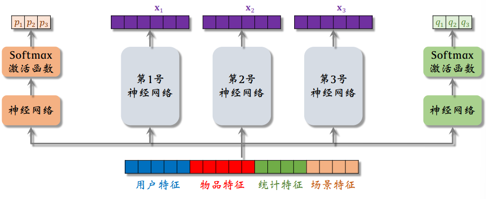

# 推荐系统的基础知识

### 消费指标：

**短期指标：**

- 点击率 = 点击次数 / 曝光次数
- 点赞率=点赞次数/点击次数
- 收藏率=收藏次数/点击次数

**北极星指标（长期指标，更加重要）：**

- 用户规模： 日活用户，月活用户
- 消费：人均使用推荐的时常
- 发布渗透率，人均发布量

## 实验流程

1. 离线实验：历史数据，没有跟用户交互
2. 小流量AB测试：把算法部署到实际产品中，看新策略和旧策略哪个好
3. 全流量上线

## 推荐系统的链路

**召回：**协同过滤，双塔模型，关注的作者等等

**排序：** 粗排（简单的模型）--> 精排（大模型） --> 重排

## 粗排算法

### 重排

目的是做多样性抽样，比如MMR，DPP，从几百中选出几十篇

用规则打散相似的内容

插入广告、运营推广内容

## A/B测试

离线实验结果正向不一定对线上指标有影响。

A/B测试可以用于选取最优参数。

怎么做：随机分桶：分b=10个桶，每个桶中有10%的用户，观察实验组和对照组之间的业务指标

**做A/B测试时流量不够用怎么办？**

分层实验：召回，粗排，精排，重拍，用户界面，广告

同层互斥，不同层正交

**Holdout机制：**

保留 10% 的⽤户，完全不受实验影响，可以考察整个部门对业务指标的贡献。

# 召回

## 基于物品的协同过滤ItemCF

**物品之间的相似度：**两个物品的受众重合度越高，两个物品越相似

**基本思想：**如果用户对物品1感兴趣，而且物品1与物品2相似，那么用户很可能喜欢物品2.

相似度的计算实际上就是余弦相似性。

**事先做离线计算：**建立用户-->物品的索引；建立物品-->物品的索引。

**线上做召回：** 

1. 给定用户id，找到用户最近感兴趣的物品索引
2. 通过物品-->物品的索引，找到top-k相似物品；
3. 对于取回的相似物品，最多nk个，用公式预估用户对物品的兴趣分数
4. 返回分数最高的100个物品

用索引，离线计算量大，但是线上召回计算少

## Swing召回通道

与ItemCF非常像，只不过物品之间相似度的计算方式不同

Swing额外考虑重合的用户是否来自同一个小圈子，对于重合度高的用户提供的权重越小。

### 基于用户的协同过滤UserCF

推荐系统如何找到跟用户相似的网友？

- 看点击，收藏，转发的重合度
- 关注的作者重合度

**离线计算：**

- 计算用户之间的相似度
- 计算用户对物品的兴趣

即可通过当前用户之间的相似度×用户对物品的兴趣来预估当前用户对候选物品的兴趣。

## 向量召回

### 矩阵补充模型

用户embedding和物品embedding求内积

数据集：{用户id，物品id，兴趣分数}，数据集中的兴趣分数是系统记录的，比如：

- 曝光但是没有点击： 0
- 点击点赞收藏转发：各1分

把用户u映射成向量$a_u$，物品i映射成向量$b_i$

矩阵补充的含义：

- 缺点1： 仅用ID embeding，没有利用物品，用户属性
- 缺点2：负样本的选取方式不对
- 缺点3：训练方法不好，内积不如余弦相似度，平方损失不如交叉熵

**模型存储：**

1. 训练得到矩阵A和B
   1. A的每一列对应用户
   2. B的每一列对应物品
2. 把矩阵A的列存储到key-value表：给定ID返回一个用户embedding
3. 矩阵B的存储和索引比较复杂

**线上服务：**

1. 把用户ID作为key，得到用户向量
2. 最近邻查找：如果枚举所有物品，时间复杂度正比于物品数量

**快速最近邻查找：**Milvus, Faiss, HnwsLib

- 衡量最近邻的标准：欧式距离，向量内积，cosine相似度

- 提前划分好数据分布，每个区域都用一个向量进行表示，同时存储好每个区域内的值

## 双塔模型

**用户表征：** 将用户ID，离散特征通过embedding层，将连续特征进行归一化、分桶处理，将embedding拼接起来，输入进神经网络中获得用户表征；

**物品表征：** 同理

### 双塔模型的训练

- Pointwise：独立看待每个正样本，负样本，做简单的二元分类
- Pairwise：每次取一个正样本、一个负样本： $Triplet hinge loss=max{0, cos(a,b^-) + m - cos(a, b^+)}$
- Listwise：每次取一个正样本、多个负样本: $CrossEntropyLoss(y,s)=-logs^+=-log(\frac{e^{cos(a,b^+)}}{e^{cos(a,b^+)+ \sum_{j=1}^n cos(a,b^{j-})}})$

正样本：用户点击的物品；

负样本：

- 没有被召回的？
- 召回但是被粗排、精排淘汰的？
- 曝光但是未被点击的？

### 双塔模型的正负样本

- 正样本：曝光而且有点击的用户-物品二元组
- 解决方案：过采样冷门物品，或降采样热门物品

- 简单负样本：未被召回的物品，可以从全体未被召回物品中抽样，非均匀采样，打压热门物品
- Batch内负样本：类似CLIP的正负样本（用户为文本，物品为图像）
- 困难负样本：被粗排淘汰的物品，精排分数靠后的物品

通常混合几种负样本，如50%简单负样本，50%困难负样本

### 双塔模型的线上召回

**离线存储：** 将物品ID和物品向量存储到数据库中

用户表征进行在线计算，通过快速最近邻算法从向量数据库中查找k个物品

### 模型更新

**全量更新：** 再凌晨，用昨天全天的数据训练1epoch，即每天数据只用一边

**增量更新：** 做online learning更新模型参数，隔几十分钟发布新模型，增量更新ID Embedding参数，发布用户ID Embedding，供用户塔在线上计算用户向量。

### 双塔模型+自监督学习

**通过Listwise的方式训练用户塔和物品塔**

- 推荐系统中，少部分物品占据大部分点击，大部分物品的点击次数不高

**纠偏：**

1. 物品j被抽样到的概率正比于点击次数
2. 预估用户i对j的兴趣$cos(a_i,b_j)$
3. 做训练的时候，把$cos(a_i,b_j)$替换为$cos(a_i,b_j)-logp_j$

**通过自监督的方式训练物品塔**

自监督学习的目标：物品i之间的相似度要高于物品i和物品j

特征变换的方法：

1. Random Mask： 随机选一些离散特征，把他们设置为default
2. Dropout：随机对齐多值离散特征
3. 互补特征：将特征随机分成两组
4. mask一组关联的特征：离线计算特征两两之间的关联，用互信息衡量

**总结：**

- 双塔模型学不好低曝光物品的向量表征，这是由于数据头部效应的问题
- Google提出采用自监督学习可以学习到较好的物品表征

**模型训练**

- 对点击做随机抽样，得到n对用户-物品二元组，作为一个batch
- 从全物品中均匀抽样，得到m个物品，作为一个batch
- 分别做双塔模型损失和物品塔的自监督学习损失

### Deep Retrieval

**索引：** 

deep retrieval将物品表征为路径，一个物品可以表示为多条路径。item-->List<path>

一个路径同样对应多个物品path -->List<item>

**预估模型：**

- 假设用3个节点表示一条路径：$path=[a,b,c]$

- 给定用户特征$x$，预估用户对节点$a$的兴趣$p_1(a|x)$

- 给定$x$和$a$，预估用户对节点$b$的兴趣$p_2(b|a;x)$

- 给定$x,a,b$，预估用户对节点$c$的兴趣$p_3(c|a,b;x)$​
- 预估用户对$path=[a,b,c]$的兴趣：$p(a,b,c|x)=p_1(a|x)\cdot p_2(b|a;x) \cdot p_3(c|a,b;x)$

**线上召回**

- 给定用户特征，用beam search召回一批路径
- 利用索引$path->List<item>$召回一批物品
- 对物品做打分和排序，选出一个子集

**Beam Search：** 是一种贪心算法，其未必是最优解。设置一个beam size，每次选择节点的时候选择概率值最大的beam size个路径。

红色的线表示，选中的路径。

**训练：** 同时学习神经网络参数和物品表征。

- 神经网络$p(a,b,c|x)$预估用户对路径$[a,b,c]$的兴趣；
- 把一个物品表征为多条路径${[a,b,c]}$，并建立索引$item->List<path>,path->List<item>$
- 正样本$(user,item):click(user,item)=1$​

**学习神经网络参数：**

- 用户对路径$[a,b,c]$的兴趣：$p(a,b,c|x)=p_1(a|x)\cdot p_2(b|a;x) \cdot p_3(c|a,b;x)$
- 如果用户点击过物品，说明用户对$J$条路径都感兴趣
- 应该让$\sum_{j=1}^Jp(a_j,b_j,c_j|x)$​变大
- 损失函数$loss = -log(\sum_{j=1}^Jp(a_j,b_j,c_j|x))$

**学习物品表征**

- 用户user对路径$path=[a,b,c]$的兴趣为$p(path|user)=p(a,b,c|x)$
- 物品item与路径path的相关性：$score(item,path)=\sum_{user}p(path|user)\times click(user,item)$
- 根据$score(item,path)$​选出J条路径作为item的表征
- 选出J条路经$\pi = {path_1,...,path_J}$作为物品的表征
- 损失函数：$loss(item, \pi)=-log(\sum_{j-1}^Jscore(item,path_j))$​
- 正则项（避免多个item集中在一个path上）:$reg(path_j)=(number of items on path_j)^4$
- 用贪心算法更新路径：每次固定住一些路径，从未被选中的路径中，选出一条作为新的路径$path_l \leftarrow argmin_{path_l}loss(item,\pi)+\alpha\cdot reg(path_l)$

### GeoHash召回

- 用户可能对附近发生的事感兴趣
- GeoHash： 对经纬度的编码，地图上的一个长方形区域
- 索引： GeoHash-->优质笔记列表
- 这条召回通道没有个性化

### 同城召回

- 用户可能对同城发生的事感兴趣
- 索引： 城市-->优质笔记列表
- 这条召回通道没有个性化

### 作何召回

- 用户对关注的作者发布的笔记感兴趣
- 索引： 用户-->关注的作者； 作者-->发布的内容
- 召回： 用户-->关注的作者-->最新的笔记

### 缓存召回

- 复用前n次推荐精排的结果，即精排结果有一大部分没有曝光，缓存起来，作为一个召回通道

## 曝光过滤问题

- 如果用户看过某个物品，则不再把该物品曝光给用户
- ⼀位⽤户看过 𝑛 个物品，本次召回 𝑟 个物品，如果暴⼒对⽐，需要`O(nr)`的时间。

**Bloom Filter:** 判断一个物品ID是否在已曝光的物品集合中，如果判断未no，则物品一定不在集合中，如果判断为yes，那么该物品很可能在集合中。

通过哈希函数将物品ID进行映射，比较召回的物品ID的对应hash值对应的值是否为1，如果为1的话就表示已经曝光过了。

# 排序模型

## 多目标排序模型

**对于每篇笔记，系统记录：**

1. 曝光次数
2. 点击次数
3. 点赞次数
4. 收藏次数
5. 转发次数

**排序的依据：**

1. 预估点击率，点赞率，收藏率，转发率等多种分数
2. 融合这些预估分数
3. 根据融合的分数做排序、截断

**训练难点：**类别不平衡：正样本少，负样本多

**解决方案：** 负样本的随机降采样，保留一小部分负样本，让正负样本数量平衡

**预估值校准：**

假设正负样本的数量为$n_+,n_{-}$，对负样本做降采样，使用$\alpha \cdot n_-$，$\alpha$是采样率，由于负样本变少，预估点击率大于真实点击率。

- 真实点击率的期望为：$E_{true}=\frac{n_+}{n_++ n_-}$
- 预估点击率的期望为：$E_{pred}=\frac{n_+}{n_++ \alpha n_-}$

- 因此真实的预估点击率的概率为：$p_{true}=\frac{\alpha p_{pred}}{1-p_{pred}+\alpha p_{pred}}$

## Multi-gate Mixture-of-Experts(MMoE)

以下的例子中，有三个专家网络，以及只有两个指标输出，即点击率和点赞率。

**极化现象：** softmax的输出值一个接近1，其余的接近0。就相当于只采用了一个专家神经网络。

**解决方法：** 在训练时，对softmax的输出使用dropout，softmax输出的n个值被mask的概率都是10%，即每个专家被丢弃的概率是10%。

## 预估分数的融合

- 简单的加权和
- 点击率乘以其他项的加权和
- 引入用户观看时间的加权融合

### 视频播放的建模

**视频排序的依据：** 播放时长和完播率，直接用回归拟合播放时长的效果不好。

**播放时长的预估：**

- 实际观测到的播放时长记作t，如果没有点击，则t=0
- 做训练是最小化交叉熵函数，$CE(y,p)$
- 做推理时，把$exp(z)$​作为播放时长的预估

**完播率的预估：**

- 回归方法：让预估完播率p拟合实际完播率y，通过交叉熵拟合
- 二元分类方法：定义完播指标为播放了80%

在实践中，不能直接把预估的完播率用到融分公式中，因为长视频的完播率通常比短视频小。

## 排序模型用到的特征

1. 用户画像：
   1. 用户ID
   2. 人口统计学属性: 性别年龄
   3. 账号信息：新老用户，活跃度
   4. 感兴趣的类目，品牌
2. 物品画像：
   1. 物品ID
   2. 发布时间
   3. GeoHash，所在城市
   4. 标题，类目，关键词，品牌
   5. 字数，图片书，视频清晰度，标签数
   6. 内容信息量，图片美学
3. 用户统计特征：
   1. 用户最近的曝光数，点击数，点赞数，收藏数
   2. 按照笔记图文/视频分桶
   3. 按照笔记类目分桶
4. 笔记统计特征：
   1. 笔记最近的曝光数，点击数，点赞数，收藏数……
   2. 按照用户性别分桶，按照用户年龄分桶
   3. 作者特征：发布内容数量，粉丝数，消费指标（曝光数，点击数，点赞数，收藏数）
5. 场景特征：
   1. 用户的位置信息
   2. 当前时刻
   3. 是否是周末，节假日
   4. 手机品牌，手机信号，操作系统

**特征处理：**

1. 离散特征：做embedding
   1. 用户ID，笔记ID，作者ID
   2. 类目，关键词，城市，手机品牌
2. 连续特征：做分桶，变成离散特征
   1. 年龄，笔记字数，视频长度
3. 连续特征：其他变换
   1. 曝光数，点击数，点赞数等数值做$log(1+x)$
   2. 转换为点击率，点赞率，并做平滑处理

**特征覆盖率：**很多特征无法覆盖100%，提高特征覆盖率，可以让精排模型更准

**精排模型：**采用前期融合的方式（对所有的特征做concatenation，再输入神经网络），所以线上推理代价大

**双塔模型：**通过后期融合的方式（把用户和物品特征分别输入不同的神经网络），线上计算量小，预估准确性不如精排模型

### 粗排的三塔模型

只有一个用户，所以即使用户塔很大，计算量也不大

物品塔可以很大，因为物品特征是静态的，可以提前计算好

交叉塔输入会实施变化，有n个物品，交叉塔必须做n次推理，所以模型较小

# 特征交叉

## Factorized Machine（FM）

- 线性模型+二阶交叉特征：$p=b+\sum_i w_ix_i+\sum_i \sum_j u_{ij}x_ix_j$
- 因此，模型有`o(d^2)`个参数，容易过拟合

**解决方法：**

FM模型有`O(kd)`个参数。

FM 是线性模型的替代品，能⽤线性回归、逻辑回归的场景，都可以⽤ FM。

FM 使⽤⼆阶交叉特征，表达能⼒⽐线性模型更强。  

## 深度交叉网络DCN

用于代替简单的全连接网络

**交叉层的结构：**

其中，$x_0$是整个神经网络最底层的输入，$x_i$是神经网络第i层的输入， hadamard product是让向量做逐元素相乘

**交叉网络：** 由多个交叉层堆叠而成

**深度交叉网络：**将全连接神经网络的输出于交叉网络的输出concatenate，再经过全连接层

DCN可以代替召回和排序模型中的全连接网络，让召回和排序更加准确

## LHUC网络结构

LHUC网络一开始起源于语音识别领域，后被用于精排模型

神经网络值多个全连接层，最后一层的激活函数是sigmoid×2，通过hadamard product使得最后的输出会放大某些特征，缩小某些特征，实现个性化。

## SENet

