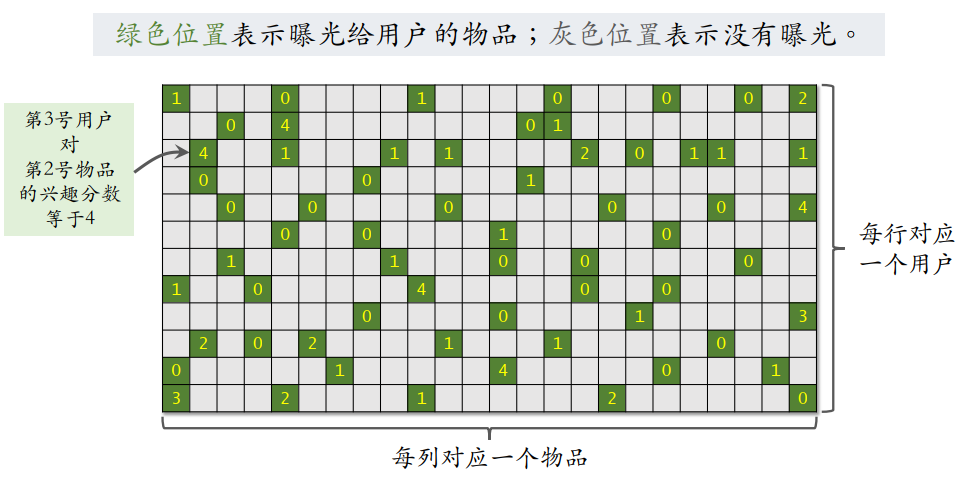

# 推荐系统的基础知识

### 消费指标：

**短期指标：**

- 点击率 = 点击次数 / 曝光次数
- 点赞率=点赞次数/点击次数
- 收藏率=收藏次数/点击次数

**北极星指标（长期指标，更加重要）：**

- 用户规模： 日活用户，月活用户
- 消费：人均使用推荐的时常
- 发布渗透率，人均发布量

## 实验流程

1. 离线实验：历史数据，没有跟用户交互
2. 小流量AB测试：把算法部署到实际产品中，看新策略和旧策略哪个好
3. 全流量上线

## 推荐系统的链路

**召回：**协同过滤，双塔模型，关注的作者等等

**排序：** 粗排（简单的模型）--> 精排（大模型） --> 重排

## 粗排算法

### 重排

目的是做多样性抽样，比如MMR，DPP，从几百中选出几十篇

用规则打散相似的内容

插入广告、运营推广内容

## A/B测试

离线实验结果正向不一定对线上指标有影响。

A/B测试可以用于选取最优参数。

怎么做：随机分桶：分b=10个桶，每个桶中有10%的用户，观察实验组和对照组之间的业务指标

**做A/B测试时流量不够用怎么办？**

分层实验：召回，粗排，精排，重拍，用户界面，广告

同层互斥，不同层正交

**Holdout机制：**

保留 10% 的⽤户，完全不受实验影响，可以考察整个部门对业务指标的贡献。

## 向量召回

### 矩阵补充模型

用户embedding和物品embedding求内积

数据集：{用户id，物品id，兴趣分数}，数据集中的兴趣分数是系统记录的，比如：

- 曝光但是没有点击： 0
- 点击点赞收藏转发：各1分

把用户u映射成向量$a_u$，物品i映射成向量$b_i$

矩阵补充的含义：

- 缺点1： 仅用ID embeding，没有利用物品，用户属性
- 缺点2：负样本的选取方式不对
- 缺点3：训练方法不好，内积不如余弦相似度，平方损失不如交叉熵

**模型存储：**

1. 训练得到矩阵A和B
   1. A的每一列对应用户
   2. B的每一列对应物品
2. 把矩阵A的列存储到key-value表：给定ID返回一个用户embedding
3. 矩阵B的存储和索引比较复杂

**线上服务：**

1. 把用户ID作为key，得到用户向量
2. 最近邻查找：如果枚举所有物品，时间复杂度正比于物品数量

**快速最近邻查找：**Milvus, Faiss, HnwsLib

- 衡量最近邻的标准：欧式距离，向量内积，cosine相似度

- 提前划分好数据分布，每个区域都用一个向量进行表示，同时存储好每个区域内的值

## 双塔模型

**用户表征：** 将用户ID，离散特征通过embedding层，将连续特征进行归一化、分桶处理，将embedding拼接起来，输入进神经网络中获得用户表征；

**物品表征：** 同理

### 双塔模型的训练

- Pointwise：独立看待每个正样本，负样本，做简单的二元分类
- Pairwise：每次取一个正样本、一个负样本： $Triplet hinge loss=max{0, cos(a,b^-) + m - cos(a, b^+)}$
- Listwise：每次取一个正样本、多个负样本: $CrossEntropyLoss(y,s)=-logs^+=-log(\frac{e^{cos(a,b^+)}}{e^{cos(a,b^+)+ \sum_{j=1}^n cos(a,b^{j-})}})$

正样本：用户点击的物品；

负样本：

- 没有被召回的？
- 召回但是被粗排、精排淘汰的？
- 曝光但是未被点击的？

### 双塔模型的正负样本

- 正样本：曝光而且有点击的用户-物品二元组
- 解决方案：过采样冷门物品，或降采样热门物品

- 简单负样本：未被召回的物品，可以从全体未被召回物品中抽样，非均匀采样，打压热门物品
- Batch内负样本：类似CLIP的正负样本（用户为文本，物品为图像）
- 困难负样本：被粗排淘汰的物品，精排分数靠后的物品

通常混合几种负样本，如50%简单负样本，50%困难负样本

### 双塔模型的线上召回

**离线存储：** 将物品ID和物品向量存储到数据库中

用户表征进行在线计算，通过快速最近邻算法从向量数据库中查找k个物品

### 模型更新

**全量更新：** 再凌晨，用昨天全天的数据训练1epoch，即每天数据只用一边

**增量更新：** 做online learning更新模型参数，隔几十分钟发布新模型，增量更新ID Embedding参数，发布用户ID Embedding，供用户塔在线上计算用户向量。

### 双塔模型+自监督学习

**通过Listwise的方式训练用户塔和物品塔**

- 推荐系统中，少部分物品占据大部分点击，大部分物品的点击次数不高

**纠偏：**

1. 物品j被抽样到的概率正比于点击次数
2. 预估用户i对j的兴趣$cos(a_i,b_j)$
3. 做训练的时候，把$cos(a_i,b_j)$替换为$cos(a_i,b_j)-logp_j$

**通过自监督的方式训练物品塔**

自监督学习的目标：物品i之间的相似度要高于物品i和物品j

特征变换的方法：

1. Random Mask： 随机选一些离散特征，把他们设置为default
2. Dropout：随机对齐多值离散特征
3. 互补特征：将特征随机分成两组
4. mask一组关联的特征：离线计算特征两两之间的关联，用互信息衡量