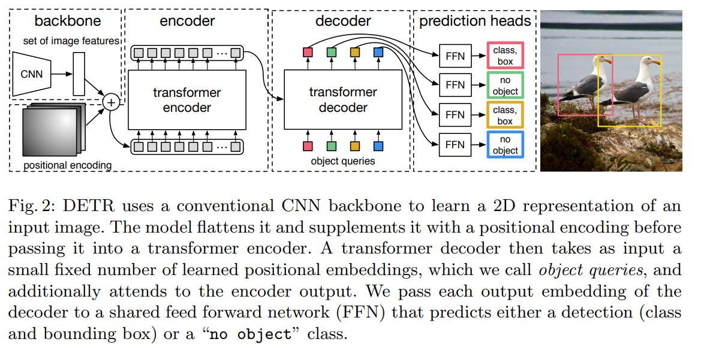
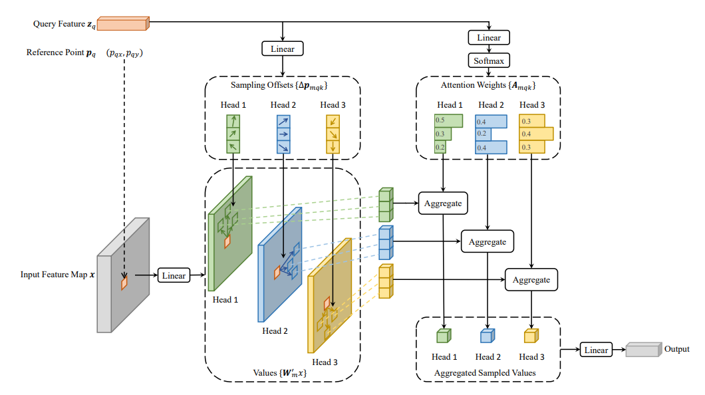
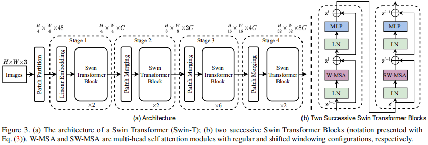
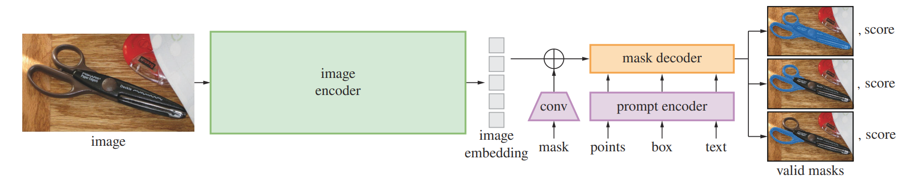
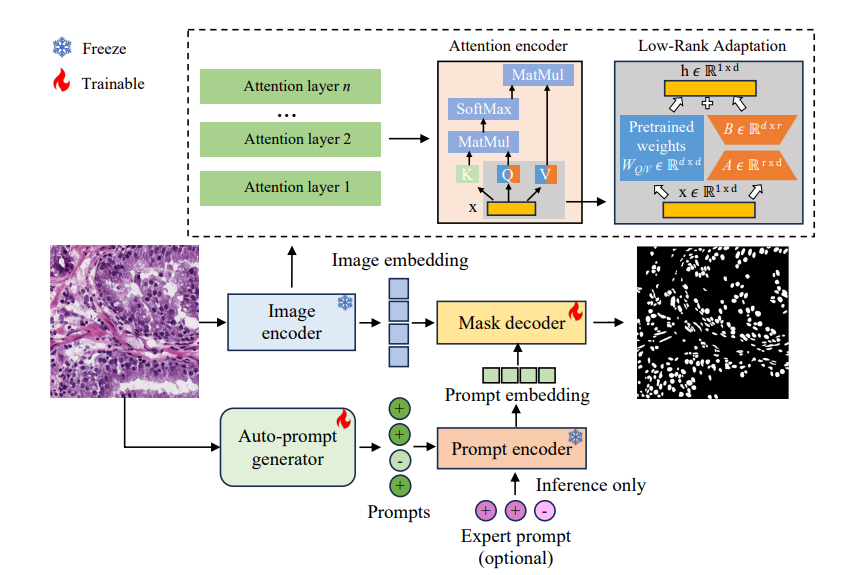
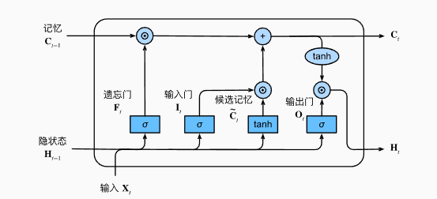
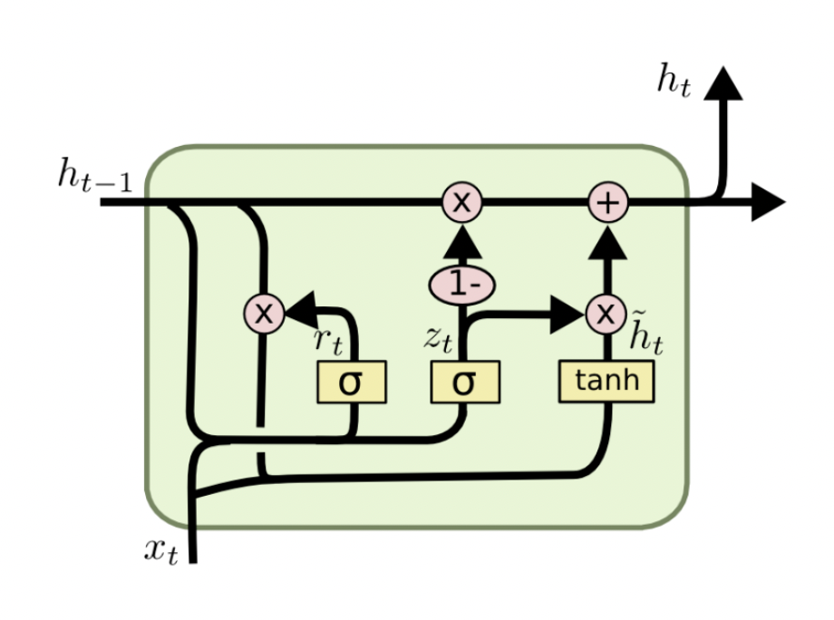

# 腾讯

## 腾讯IEG 游戏安全部门 安全技术岗位

### 2024年8月8日 9：30 一面

- 时长：47min
- 部门相关：IEG下面一个为游戏的开发运营提供安全支持服务，成本部门，外挂，黑产
- 岗位名称：数据科学，机器学习，后台策略安全
- 工作内容：基于汇编指令流分析，目标检测，表格数据

### 问题1： AI辅助如何帮助医生？要实现落地算法的瓶颈在哪里？


### 问题2： 还有哪些因素会影响到智能诊断？


### 问题3： CT和病理之间的差异，为什么病理是金标准？


### 问题4： 常见的卷积操作有什么？

- 标准卷积：通过滑动一个过滤器（或称为核）在输入图像上进行计算。每个位置上的输出都是通过将过滤器与输入图像中的相应区域进行点积运算得到的。
- 深度可分离卷积：通常用于减少计算量。它由两个步骤组成：
  - 深度卷积（Depthwise Convolution），其中每个输入通道都单独与一个独立的过滤器进行卷积。
  - 点卷积（Pointwise Convolution），在深度卷积之后，使用1x1卷积来组合来自不同通道的信息。
- 转置卷积：主要用于上采样任务，如图像分割或生成模型中的生成器部分。它实际上是对标准卷积操作的逆操作，可以放大特征图的尺寸。
- 空洞卷积：扩张卷积，它可以增加感受野而不增加参数数量或计算量。这是通过在过滤器的元素之间插入空洞来实现的。
- 分组卷积：输入通道被分成多个组，并且每个组只与特定的过滤器组相连。这可以降低计算复杂度，同时保持模型的表达能力。


### 问题5：Pytorch在使用过程中哪些点让你觉得非常顺手？

生态很丰富，大部门的CVPR类型的方法都有pytorch的实现方式


### 问题6：通过公网查询某个信息的时候，速度很慢，这时候要怎么定位问题？

- 确认网络状态：检查您的本地网络连接是否正常，尝试重启路由器或调制解调器。
- 检查DNS解析：DNS解析缓慢可能是导致网页加载速度慢的原因之一。您可以尝试更换DNS服务器
- 使用ping命令：测试目标网站的响应时间。如果响应时间很长或丢包率很高，则可能是网络路径上的问题。
- 跟踪路由：使用 `tracert` (Windows) 或 `traceroute` (Linux/Mac) 来查看数据包到达目标网站所经过的路径，以及每个节点的响应时间。
- 清楚浏览器缓存和Cookie


### 问题7： 了解大数据处理中Hadoop平台吗？

Hadoop是一个广泛使用的开源大数据处理平台，它最初由雅虎的Doug Cutting创建。Hadoop的核心组件包括分布式文件系统（HDFS）和一个用于数据处理的框架（MapReduce）。

- HDFS（Hadoop Distributed File System）:HDFS 是 Hadoop 的分布式文件系统，用于存储大规模的数据集。它将文件分割成块并在集群中的多个节点上进行分布存储，提供高容错性和数据吞吐量。
- MapReduce：MapReduce 是一种编程模型，用于大规模数据集的并行处理。它将数据处理任务分为“映射”(Map) 和“规约”(Reduce) 两个阶段。Map 阶段负责对数据进行过滤和排序，而 Reduce 阶段则执行汇总操作。


### 问题8： 对C++了解吗？


### 问题9：怎么在linux中调试程序？

- 使用GBD（GNU Debugger）：GDB 是一个功能强大的源代码级别的调试器，支持多种编程语言，包括 C、C++、Objective-C、Fortran、Ada 和 Modula-2。

```bash
gcc -g myprogram.c -o myprogram
gdb ./myprogram
```


### 问题10： python怎么定义私有函数？

- 单下划线前缀：如果一个函数名或变量名以单个下划线 `_` 开头，这表明它是一个内部使用的成员，虽然仍然可以从外部访问，但建议不要这样做。这是一个约定，不是强制性的限制。
- 双下划线前缀：如果一个成员名以双下划线 `__` 开头，则Python会对其进行名称改写（name mangling），这样它就不能从类的外部直接访问。名称改写是通过在名称前面加上类名和一个下划线实现的，例如 `__private_function` 在类 `MyClass` 中会被改写为 `_MyClass__private_function`

在实际开发中，通常使用单下划线 `_` 来表示内部使用的成员，而双下划线 `__` 主要用于避免子类中的命名冲突。


### 问题11： python中with open有没有不用close的方法？

`with`语句是一种优雅的方式来处理文件打开和关闭的操作。当你使用`with open()`时，文件会在`with`块执行完毕后自动关闭，你不需要显式地调用`close()`方法。这就是`with`语句的一个主要优点，它可以确保即使在文件操作过程中发生异常，文件也会被正确关闭。

- 为什么用`with open()`?
  - **自动管理资源**：使用`with`语句可以确保文件在不再需要时被正确关闭，即使发生了异常。
  - **安全性**：在文件操作完成后立即释放文件描述符，避免资源泄露。

- 当文件很大时，考虑逐行读取或使用缓冲区读取，以节省内存。


### 问题12：当一个文件特别大，内存不够时，with打开文件实际上发生了什么？

- 文件打开：
  - 当你使用`with open()`时，Python会打开文件并返回一个文件对象。

- 文件读取：
  - 默认情况下，`read()` 方法会尝试读取整个文件的内容，但这并不意味着整个文件会一次性加载到内存中。
  - 实际上，`read()` 方法会根据内部缓冲机制分块读取文件。如果文件太大，`read()` 会根据可用内存和系统缓冲策略来决定每次读取多少数据。
- 逐行读取
  - 使用`for line in file:` 循环时，每次迭代都会读取一行数据到内存中。这种方式非常适合处理大文件，因为每一行数据都会在处理完后被释放，不会占用大量的内存。
- 按需读取
  - 你可以使用`read(size)`指定每次读取的字节数，这样可以更好地控制内存使用。


### 问题13：python中readlines是怎么做的？

`readlines()` 方法用于从文件中读取所有行并将它们作为一个列表返回。每一行作为一个字符串元素存储在列表中。

如果文件非常大，`readlines()` 会一次性将所有行加载到内存中，这可能导致内存不足。在这种情况下，应考虑逐行读取文件，例如使用 `for line in file:` 循环。

dfsaj

### 问题14：愿意做业务还是做科研相关的职业方向


### 问题15： 你的职业规划大概是怎么样的？


-  反问：
  - 面试官怎么对医疗方面这么清楚
  - 工作中用哪个语言多些


## 2024年8月12日 16：00 一面

### 问题1： 游戏场景题，怎么判断CF中的透视外挂


### 问题2：游戏和图像的差异很大，后续的职业生涯你有什么打算


### 问题3： 你觉得你来腾讯做游戏安全最大的理由


### 问题4： 科研还是到企业你怎么选择


### 2024年8月17日 线下宣讲会


# 众安银行

## 2024年8月26日一面

### 问题1： 场景题目，公司有200万的钱用来给用户发消费券，应该怎么派卷让更多的人使用银行卡进行消费？

1. 用户行为建模： 通过历史数据对用户的消费行为进行建模，识别用户的消费习惯、消费频率、消费偏好等信息。然后，基于这些模型设计合适的消费券策略。
   1. 用户分群：使用**聚类算法**（如 K-means、DBSCAN 等）对用户进行分群，基于用户的历史消费行为，将用户划分为不同的类别
   2. 用户消费预测：基于用户历史消费记录，使用**时间序列预测模型**（如 ARIMA、LSTM 等）来预测未来一段时间内用户可能的消费行为，并根据预测结果动态调整消费券的发放。
2. 个性化消费券推荐：
   1. 协同过滤：**基于用户的协同过滤**：通过分析和目标用户消费行为相似的用户的消费券使用情况，向目标用户推荐更可能使用的消费券。**基于物品的协同过滤**：根据用户过去的消费商品和支付习惯，向用户推荐相关的消费券。例如，用户在超市购物时，可能会收到更多与超市商品相关的满减券。
3. 优化目标：
   1. 在设计消费券发放策略时，必须考虑到总预算的限制。可以使用优化算法（如线性规划、动态规划等）确保在预算范围内最大化用户参与度。
   2. 提升用户通过银行卡支付的比例。可以设定目标函数，如**最大化用户通过银行卡支付的消费额**，在推荐消费券时，优先发放那些能够激励用户使用银行卡消费的券种。


### 问题2： 场景题目，如何给用户推荐基金？


### 问题3：模型的选型方面你会怎么考虑？

在模型选型方面，涉及到的考虑因素包括数据特征、任务目标、模型的复杂度、可解释性、训练成本和推理效率等。针对不同的应用场景和任务，选择合适的模型非常关键。

**经典模型**：对于简单的分类任务，经典的机器学习模型如 **逻辑回归**、**决策树**、**支持向量机（SVM）** 通常表现不错，尤其是在数据规模不大时。

**复杂模型**：对于复杂分类任务或大规模数据，使用 **随机森林**、**梯度提升树（如 XGBoost、LightGBM、CatBoost）** 或 **深度神经网络（DNN）** 更加合适，特别是当特征复杂且非线性时。

**训练成本和推理效率**

## 二面 2024年8月29日 18：30

### 问题1： 场景题目，我们有一个APP，如何给用户推荐基金？


### 问题2： 推荐系统中，当有了用户画像和内容理解后怎么向用户推荐最匹配的内容？

1. 基于用户兴趣的内容匹配
2. 内容向量与用户向量的匹配：使用嵌入（embedding）模型将用户画像和内容特征转化为向量表示，并通过**向量相似性**来进行推荐。通过计算用户嵌入和内容嵌入之间的**相似度**（如余弦相似度、点积）来为用户推荐与其兴趣最相关的内容。
3. 协同过滤与内容结合的推荐：
   1. **用户-物品协同过滤**：通过用户行为数据（如点击、评分、浏览等）寻找与目标用户行为相似的用户，推荐这些相似用户喜欢的内容。然后，通过内容理解来增强推荐效果，确保推荐内容与用户画像匹配。
   2. **基于内容的协同过滤**：在内容理解的基础上，找到与用户之前浏览过的内容相似的内容进行推荐。例如，基于用户曾浏览过的内容的特征（如主题、关键词等），推荐相似的内容。
4. 实时个性化推荐：通过区分用户的短期兴趣（如最近浏览的内容）和长期兴趣（基于历史行为和用户画像的持久偏好），推荐系统可以进行更加动态且精准的推荐。


# 灵犀互娱

## 2024年9月2日 一面

### 问题1： 可以说一下病理图像分类的流程嘛


### 问题2：为什么MIL可以解决标注少的问题


### 问题3：MIL的原理是什么呢


### 问题4： 怎么选取切patch的大小呢？


### 问题5： 具体讲讲多重提示学习


### 问题6：引入了CLIP会不会把问题搞复杂了？


# 中兴

## 2024年8月1日 智算一面

### 问题1：介绍一下矩阵分析课程中的内容

- 矩阵基础：
  - 矩阵的定义与表示
  - 矩阵运算（加减乘，转置，逆）
  - 特殊类型的矩阵（对角矩阵、单位矩阵、对称矩阵、三角矩阵）
- 行列式与逆矩阵
- 矩阵分解
  - LU分解
  - QR分解
  - Cholesky分解
  - 奇异值分解
  - 特征值分解
- 向量空间与线性变换
  - 基与维数
  - 线性变换及其矩阵表示
  - 正交变换与正交矩阵
- 正交性与投影
  - 内积与范数
  - 向量的正交性与正交基
  - Gram-Schmidt正交化过程

### 问题2： 介绍一下内积和外积

- 内积是向量空间中的一种运算，定义了两个向量之间的“乘积”，从而引入了长度和角度的概念。

​	$<u,v>=\sum_i^nu_iv_i$

- 外积是两个向量的另一种运算，结果是一个矩阵，外积用于表示投影和线性变换

​	$u⊗v=uv^T$​

- 范数适用于测量向量大小或长度的函数，有非负性、齐次性、三角不等性


### 问题3：参数估计时，极大似然和贝叶斯的区别

- 极大似然估计是基于已经观察到的数据，通过选择最可能生成这些数据的参数值来进行估计。具体步骤为：
  - 定义似然函数$L(\theta;X)=P(X|\theta)=\prod_{i=1}^nP(x_i|\theta)$
  - 最大化似然函数来找到参数的估计值$\hat\theta$, $\hat\theta=argmax_{\theta}logL(\theta;X)$
- 贝叶斯估计是基于贝叶斯定理，通过综合先验知识和观察到的数据来进行参数估计。
  - 定义先验分布：选择一个先验分布$P(\theta)$来表达对参数$\theta$的先验知识；
  - 计算后验分布：$P(\theta|x)=\frac{P(x|\theta)P(\theta)}{P(x)}$，其中$P(x)=\int P(x|\theta)P(\theta)d\theta$
  - 参数估计：可以用后验分布的期望值$\hat\theta_{mean}=\int \theta P(\theta|x)d\theta$或者后验分布的最大值作为参数估计值

- **区别：**MLE完全基于数据，不考虑任何先验信息，假设参数值在初始时是等可能的；贝叶斯估计结合先验信息和数据进行估计，先验分布$P(\theta)$起到重要的作用。 MLE给出单点估计，即最可能的参数值；贝叶斯估计给出参数的后验分布，可以提供更加丰富的信息，包括参数的不确定性。MLE只需要最大化对数似然函数，相对简单；贝叶斯估计需要计算后验分布，有时需要复杂的数值积分或采样方法，计算复杂度高；MLE在大样本情况下具有较好的统计性质；贝叶斯估计在小样本情况下先验信息可以显著改善估计效果。


### 问题4： EM算法的原理

EM算法（Expectation-Maximization算法）是一种用于**含有隐变量（或缺失数据）的概率模型的参数估计方法**。它广泛应用于混合模型、隐马尔可夫模型等统计模型中。EM算法通过交替执行期望步骤（E步）和最大化步骤（M步）来迭代地找到模型参数的**最大似然估计**。

假设我们有观测数据 $X$和隐变量$Z$，以及参数向量 $\theta$。EM算法的目标是找到参数 $\theta$ 使得观测数据的似然函数 $P(X;\theta)$最大化。

- 初始化参数$\theta^0$
- 迭代过程：
  - E step: 计算隐变量的条件期望，使用当前参数估计$\theta^t$;$Q(\theta|\theta^t)=E_{Z|X;\theta^t}[logP(X,Z;\theta)]$
  - M step: 最大化条件期望，更新参数估计：$\theta^{t+1}=arg max_{\theta}Q(\theta|\theta^t)$


### 问题5： CLIP算法的框架

## 2024年9月3日 智算二面

### 问题1： 如何团队合作


### 问题2： 紧急任务怎么应对


### 问题3： 未来的职业规划


# 2024年9月7日 贝壳一面二面

### 问题1： 讲解一下Transformer这个模型

Transformer 模型主要由 **编码器（Encoder）** 和 **解码器（Decoder）** 两个模块组成。

**编码器**：输入序列通过编码器进行处理，将输入数据转换为一个高维的表示（编码向量），该表示包含输入序列中的所有信息。

**解码器**：解码器根据编码器生成的编码向量和当前的输入（如目标语言的词），生成输出序列（如翻译结果）。

**多头自注意力机制（Multi-Head Self-Attention）**：自注意力机制允许模型对输入序列中的每个位置，根据序列中其他所有位置的表示进行加权组合，从而捕捉序列中长距离依赖关系。多头机制使得模型可以从多个不同的角度计算注意力。

**前馈神经网络（Feedforward Neural Network）**：每个注意力后的表示通过一个前馈神经网络处理，通常由两层全连接网络组成。

**（Masked Multi-Head Self-Attention）**：自注意力机制，带有掩码（mask），以确保当前解码位置只能关注已经生成的输出，而不能看到未来的目标词。

**编码器-解码器注意力机制（Encoder-Decoder Attention）**：解码器的每一层通过一个注意力机制直接访问编码器的输出，从而利用编码器中的信息进行预测。


### 问题2:  为什么要加入位置编码

在 Transformer 模型中，**位置编码（Positional Encoding）\**的引入是为了让模型能够捕捉序列中的顺序信息。与传统的递归神经网络（RNN）和卷积神经网络（CNN）不同，Transformer 是一种基于\**注意力机制**的模型，它完全摒弃了 RNN 和 CNN 中的递归和卷积操作。因此，Transformer 在结构上**无法直接获得输入序列的顺序信息**。

自然语言等序列数据具有天然的顺序信息，这一点对于正确理解和处理数据非常重要。


### 问题3： RNN和Transformer对比

RNN 需要逐步处理每个输入时间步，当前的输出依赖于前一个时间步的结果，因此无法在不同时间步之间实现并行计算。这导致 RNN 的训练和推理速度较慢，尤其在处理长序列时。

由于 RNN 是递归结构，模型天然能够理解序列中的顺序信息，因此不需要额外的位置编码。

RNN 在处理长序列时会面临梯度消失问题，导致它难以有效捕捉序列中的长距离依赖关系。尽管 LSTM 和 GRU 通过引入门控机制缓解了这个问题，但在处理非常长的序列时，仍然存在一定的限制。


### 问题4： 讲一下过拟合和欠拟合的特点以及怎么解决？

过拟合指的是模型在训练数据上表现非常好，但在测试数据或新数据上表现较差。

**解决方法：**

1. 简化模型
2. 正则化
3. 增加数据量
4. 使用Droupout
5. 交叉验证来评估泛化性能

欠拟合是指模型在训练数据和测试数据上都表现不佳，无法捕捉数据中的潜在模式。

**解决方法：**

1. 增加模型的复杂度
2. 特征工程
3. 减少正则化
4. 增加训练时间


### 问题5： 怎么选取L1和L2正则化

| **特性**           | **L1 正则化（Lasso）**                           | **L2 正则化（Ridge）**                         |
| ------------------ | ------------------------------------------------ | ---------------------------------------------- |
| **稀疏性**         | 会产生稀疏解，部分特征的权重会被强制设为零       | 不会产生稀疏解，所有特征都会被保留             |
| **特征选择**       | 自动选择特征，适合用于高维数据和特征选择         | 不进行特征选择，适合所有特征都有一定作用的场景 |
| **模型解释性**     | 更容易解释，因为只保留了少量重要的特征           | 保留所有特征，模型的解释性可能较弱             |
| **适合处理共线性** | 较不适合处理多重共线性                           | 更适合处理多重共线性，通过缩小相关特征的权重   |
| **惩罚权重**       | 对权重的惩罚是线性的，对大权重的惩罚力度相对较小 | 对较大的权重惩罚更大，通过平方项强烈缩小大权重 |
| **适用场景**       | 特征维度很高，且希望进行特征选择的任务           | 特征维度较低，或所有特征对结果都有影响的任务   |


### 问题6： 怎么看待机器学习和CV之间的Gap

CV中的许多技术都是基于ML的，特别是深度学习。因此，ML和CV在许多技术和理论上是紧密相关的，CV的技术积累有助于更好地理解和应用ML。诸如卷积神经网络（CNN），特征金字塔（FPN）、注意力机制（Attention）等。

**CV 处理的是结构化的视觉数据**，如图像和视频，这些数据有明确的空间结构，并且通常通过卷积神经网络来提取特征。

**ML 广泛应用于多种类型的数据**，包括结构化数据（如表格、时间序列数据）、非结构化数据（如文本、语音）等。相比之下，CV主要聚焦于视觉数据，而ML应用范围更广，需要掌握不同数据类型的处理技巧，如自然语言处理（NLP）中的文本向量化、特征工程等。

**特征工程和特征提取**：在CV中，深度学习自动进行特征提取，而在搜索推荐系统中，特征工程的设计至关重要，需要结合用户行为数据、上下文信息、时间序列数据等手动或自动设计有效的特征。

**模型结构**：CV领域中，通常使用卷积神经网络，但在搜索推荐系统中，更多使用的模型可能是梯度提升树（如XGBoost）、矩阵分解、图神经网络等。因此，理解如何在这些不同的模型上实现优良性能是一个新的挑战。

- 你认为CV与ML之间的GAP主要体现在应用场景的不同以及数据和模型处理的差异。

- 你在CV中掌握了丰富的机器学习和深度学习技巧，可以帮助你快速适应新的应用场景，如搜索和推荐系统。

- 你也意识到在ML的通用领域中，需要应对不同的数据类型和算法结构，并且你已经通过扩展学习这些领域来缩小差距。


### 问题7： 医学图像中的实例分割与自然图像的挑战有什么不同？

- **数据获取与标注难度**：医学图像数据更难获取和标注，数据量往往较少，且标注具有很高的专业性。
- **特征提取的复杂性**：医学图像的低对比度和模糊边界等特性使得分割难度增大，模型需要更加关注细节。
- **目标的大小和形状差异大**：医学图像中的目标大小差异悬殊，且形状复杂，而自然图像中的目标较为规则。
- **精度要求高**：医学图像分割精度对临床应用至关重要，而自然图像在许多应用场景中容忍度较高。


### 问题8： 怎么去找医学图像分割的创新点


### 问题9： 对于跨模态知识蒸馏，你的见解是什么

**优势：**

- **模态间的互补性**：不同模态的数据通常携带互补的信息。
- **模型泛化性增强**：由于教师模型和学生模型之间跨越了模态的差异，学生模型可以通过吸收来自其他模态的信息，学习到更广泛、更抽象的特征。这有助于提升学生模型在目标模态上的泛化能力。
- **提升低模态模型性能**：在一些数据模态质量较低或信息不足的情况下，通过跨模态知识蒸馏，可以利用另一个模态的教师模型提供更丰富的上下文信息，弥补单模态数据的不足。
- **减少数据依赖**：在实际应用中，有时某些模态的数据较为稀缺或难以获取（例如医学领域的图像数据），通过跨模态知识蒸馏，可以利用容易获取的模态数据（如文本数据）来进行辅助训练，减少对难以获取的数据的依赖。

**挑战：**

- **模态差异性**：不同模态的数据类型和特征空间通常差异较大。如何有效地将不同模态中的知识进行对齐和传递是一个核心挑战。
- **知识表示的一致性**：为了有效地将知识从教师模型传递到学生模型，模型需要在不同模态之间找到合适的知识表示形式。


# 锐明技术

### 感知算法工程师 一面2024年9月10日

### 问题1： 有没有做过算法部署相关的项目


###  问题2： 有没有做过检测方面的一些任务

#### R-CNN系列

- R-CNN：R-CNN 是早期的目标检测算法之一。它首先使用 **Selective Search** 生成候选区域，然后将每个候选区域送入 CNN 进行特征提取，接着利用 SVM 分类器来对这些特征进行分类，并使用回归方法进行边界框的精细调整。
- Fast R-CNN： 将整个图像送入 CNN 提取特征，并通过共享特征的方式减少重复计算。然后，通过 **ROI Pooling（Region of Interest Pooling）** 将候选区域映射到固定大小的特征图进行分类和回归。
- Faster R-CNN： 它通过引入 **RPN（Region Proposal Network）** 代替 Selective Search 来生成候选区域，从而大大提高了检测速度。RPN 与基础 CNN 网络共享特征，生成区域建议，然后在第二阶段对这些区域进行精细化检测。
- Mask R-CNN： 除了边界框预测和分类外，它还增加了一个分支，用于预测物体的像素级掩码（Mask）。同时采用了ROI Align。
- Cascade R-CNN:  在基于anchor的检测方法中，我们一般会设置训练的正负样本（用于训练分类以及对正样本进行坐标回归），选取正负样本的方式主要利用候选框与ground truth的IOU占比，常用的比例是50%，即IOU>0.5的作为正样本，IOU<0.3作为负样本等，但是这样就带来了一个问题，阈值取0.5是最好的吗？**Cascade R-CNN就是使用不同的IOU阈值，训练了多个级联的检测器。**

**SPP-Net：**SPP-Net 改进了 R-CNN 的效率问题，通过引入多层空间金字塔池化（Spatial Pyramid Pooling）将图像分割成不同尺度的块，这样可以在不改变输入大小的情况下生成固定维度的特征表示，解决了传统 CNN 依赖固定输入大小的问题。

### YOLO系列

单阶段检测器直接在图片上预测物体的类别和边界框，无需区域提议阶段，因此速度较快，但通常精度略逊于两阶段检测器。

- YOLOv3： YOLOv3 增加了多尺度检测，在不同尺度的特征图上同时进行检测，适合检测小目标。此外，YOLOv3 使用了 Darknet-53 作为 backbone，进一步提升了检测精度。
- **YOLOv4（2020）** 和 **YOLOv5**： YOLOv4 引入了许多改进技巧，如 Mosaic 数据增强、CSPNet、SPP 等，使其在速度和精度上进一步提升。YOLOv5 则是更轻量化的版本，易于部署和训练，常用于工业应用。

#### DETR

基于 Transformer 的端到端目标检测，没有非极大值抑制 NMS 后处理步骤、没有 anchor 等先验知识和约束，整个由网络实现端到端的目标检测实现，大大简化了目标检测的 pipeline。 transformer decoder中采用的是标准的mulit-head self- and encoder decoder attention.



#### Deformable DETR



DETR消除了目标检任务中的`手工设计痕迹`，但是存在**收敛慢**以及Transformer的自注意力造成的**特征图分辨率不能太高**的问题，这就导致了**小目标检测性能很差**。Deformable DETR只在参考点附近采样**少量的key**来计算注意力，因此我们的方法收敛快并且可以用到多尺度特征。

可变形卷积**DCN**是一种注意稀疏空间位置很好的机制，但是其**缺乏元素之间关系的建模能力**。

综上所述，`Deformable Attention`模块结合了DCN稀疏采样能力和Transformer的全局关系建模能力。这个模块可以**聚合多尺度特征**，不需要FPN了，我们用这个模块替换了Transformer Encoder中的`Multi-Head Self- Attention`模块和Transformer Decoder中的`Cross Attention`模块。

通过在输入特征图上的参考点(reference point)附近只采样少数点(deformable detr设置为3个点)来作为注意力的 k 。因此要解决的问题就是：（1）确定reference point。（2）确定每个reference point的偏移量(offset)。（3）确定注意力权重矩阵 A。


#### Swin Transformer



**视觉元素在尺度 (scale) 上可以存在很大差异**，**视觉元素在尺度 (scale) 上可以存在很大差异**，而**自注意力的计算复杂度是关于图像大小的二次方**。Swin Transformer 通过 从小尺寸 patch (灰色轮廓) 开始，逐渐在更深的 Transformer 层中合并相邻 patch，从而构造出一个层次化表示 (hierarchical representation)。通过这些层次化特征图，Swin Transformer 模型可方便地利用先进技术进行密集预测，例如特征金字塔网络 (FPN) 或 U-Net。


### 问题3： 分割指标

**IOU：**预测区域与真实区域之间的交并比。

**Dice**: Dice 系数与 IoU 类似，常用于评估两个区域的重叠程度。

**F1 Score:** F1 分数结合了分割的精度（Precision）和召回率（Recall）。在实例分割任务中，它被用来评估前景目标的检测和分割效果。

**AP: ** AP（Average Precision，平均精度）是目标检测和实例分割中常用的评价指标，它用于评估模型在不同阈值下的精度。AP 的计算基于 **Precision-Recall 曲线**，它通过逐步改变检测的置信度阈值，计算出精度（Precision）和召回率（Recall），再根据这些点来计算曲线下的面积。


### 问题4： 微调过SAM吗



SAM 的核心架构基于 Vision Transformer（ViT），由三个主要组件组成：

1. Image encoder：用于从图像中提取丰富的视觉特征。
2. Prompt encoder： 将用户提供的提示（如点、框、文本）编码成模型可以理解的格式。
3. Mask Decoder： 结合图像特征和提示信息生成对象的分割掩码。

SAM 的成功在很大程度上依赖于 Meta AI 构建的一个大型数据集，这个数据集包含了数十亿张图像及其相应的分割掩码。这些掩码是通过人工标注或自动化工具生成的，涵盖了不同类型的对象和复杂的场景。这种大规模数据的使用使得 SAM 能够学习到通用的分割特征，适应各种图像分割任务。

- **自动生成标注**：部分分割标注可能是通过自动化的方法生成的，这加速了数据集的扩展，保证了数据的多样性和覆盖面。
- **涵盖多领域的图像**：从自然场景、医疗影像、卫星图片到艺术品等多种不同领域的图像，这使得 SAM 具备了广泛的泛化能力。

- **联合训练**：在训练过程中，SAM 学习如何根据不同的提示生成相应的分割结果。这使得模型能够灵活应对不同的任务，成为一个高度通用的分割工具。

**如何微调SAM：**




### 问题5： 如果判断过拟合与欠拟合，以及怎么解决


### 问题6： L2正则化的原理

权重的大小反映了模型对输入特征的敏感性。**如果某些权重非常大，意味着模型在预测时对相应的输入特征过度依赖，从而增加了模型的复杂性**。

L2 正则化通过惩罚大权重，迫使模型使用更小的权重值。这等价于假设每个特征对输出的影响力较小，避免模型对某些特征的依赖过大。这种约束有助于避免模型的复杂化，使模型能够在有限的训练数据上更好地泛化。


### 问题7： 讲一下LSTM模型

**RNN：** 

在每个时刻$t$，RNN会接收当前时刻的输入单词$x_t$和上一个时刻的输出状态$h_{t-1}$，然后计算得到当前时刻的输出$h_t$，在RNN中这个实现机制比较简单：

$h_t = tanh(Wx_t + Vh_{t-1}+b)$

即在时刻$t$，RNN单元会对两个输入$x_t$和$h_{t-1}$进行线性变换，然后将结果使用$tanh$激活函数进行处理，得到当前时刻$t$的输出$h_t$​。

**缺点：** 当阅读很长的序列时，网络内部的信息会逐渐变得越来越复杂，以至于超过网络的记忆能力，使得最终的输出信息变得混乱无用。

**长短时记忆网络LSTM：**通过引入**门机制**来控制LSTM单元需要记忆哪些信息，遗忘哪些信息，从而保持更长的信息依赖，更加轻松地表达整个句子语义。

- **状态向量$c_t$**：它控制着整个LSTM单元的状态或者记忆，它会根据每个时刻的输入进行更新，从而实时保持LSTM单元的记忆。

- **隐状态向量$h_t$**：它是当前LSTM单元对外的输出状态，它是实际的工作状态向量，即一般会利用 $h_{t}$​来做一些具体的任务。

- **遗忘门**$f_t$：控制前一时刻的状态向量$c_{t-1}$​需要被屏蔽/遗忘哪些信息。

- **输入门**$i_t$：控制当前时刻的输入信息需要向状态向量$c_t$中注入哪些信息。

  $i_t=\sigma(W_i\cdot [h_{t-1},x_t]+b_i)$

  $\hat C_t = tanh(W_C \cdot [h_{t-1},x_t]+b_c)$

  $C_t=f_t\cdot C_{t-1}+i_t+\hat C_t$

​	$f_t=\sigma(W_f \cdot [h_{t-1},x_t]+b_f)$

- **输出门**$o_t$：控制当前时刻的状态向量$c_t$需要对外输出哪些信息，最终输出的信息即为$h_t$​。

  $o_t=\sigma(W_o \cdot [h_{t-1},x_t]+b_o)$

  $h_t=o_t \cdot tanh(C_t)$



**门控循环单元GRU：**GRU也是对于LSTM结构复杂性的优化。LSTM能够解决循环神经网络因长期依赖带来的梯度消失和梯度爆炸问题，但是LSTM有三个不同的门，参数较多，训练起来比较困难。



- GRU只有两个门。GRU将LSTM中的输入门和遗忘门合二为一，称为更新门（update gate），上图中的$z_{t}$，控制前边记忆信息能够继续保留到当前时刻的数据量，或者说决定有多少前一时间步的信息和当前时间步的信息要被继续传递到未来；GRU的另一个门称为重置门（reset gate），上图中的$r_{t}$ ，控制要遗忘多少过去的信息。

- 取消进行线性自更新的记忆单元（memory cell），而是直接在隐藏单元中利用门控直接进行线性自更新。

  $z_{t}=\sigma(W_{z} \cdot [h_{t-1},x_{t}])$

  $r_{t}=\sigma(W_{r} \cdot [h_{t-1},x_{t}])$

  $\tilde h=tanh(W \cdot [r_{t} \odot h_{t-1},x_{t}])$

  $h_{t}=(1-z_{t})\odot h_{t-1}+z_{t} \odot \tilde h_{t-1}$


****

# 银行业务的模拟面试

### 问题1： 请你解释一下在金融场景中，如何使用哈希表来提升数据检索的效率？你认为哈希表在这种场景下可能存在什么样的局限性？

哈希表是一种通过哈希函数将键映射到特定位置的数据结构，能够在常数时间内完成插入和查找操作。在金融场景中，哈希表可以用于快速检索客户信息、交易记录等。例如，基于客户ID作为键，将客户信息存储在哈希表中，这样当系统需要快速访问特定客户的账户信息时，可以通过O(1)的时间复杂度进行检索。

局限性：

1. **冲突问题**：当多个键通过哈希函数映射到相同的位置时，就会发生冲突。虽然可以通过链地址法或开放地址法解决，但仍然会影响检索效率，特别是在高冲突率的情况下。
2. **动态扩展的开销**：哈希表在存储数据超过一定量时，需要进行动态扩展，这个过程中会重新分配存储空间并重新计算所有键的哈希值，导致性能开销。
3. **有序性**：哈希表不维护数据的有序性，这在需要顺序处理数据的金融场景中可能不太适用，如对交易进行排序。


### 问题2： 假设你需要为虚拟银行的信用风险评估模型设计一个算法，你会选择哪种机器学习模型？请解释你的选择，并谈谈如何处理数据中的不平衡问题（例如，坏账率很低的情况）。

在信用风险评估中，逻辑回归、随机森林和梯度提升树（GBDT）是常见的选择。我可能会选择**梯度提升树（GBDT）**，因为它在处理非线性关系和处理特征的重要性方面表现良好，并且在金融领域应用广泛。

**数据不平衡时：**

1. **过采样（Oversampling）**：对少数类样本进行过采样，例如通过SMOTE（合成少数类过采样技术）生成合成样本。
2. **欠采样（Undersampling）**：对多数类样本进行欠采样，减少其数量以平衡数据集。
3. **使用惩罚性权重**：在模型中引入惩罚性权重，对少数类样本赋予更高的权重，减少模型对多数类的偏倚。
4. **集成学习**：通过结合多个模型的预测结果，提升模型在不平衡数据集上的表现，如通过Bagging或Boosting技术。


### 问题3： 虚拟银行处理的大量用户交易数据如何通过分布式计算框架来高效处理？

在处理大量用户交易数据时，分布式计算框架如Hadoop和Spark非常有用。

- Hadoop： 基于MapReduce的批处理框架，适合处理大规模数据集，通过将计算任务分发到多个节点并行处理。它的HDFS（分布式文件系统）提供高可靠性存储。
- Spark: 比Hadoop更为高效的内存计算框架，支持批处理、流处理和交互式查询。Spark通过RDD（弹性分布式数据集）实现了对内存中数据的高效操作，并支持在内存中处理数据，从而比Hadoop MapReduce更快。


### 问题4： 众安的虚拟银行可能会为用户推荐理财产品。你会如何设计一个推荐系统，考虑到用户的历史行为、风险偏好和市场变化？你会选择哪种推荐算法，并说明理由。

推荐系统可以通过以下几个步骤来设计：

1. **用户画像**：收集用户的历史行为数据（如购买记录、浏览记录）、风险偏好（通过问卷调查或历史交易行为推断）以及基本信息（如年龄、收入等）来构建用户画像。
2. **产品画像**：为理财产品建立画像，包括收益率、风险等级、适合的投资期限等信息。
3. **推荐模型**：可以选择协同过滤、基于内容的推荐或混合推荐算法。
   1. **协同过滤**：根据相似用户的行为推荐产品，适用于新产品较少的情况。
   2. **基于内容的推荐**：根据用户的历史行为和产品特征进行推荐，适用于新用户或新产品。
   3. **混合推荐**：结合协同过滤和基于内容的推荐，提升推荐的准确性和多样性。
4. **动态调整**：引入市场变化因素（如利率波动、经济环境变化）实时调整推荐结果。

我可能会选择**混合推荐算法**，因为它能同时利用用户行为和产品特征，并能够较好地应对新用户冷启动问题。
